# USB流量（简）

USB流量可以用来传输多种交互式设备的操作 比如鼠标、键盘、手柄

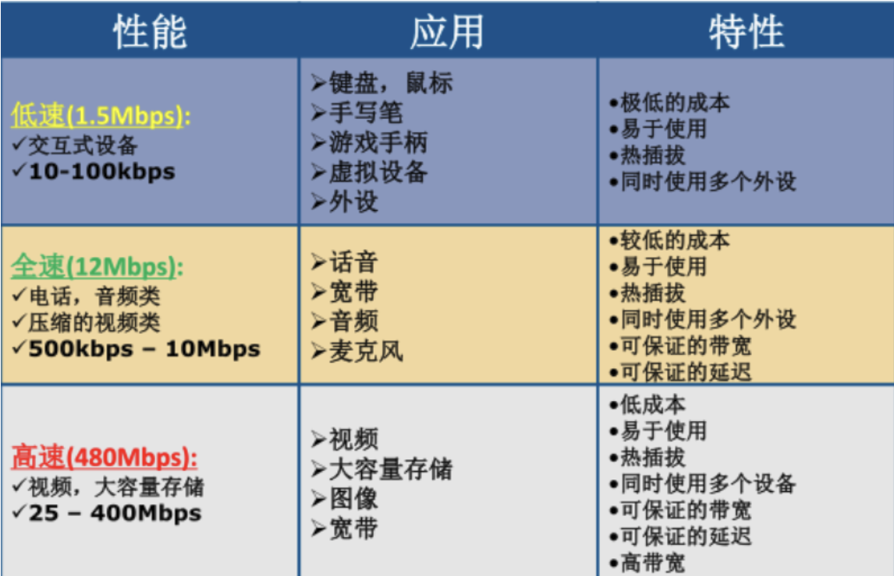

这个文章只简单介绍鼠标以及键盘的USB流量 并且附加两个工具的简单使用

## 鼠标协议

### 简述

虽然鼠标移动表现为连续性 但是实际上计算机的一切连续性内容是用离散数据模拟的

所以鼠标移动的数据也会被打包成一个个离散的USB流量包传输

我们简单看一个鼠标流量

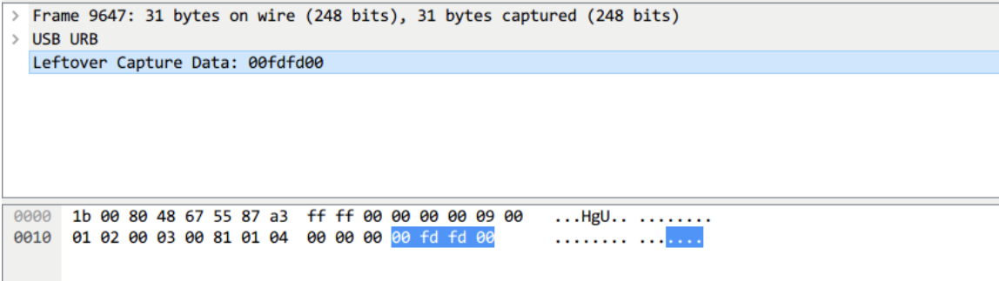

途中被选中的部分即为鼠标流量的数据区 如图所示 鼠标流量的数据由四个字节表述

- 第1个字节代表按键 即左键右键中健\(部分鼠标还有侧键\)
  - 取 `00` 时 代表没按键

  - 取 `01` 时 代表按左键

  - 取 `02` 时 代表按右键

- 第2个字节类似一个 signed byte 类型 其最高位为符号位
  - 值为 `01`\~`7F`（最高位为0 正数）时 代表向右移动像素

  - 值为 `80`\~`FF`（最高位为1 负数）时 代表向左移动像素

  - 值为 `00` 时 代表不移动

- 第3个字节与第二个字节类似 只不过从左右变成了上下
  - 值为 `01`\~`7F`（最高位为0 正数）时 代表向上移动像素

  - 值为 `80`\~`FF`（最高位为1 负数）时 代表向下移动像素

  - 值为 `00` 时 代表不移动

- 第4个字节代表中键滚动值 不滚动就是`00`

有了这些映射 我们就可以复原鼠标移动的轨迹

这里直接用现成的工具就好

事实上 也有8字节数据长度的鼠标流量

- 第1个字节代表按键 即左键右键中健(部分鼠标还有侧键)
  - 取 `00` 时 代表没按键

  - 取 `01` 时 代表按左键

  - 取 `02` 时 代表按右键

- 第2个字节是保留位 通常是 `00` 解析时忽略即可

- 第3个字节是 X（左右方向）的低位字节

- 第4个字节是 X 的高位字节（16 位小端，符号扩展）
  - 高位为 `00`（即 X 为正）时 代表向右移动像素

  - 高位为 `ff`（即 X 为负）时 代表向左移动像素

- 第5个字节是 Y（上下方向）的低位字节

- 第6个字节是 Y 的高位字节（16 位小端，符号扩展）
  - 高位为 `00`（即 Y 为正）时 代表向上移动像素

  - 高位为 `ff`（即 Y 为负）时 代表向下移动像素

- 第7、第8字节是保留位 通常为 `00`

### 工具：[USB-Mouse-Pcap-Visualizer](https://github.com/WangYihang/USB-Mouse-Pcap-Visualizer)

这个工具可以从 pcap 里提取鼠标包 按上面4字节还原按键状态与相对位移 再累加成可视的轨迹 产出csv文件

```
python usb-mouse-pcap-visualizer.py -i <输入.pcap> -o <输出.csv>
```

### 例题：[NUAACTF-2017]**traffic**

[**题目地址**](https://ctf.bugku.com/challenges/detail/id/241.html)

**题目描述：**Emmm，这是什么流量...

**工具：**Wireshark USB-Mouse-Pcap-Visualizer

拿到附件 pcap文件

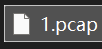

**Wireshark **打开

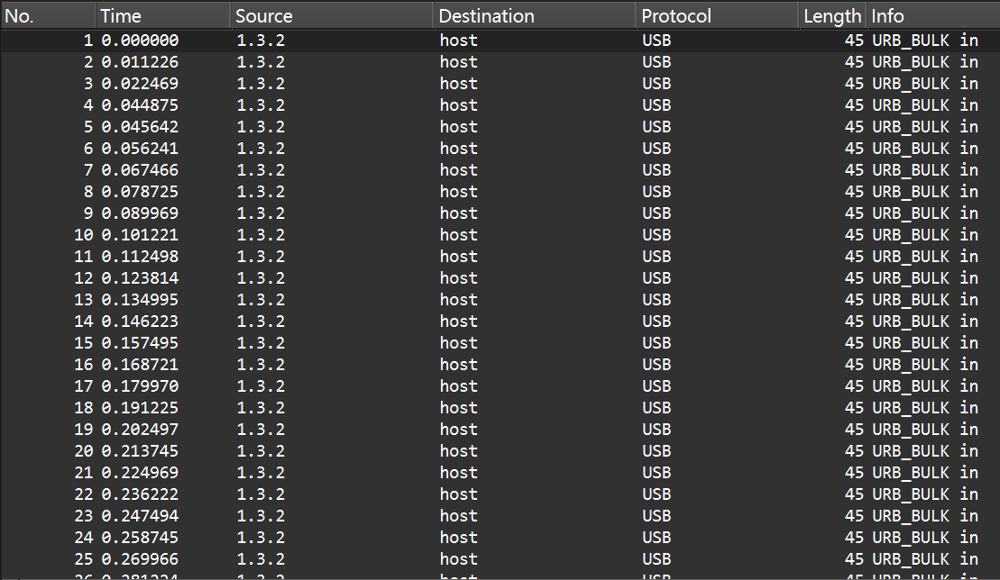

发现全是USB流量 随便点开一个看看

利用 **USB-Mouse-Pcap-Visualizer** 得到csv文件

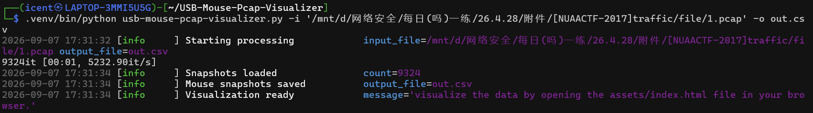

起一个本地服务(因为wsl没有可视化ui 起服务可以用原windows访问)

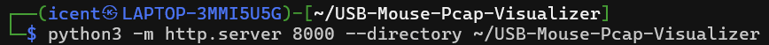

访问

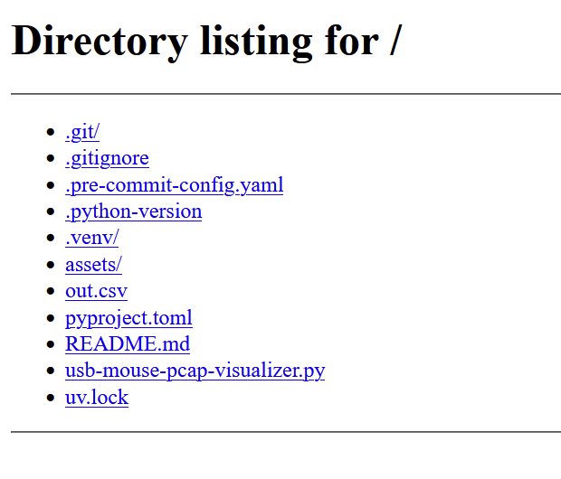

点击 `assets/`

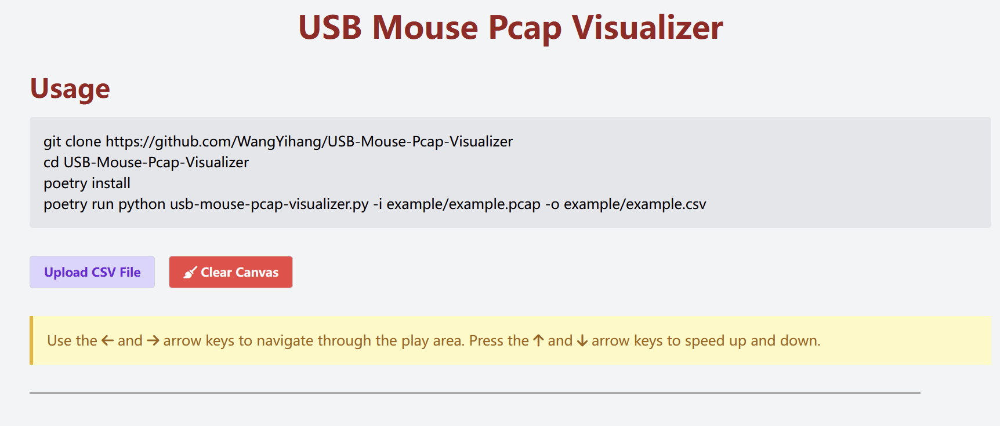

在这里上传刚刚产出的csv文件即可

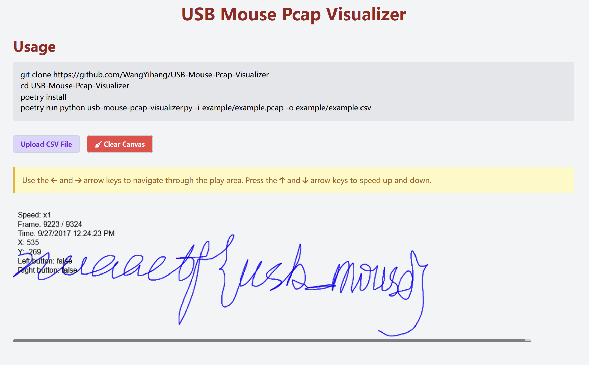

(这字丑死了) 用完记得 `Ctrl+c` 关服务

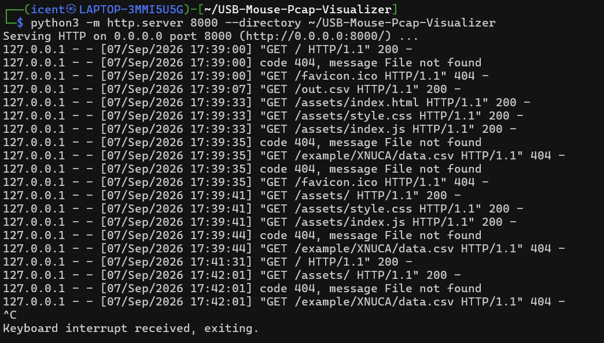

取得flag flag为

`nuaactf{usb_mouse}`

## 键盘协议

### 简述

依旧简单的看一个键盘流量

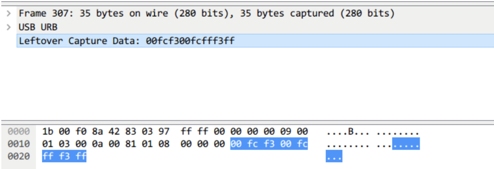

选择的区域就是键盘流量的数据区 可以看到长度为8字节 击键信息集中在第3个字节

- 第1个字节是修饰键
  - `01` 左 Ctrl `02` 左 Shift `04` 左 Alt `08` 左 Win(GUI)

  - `10` 右 Ctrl `20` 右 Shift `40` 右 Alt `80` 右 Win

  - 例：`0x02` = 按左 Shift → 配合键码决定是**大写/上档字符**（如 `a` → `A`，`1` → `!`）

- 第2个字节是保留位 通常是 `00` 解析时忽略即可

- 第3个字节本身是 HID Usage ID 可以查 HID Usage Table 映射表还原成字符
  - 松开一个键时 该字节回 `0x00`

- 第4-8字节 多键位 忽略即可

完整映射表放在最后

### 工具：[UsbKeyboardDataHacker](https://github.com/WangYihang/UsbKeyboardDataHacker)

可以把pcap中的usb键盘流量映射为可读的键盘字符

```
python UsbKeyboardDataHacker.py --input <输入.pcap>
```

### 例题：[NISACTF 2022]破损的flag

[**题目链接**](https://www.nssctf.cn/problem/2048)

**题目描述：**flag真的是flag吗？

Tips：flag格式为NSSCTF{}

ps:记得补全单词哦，单词和单词之间记得加\_哦

**工具：**Wireshark UsbKeyboardDataHacker

拿到附件 位置格式文件

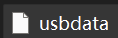

用 file 命令查看文件类型

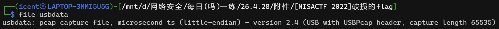

发现是pcap文件 改后缀 用 **Wireshark **打开

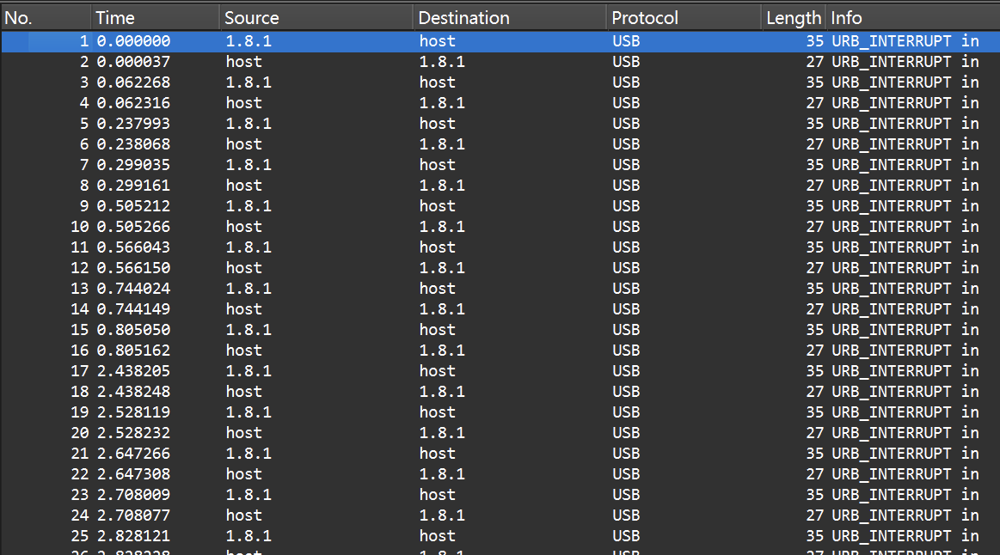

发现都是usb流量 随便点开一条查看数据长度


发现是8字节 猜测是键盘流量 使用 **UsbKeyboardDataHacker**

（因为我的工具依赖在虚拟环境里 所以命令行命令和上文写的不同）

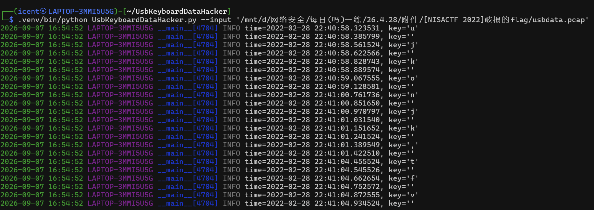

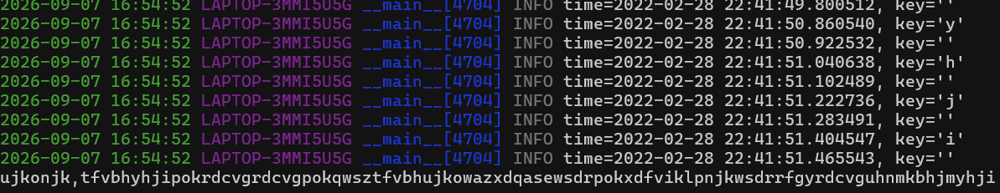

最后得到

```
ujkonjk,tfvbhyhjipokrdcvgrdcvgpokqwsztfvbhujkowazxdqasewsdrpokxdfviklpnjkwsdrrfgyrdcvguhnmkbhjmyhji
```

这是键盘包围密码 因为这个文章主要是讲USB的 所以这个后续单独写个文章讲 直接解密就行

得到 `imgulfflagiswelcometfjnu`

断句得到 `im gulf flag is welcome t fjnu`

根据题目描述“补全单词” 应该是 `im gulf flag is welcome to fjnu`

将flag部分拿出来 加上`_`

取得flag flag为

NSSCTF{welcome_to_fjnu}

## 其他

写一点小tip

有些小阴间会把4字节的鼠标流量填充成8字节(并非正常的8字节鼠标流量)

伪装成键盘流量 导致键盘流量工具空输出

**第1字节 修饰键映射表**

| 位值 (Hex) | 含义         |
| ---------- | ------------ |
| 0x01       | 左 Ctrl      |
| 0x02       | 左 Shift     |
| 0x04       | 左 Alt       |
| 0x08       | 左 Win / GUI |
| 0x10       | 右 Ctrl      |
| 0x20       | 右 Shift     |
| 0x40       | 右 Alt       |
| 0x80       | 右 Win / GUI |

**第3字节 键盘 HID 主键码映射表**

| Usage ID (Hex) | Dec | 键 (无修饰/普通) | 键 (Shift/上档) | 备注     |
| -------------- | --- | ---------------- | --------------- | -------- |
| 0x04           | 4   | a                | A               |          |
| 0x05           | 5   | b                | B               |          |
| 0x06           | 6   | c                | C               |          |
| 0x07           | 7   | d                | D               |          |
| 0x08           | 8   | e                | E               |          |
| 0x09           | 9   | f                | F               |          |
| 0x0A           | 10  | g                | G               |          |
| 0x0B           | 11  | h                | H               |          |
| 0x0C           | 12  | i                | I               |          |
| 0x0D           | 13  | j                | J               |          |
| 0x0E           | 14  | k                | K               |          |
| 0x0F           | 15  | l                | L               |          |
| 0x10           | 16  | m                | M               |          |
| 0x11           | 17  | n                | N               |          |
| 0x12           | 18  | o                | O               |          |
| 0x13           | 19  | p                | P               |          |
| 0x14           | 20  | q                | Q               |          |
| 0x15           | 21  | r                | R               |          |
| 0x16           | 22  | s                | S               |          |
| 0x17           | 23  | t                | T               |          |
| 0x18           | 24  | u                | U               |          |
| 0x19           | 25  | v                | V               |          |
| 0x1A           | 26  | w                | W               |          |
| 0x1B           | 27  | x                | X               |          |
| 0x1C           | 28  | y                | Y               |          |
| 0x1D           | 29  | z                | Z               |          |
| 0x1E           | 30  | 1                | !               |          |
| 0x1F           | 31  | 2                | @               |          |
| 0x20           | 32  | 3                | #               |          |
| 0x21           | 33  | 4                | $               |          |
| 0x22           | 34  | 5                | %               |          |
| 0x23           | 35  | 6                | ^               |          |
| 0x24           | 36  | 7                | \&              |          |
| 0x25           | 37  | 8                | \*              |          |
| 0x26           | 38  | 9                | (               |          |
| 0x27           | 39  | 0                | )               |          |
| 0x28           | 40  | Enter (Return)   | Enter           | 回车     |
| 0x29           | 41  | Escape           | Escape          | ESC      |
| 0x2A           | 42  | Backspace        | Backspace       | 退格     |
| 0x2B           | 43  | Tab              | Tab             | 制表     |
| 0x2C           | 44  | Space            | Space           | 空格     |
| 0x2D           | 45  | -                | \_              |          |
| 0x2E           | 46  | =                | +               |          |
| 0x2F           | 47  | [                | {               |          |
| 0x30           | 48  | ]                | }               |          |
| 0x31           | 49  | \                | \|              | 反斜杠   |
| 0x32           | 50  | Non-US # / \~    | —               | 非美式 # |
| 0x33           | 51  | ;                | :               |          |
| 0x34           | 52  | '                | "               |          |
| 0x35           | 53  | `                | \~              | 反引号   |
| 0x36           | 54  | ,                | \<              |          |
| 0x37           | 55  | .                | >               |          |
| 0x38           | 56  | /                | ?               |          |
| 0x39           | 57  | Caps Lock        | —               | 大写锁定 |
| 0x3A           | 58  | F1               | F1              |          |
| 0x3B           | 59  | F2               | F2              |          |
| 0x3C           | 60  | F3               | F3              |          |
| 0x3D           | 61  | F4               | F4              |          |
| 0x3E           | 62  | F5               | F5              |          |
| 0x3F           | 63  | F6               | F6              |          |
| 0x40           | 64  | F7               | F7              |          |
| 0x41           | 65  | F8               | F8              |          |
| 0x42           | 66  | F9               | F9              |          |
| 0x43           | 67  | F10              | F10             |          |
| 0x44           | 68  | F11              | F11             |          |
| 0x45           | 69  | F12              | F12             |          |

**额外：导航 / 编辑键（功能键区之后）**

| Usage ID (Hex) | Dec | 键                | 备注         |
| -------------- | --- | ----------------- | ------------ |
| 0x46           | 70  | PrintScreen       | 截图         |
| 0x47           | 71  | Scroll Lock       | 滚动锁定     |
| 0x48           | 72  | Pause             | 暂停         |
| 0x49           | 73  | Insert            | 插入         |
| 0x4A           | 74  | Home              |              |
| 0x4B           | 75  | Page Up           |              |
| 0x4C           | 76  | Delete (Del)      | 前向删除     |
| 0x4D           | 77  | End               |              |
| 0x4E           | 78  | Page Down         |              |
| 0x4F           | 79  | Right Arrow       | →            |
| 0x50           | 80  | Left Arrow        | ←            |
| 0x51           | 81  | Down Arrow        | ↓            |
| 0x52           | 82  | Up Arrow          | ↑            |
| 0x53           | 83  | Num Lock          | 数字锁定     |
| 0x54           | 84  | Keypad /          | 小键盘 /     |
| 0x55           | 85  | Keypad \*         | 小键盘 \*    |
| 0x56           | 86  | Keypad -          | 小键盘 -     |
| 0x57           | 87  | Keypad +          | 小键盘 +     |
| 0x58           | 88  | Keypad Enter      | 小键盘回车   |
| 0x59           | 89  | Keypad 1 / End    |              |
| 0x5A           | 90  | Keypad 2 / ↓      |              |
| 0x5B           | 91  | Keypad 3 / PgDn   |              |
| 0x5C           | 92  | Keypad 4 / ←      |              |
| 0x5D           | 93  | Keypad 5          |              |
| 0x5E           | 94  | Keypad 6 / →      |              |
| 0x5F           | 95  | Keypad 7 / Home   |              |
| 0x60           | 96  | Keypad 8 / ↑      |              |
| 0x61           | 97  | Keypad 9 / PgUp   |              |
| 0x62           | 98  | Keypad 0 / Insert |              |
| 0x63           | 99  | Keypad . / Delete | 小键盘小数点 |
| 0x64           | 100 | Non-US \          | 非美式反斜杠 |
