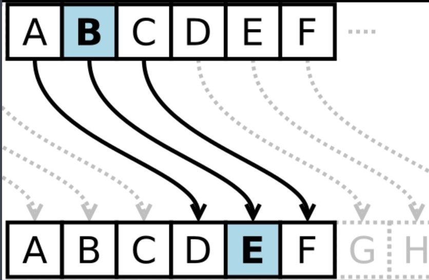

# 凯撒密码

凯撒密码（_Caesar cipher_）是一种替换加密技术  
明文中的所有**字母**都在字母表上 向后/向前 按照一个固定数目（Shift）进行偏移后被替换成密文



比如 `ICENT` 可以加密成 `KEGPV` Shift 为 2  
原理简单 可以写个脚本

```
# 凯撒密码爆破

def caesar_break(ciphertext):
    """
    对密文进行凯撒密码爆破（仅对字母移位，数字和符号不变）。
    输出所有偏移量对应的明文。
    """
    # 循环爆破26次（26个字母）
    for shift in range(26):
        # 设立一个 c_str 存储此次循环爆破结果
        c_str = []
        # 逐个字符转换
        for ch in ciphertext:
            # 大写字母
            if ch.isupper():
                shifted = chr((ord(ch) - ord('A') + shift) % 26 + ord('A'))
                c_str.append(shifted)
            # 小写字母
            elif ch.islower():
                shifted = chr((ord(ch) - ord('a') + shift) % 26 + ord('a'))
                c_str.append(shifted)
            # 非字母字符
            else:
                c_str.append(ch)
        # 输出此次循环的结果
        print(f"Shift {shift:2d}: {''.join(c_str)}")

if __name__ == "__main__":
    cipher = "要加密/解密的密文"
    caesar_break(cipher)
```

凯撒密码通常被作为其他更复杂的加密方法中的一个步骤，例如维吉尼亚密码。凯撒密码还在现代的ROT13系统中被应用

根据偏移量的不同，还存在若干特定的凯撒密码名称：

> 偏移量为10：Avocat(A→K)  
> 偏移量为13：ROT13  
> 偏移量为-5：Cassis (K 6)  
> 偏移量为-6：Cassette (K 7)

## 来一串神秘字符

xdsy{F0o_q0m_Cf0o_U4354j!}
