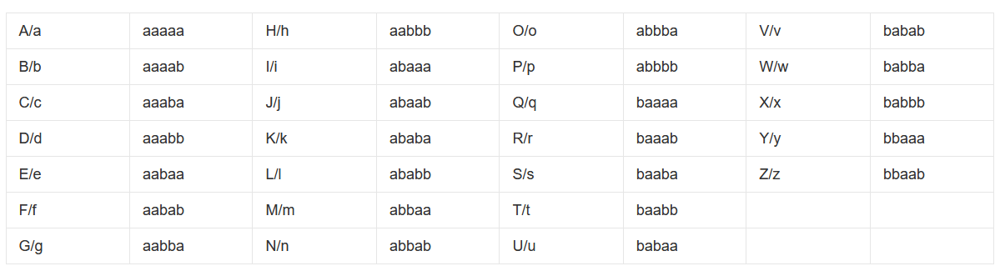

# 培根密码

培根密码，又名倍康尼密码（_Bacon's cipher_）  
加密时，明文中的每个字母都会转换成一组五个英文字母。其转换依靠下表：

这里的ab 只要是能区别成两类型的 都可以抽象为ab  
比如

**T**o e**n**code**a**mes**s**age e**a**ch letter**of**the**pl**a**i**nt**ex**t**i**s replaced b**y a g**rou**p of f**i**ve**of**th**e lett**ers'A'**o**r 'B'**

这段文本 把粗体当作 A 正常当作 B 可以解码出 `steganography`

想要解密 可以用 **Cyberchef**

## 来一串神秘字符

BABAAABBABBABAABAABAAABBBABAAABAAABABAAABAAABAAAABAAAAAAAABAABBABABBAA
