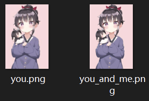
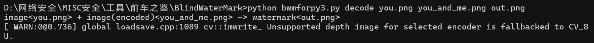
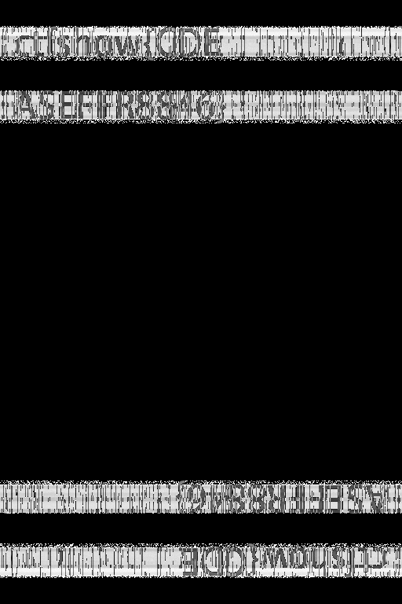

# 盲水印(两图型)

## 概念（百度给出）

盲水印是一种肉眼不可见的数字水印技术，用于在不影响原始媒体质量的情况下嵌入版权或身份信息，并可在无需原始文件的情况下提取验证。

有三个特性

- **隐蔽性**：水印不可见，不干扰用户体验，也不易被模仿

- **鲁棒性**：即使经过压缩、裁剪、旋转或涂改，水印仍可被提取

- **不易移除性**：即便被察觉，水印也难以被有意破坏或删除

其中 鲁棒性是指经过正常的传递、压缩 依旧能保持较好的强健性 不易丢失

而不易移除性指的是 攻击者刻意想要去除盲水印 使用涂改 裁切 擦除等方式 都难以去除盲水印的存在

理论上 盲水印可以作用于大部分图片类型 png jpeg webp bmp 甚至gif 理论上都可以嵌入盲水印

## 理论

将图片进行 **离散余弦 小波 **或者**傅里叶变换** 得到图片的频谱信息

再将水印的编码信息叠加到图片的频谱上 最后再进行一次逆变换

**离散余弦 小波 傅里叶变换** 这三种方式在盲水印上的作用几乎相同 都是将图片转化为频谱数据

只是底层算法不同 由于下面使用的工具的原理是傅里叶变换 所以这里以它为例子

傅里叶变换(FFT)会把图分解成基频、倍频的一系列正弦/余弦波

也就是把原本是像素数据的图片 转化成了各个频率的强度的数据

下文用到的工具的源码如下

```
f1 = np.fft.fft2(img)
```

接着把要隐写的盲水印叠加到转换得到的频谱上

由于这里是线性加法 所以也为盲水印的可逆打下基础

```Python
f2 = f1 + alpha * rwm
```

这里涉及到两个参数 `alpha` `rwm`

`alpha`(工具默认 3.0)就是水印强度 alpha数值越大 水印越明显 但对图片的损伤越大 隐蔽性就越差

`rwm` 就是处理过的水印图片（原水印图片叫wm） 处理过程放在理论的最下方 想了解可以看看

最后用傅里叶逆变换 将处理过的频谱重新还原成图片

```
_img = np.fft.ifft2(f2)     # 逆变换回空间域
img_wm = np.real(_img)      # 只取实部
cv2.imwrite("out.png", img_wm)  # 写出带隐形水印的成品图
```

这样就得到了嵌入盲水印的图片 out.png

既然知道了嵌入的原理 那么提取不过就是把这个路径逆着走一遍

同样的 第一步 先将有盲水印的图片用傅里叶变换转化为频谱数据

```
f2 = np.fft.fft2(img_wm)     # 带水印图频谱
```

我们的目标是得到rwm这个水印 那么根据刚刚的线性加法 我们必须先有原图片的频谱数值

这也是为什么盲水印的题目刚需原图片

```
f1 = np.fft.fft2(img)        # 原图频谱
rwm = (f2 - f1) / alpha      # 相减消掉原图,再除以alpha,水印信息被还原
```

这样就得到了处理过的水印图片的数值rwm

怎么处理wm的 就怎么逆向处理rwm

这样我们就得到了隐写的图片

水印wm的处理

```
h, w = img.shape[0], img.shape[1]

# 1) 画一块“高为原图一半、宽全宽”的空白画布,把水印放到左上角
hwm  = np.zeros((int(h*0.5), w, img.shape[2]))
hwm2 = np.copy(hwm)
for i in range(wm.shape[0]):
    for j in range(wm.shape[1]):
        hwm2[i][j] = wm[i][j]          # 水印像素填进左上角区域

# 2) 用 seed 把这块画布的行、列顺序随机打乱(信息散开)
random.seed(seed)
m, n = list(range(hwm.shape[0])), list(range(hwm.shape[1]))
random.shuffle(m); random.shuffle(n)
for i in range(hwm.shape[0]):
    for j in range(hwm.shape[1]):
        hwm[i][j] = hwm2[m[i]][n[j]]   # 水印被打散、铺满整个上半区

# 3) 把上半区“镜像”到下半区,得到与原图同尺寸的 rwm
rwm = np.zeros(img.shape)
for i in range(hwm.shape[0]):
    for j in range(hwm.shape[1]):
        rwm[i][j] = hwm[i][j]
        rwm[rwm.shape[0]-i-1][rwm.shape[1]-j-1] = hwm[i][j]
```

`seed` 是除 `alpha` 外的第二个参数 工具默认 `seed=20160930`

## 工具

工具名为 **BlindWaterMark**[github网址](https://github.com/chishaxie/BlindWaterMark#blindwatermark)

注意工具需要python包依赖 需要自己手动安装

工具的使用说明在 README 写的很详细 这里就简单写写做题时常用的命令

从python3版本嵌入的图片中提取盲水印

```
# 使用默认参数 alpha=3.0 seed=20160930
python bwmforpy3.py decode <原图.png> <嵌入盲水印的图片.png> <提取结果.png>

# 设置 alpah
python bwmforpy3.py decode <原图.png> <嵌入盲水印的图片.png> <提取结果.png> --alpha <float数值>

# 设置 seed
python bwmforpy3.py decode <原图.png> <嵌入盲水印的图片.png> <提取结果.png> --seed <int数值>
```

从python2版本嵌入的图片中提取盲水印

```
# 使用默认参数 alpha=3.0 seed=20160930
python bwm.py decode <原图.png> <嵌入盲水印的图片.png> <提取结果.png>
或者
python bwmforpy3.py decode <原图.png> <嵌入盲水印的图片.png> <提取结果.png> --oldseed

# 设置 alpah
python bwm.py decode <原图.png> <嵌入盲水印的图片.png> <提取结果.png> --alpha <float数值>
或者
python bwmforpy3.py decode <原图.png> <嵌入盲水印的图片.png> <提取结果.png> --alpha <float数值> --oldseed

# 设置 seed
python bwm.py decode <原图.png> <嵌入盲水印的图片.png> <提取结果.png> --seed <int数值>
或者
python bwmforpy3.py decode <原图.png> <嵌入盲水印的图片.png> <提取结果.png> --seed <int数值> --oldseed
```

当然 `alpha` 和 `seed` 这两个参数也可以一起使用

## 例题

[题目地址](https://ctf.show/challenges) 进去后在菜狗杯检索题目名即可

**题目名称：**You and me

**工具：**BlindWaterMark

拿到附件 解压 两张png图片



根据图片名 `you` `you_and_me` 猜测第二张图片相较第一个文件嵌入了什么内容

由于存在原图片 符合盲水印解密的特征 所以猜测是盲水印

对图片简单分析 没有检索到alpha和seed的数值 所以猜测用工具默认的alpha和seed即可

将两张图片移动到工具目录下 先试试是不是python3 提取

```
python bwmforpy3 decode you.png you_and_me.png out.png
```



查看得到的out.png



取得flag flag为

ctfshow{CDEASEFFR8846}
