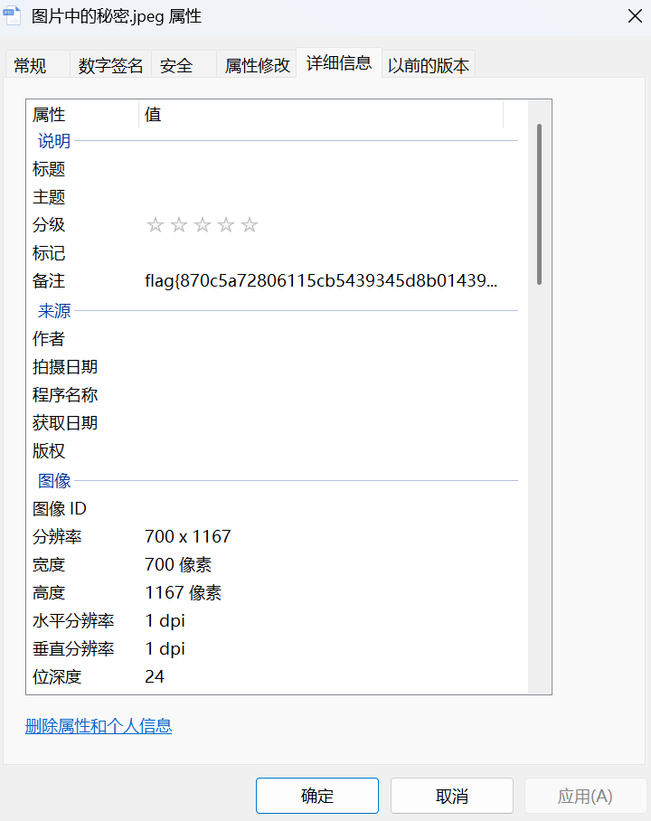

# 基础破解

**题目描述**：小明经常喜欢在文件中藏一些秘密。时间久了便忘记了，你能帮小明找到该文件中的秘密吗？注意：得到的 flag 请包上 flag{} 提交  
**工具**：无

拿到附件 解压 发现里面是一张jpeg图片

根据题目描述 信息藏在文件里 所以先看看属性

在备注里发现flag 复制 取得flag flag为  
`flag{870c5a72806115cb5439345d8b014396}`
