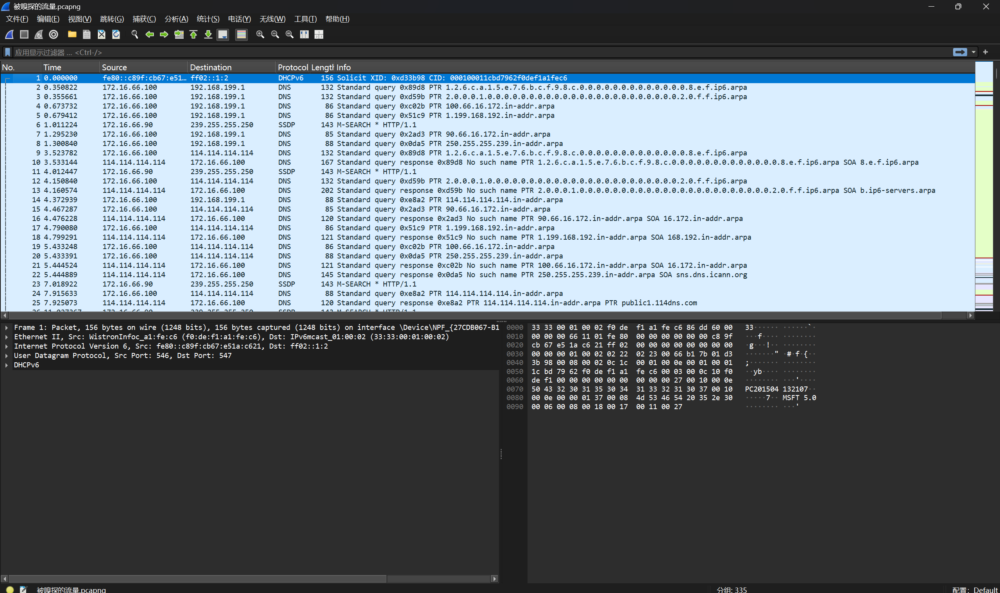
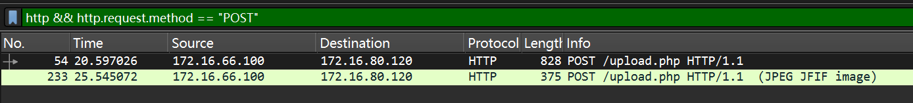
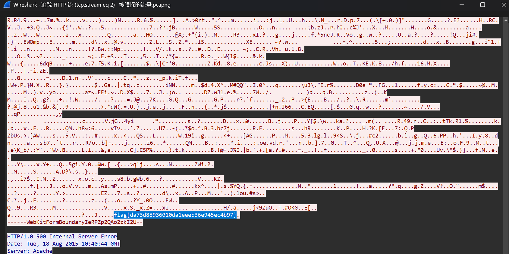

# 被嗅探的流量

**题目描述**：某黑客潜入到某公司内网通过嗅探抓取了一段文件传输的数据，该数据也被该公司截获，你能帮该公司分析他抓取的到底是什么文件的数据吗？注意：得到的 flag 请包上 flag{} 提交  
**工具**：Wireshark

拿到附件 解压 发现里面是一个pcapng文件

那就需要用 **Wireshark** 打开

根据题目描述 我们知道需要找文件传输的数据 既然文件要传输 那就需要 POST  
在显式过滤器中输入过滤语句

发现有两个包 它们都访问/upload.php  
upload是上传文件 可疑 一个包标明了传输的是JPEG图片 右键查看http流

在JPEG源码的末端发现flag 取得flag flag为  
`flag{da73d88936010da1eeeb36e945ec4b97}`
