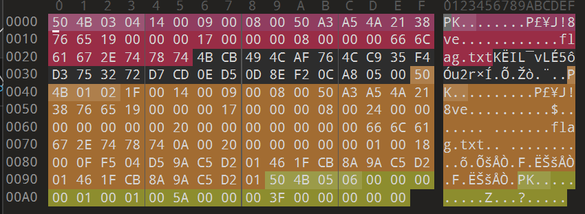
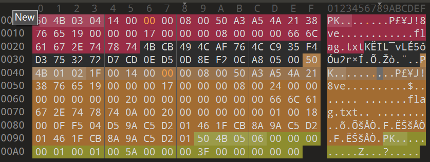
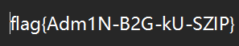

# zip伪加密

**题目描述**：注意：得到的 flag 请包上 flag{} 提交  
**工具**：010Editor

拿到附件 解压 发现要密码  
根据题目描述 这个加密是假的 用 **010Editor** 打开

根据zip加密的知识 知道重点应该放在 **压缩源文件数据区**（红色部分）与 **压缩源文件目录区**（黄色部分）的  
`50 4B`后的 `14 00`后的数据 即`09 00`上  
若数据为 `09 00` 则为加密 `00 00`则没有加密

> ps: 根据查到的资料 应该 **压缩源文件数据区** 为 `00 00` **压缩源文件目录区** 为 `09 00` 才是伪加密  
> 按资料上 两个都是 `09 00` 应该是真加密 但是题目上明确表示是伪加密 所以这里把两个都给改成 `00 00`

保存 再直接打开

`flag.txt` 中有flag 取得flag flag为  
`flag{Adm1N-B2G-kU-SZIP}`
