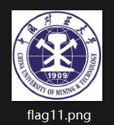
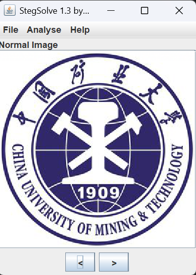
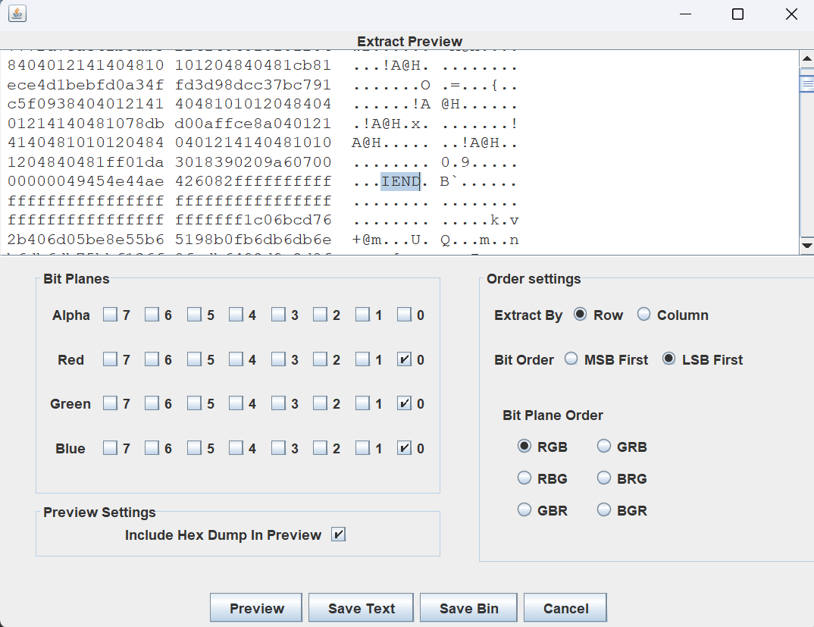
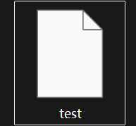
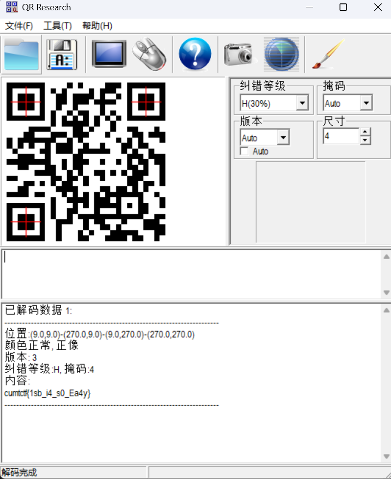

# LSB

**题目描述**：注意：得到的 flag 请包上 flag{} 提交  
**工具**：Stegsolve Firefox QR_Research

拿到附件 解压 发现里面是一张png图片

由于是png文件 且题目基本明示是 **LSB加密** 所以用 **Stegsolve** 打开

检查一下所有轨道 看起来没什么问题 那就点 `Analyse` `Data Extract`  
勾选 `LSB first` 将 `RED` `GREEN` `BULE` 都勾选成 0 点 `Preview`

Row 和 Column 都试试 没发现什么  
不过发现了PNG文件的结束符 `IEND` 后还有一大串内容 可能藏了个文件？试着保存一下  
按 `Save bin` 保存成二进制文件

没有后缀名 试着找个能解析二进制文件的软件打开 这里用的 **Firefox** 浏览器

发现是个二维码png文件 把文件后缀改成png 用 **QR_Research** 扫一下

扫出来就是flag 复制 将 `cumtctf` 改为 `flag` 取得flag flag为  
`flag{1sb_i4_s0_Ea4y}`
