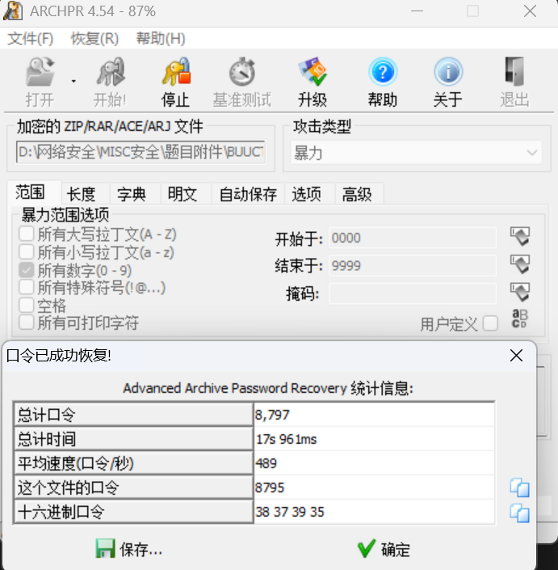

# rar

**题目描述**：这个是一个rar文件，里面好像隐藏着什么秘密，但是压缩包被加密了，毫无保留的告诉你，rar的密码是4位纯数字。注意：得到的 flag 请包上 flag{} 提交  
**工具**：ARCHPR

拿到附件 解压 发现里面是一个rar文件

试着打开 发现要密码  
根据题目描述 我们知道密码是四位纯数字 这里用 **ARCHPR** 爆破  
设置为 勾选 **所有数字(0-9)** 从0000到9999

密码是 8795 打开压缩包 里面有 flag.txt 打开

复制 取得flag flag为  
`flag{1773c5da790bd3caff38e3decd180eb7}`
