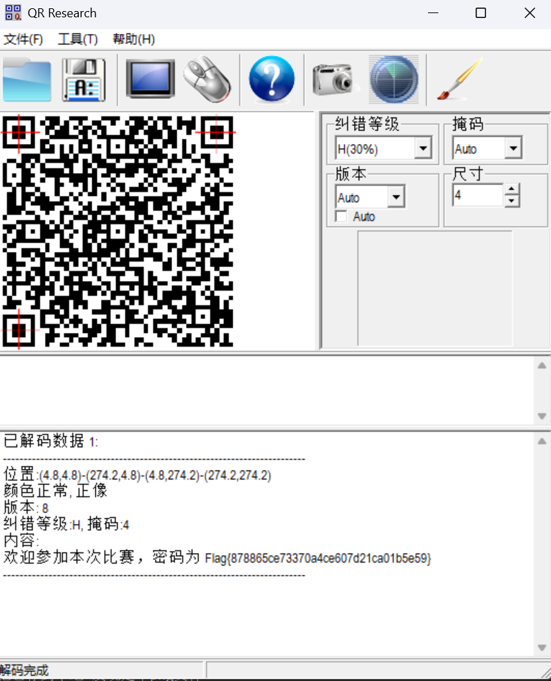

# qr

**题目描述**：这是一个二维码，谁用谁知道！注意：得到的 flag 请包上 flag{} 提交  
**工具**：QR_Research

点击附件 发现是个二维码 把它存到本地 发现是个png文件

用 **QR_Research** 扫一下

扫出了flag 复制 将 `Flag` 改为 `flag` 取得flag flag为  
`flag{878865ce73370a4ce607d21ca01b5e59}`
