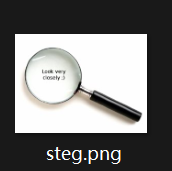
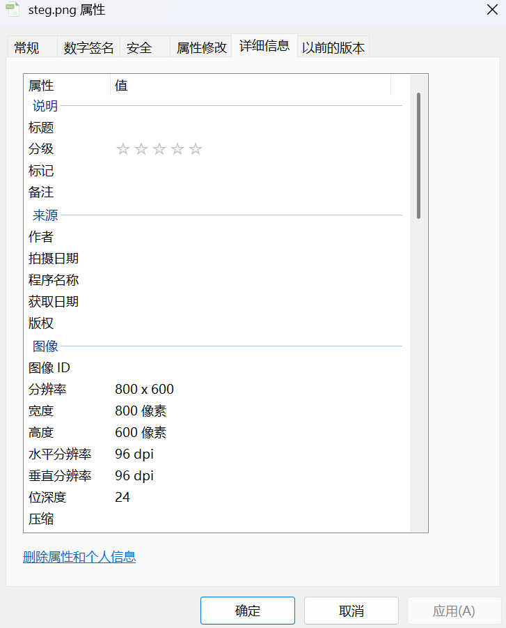
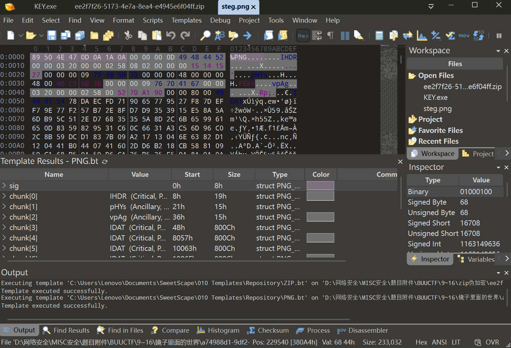
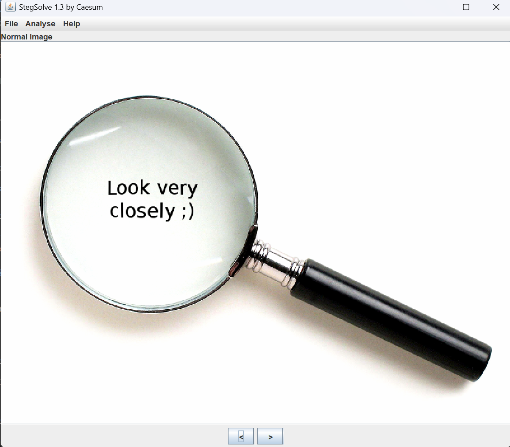
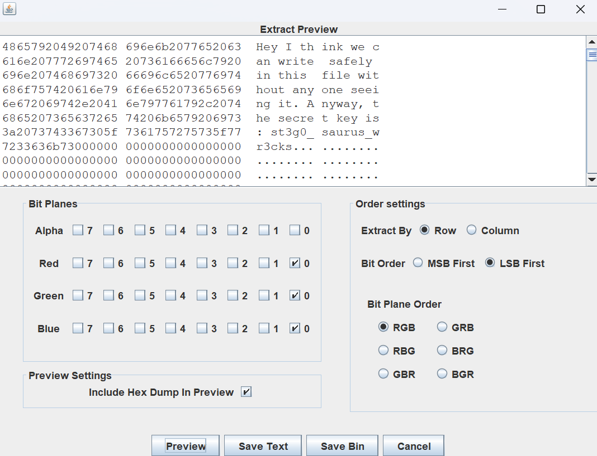

# 镜子里面的世界

**题目描述**：注意：得到的 flag 请包上 flag{} 提交  
**工具**：Stegsolve

拿到附件 解压 发现里面是一张png图片

图片上写着 `"look very closely;)"`  
先看看属性吧

空的 那用 **010Editor** 看看

好像也看不出个啥 但是还是觉得怪怪的 可能因为数据量很大？  
总之先不着急关页面 用 **Stegsolve** 看看

检查一下所有轨道 看不出啥 试试是不是LSB 设置一下 看看

虽然不是flag 但是有线索  
`Hey I think we can write safely in this file without any one seeing it. Anyway, the secret key is : st3g0_saurus_wr3cks`  
大致就是给了个密钥 `st3g0_ saurus_wr3cks`

这个会不会就是flag？ 套个 `flag{}`试试

过了 还真是 取得flag flag为  
`flag{st3g0_saurus_wr3cks}`
