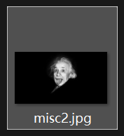
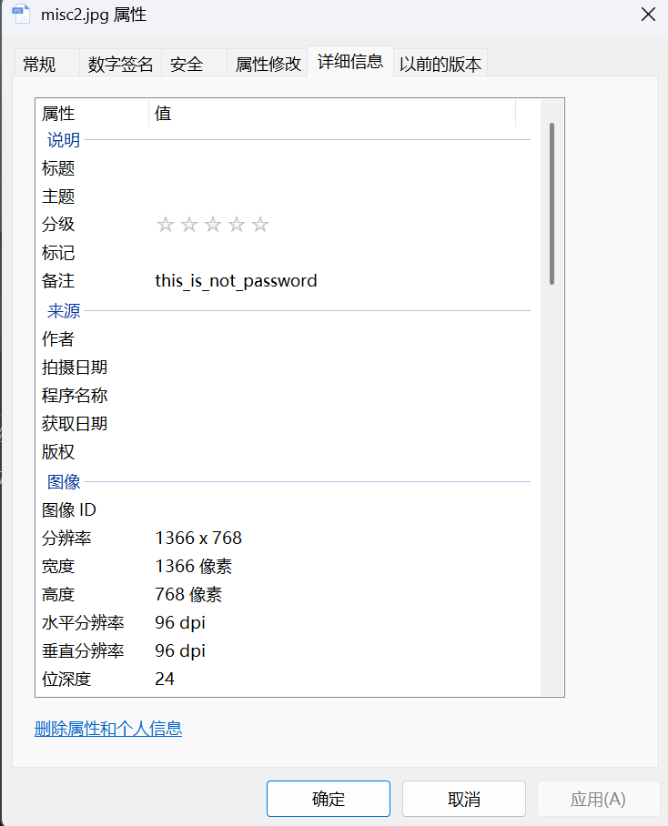
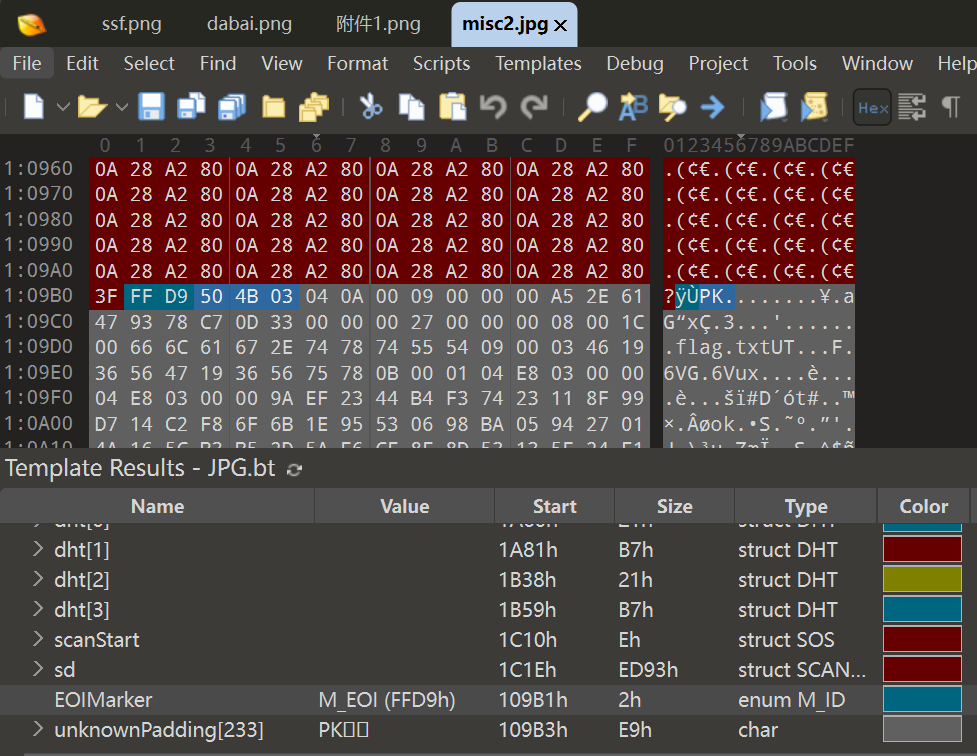
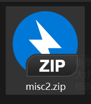
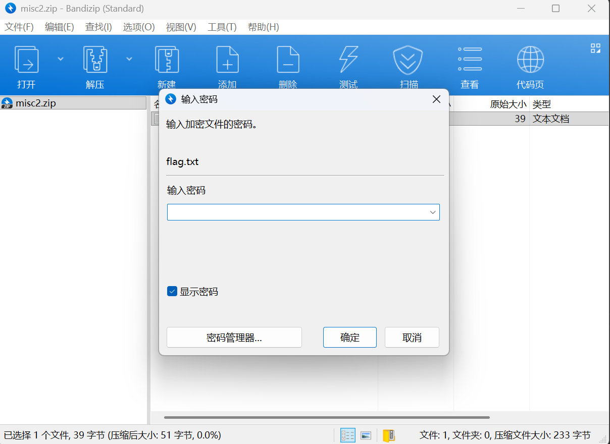
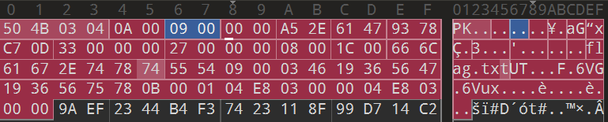
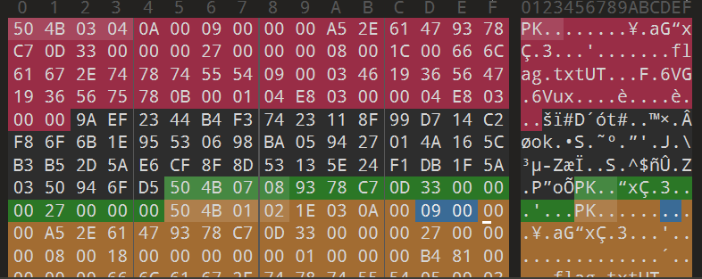
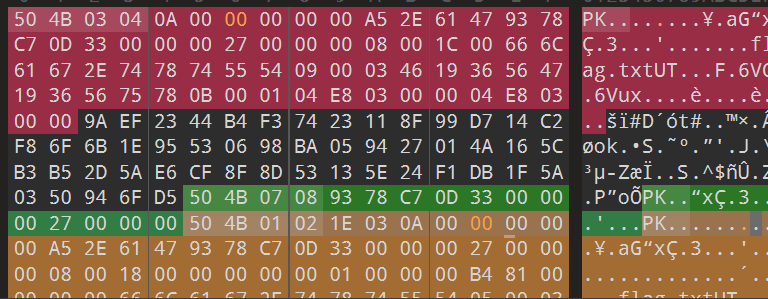
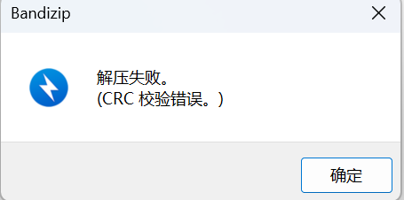
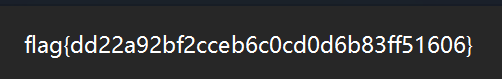

# 爱因斯坦

**题目描述**：注意：得到的 flag 请包上 flag{} 提交  
**工具**：010Editor

拿到附件 发现是个jpg图片

没啥提示 看看属性先

备注说 `this_is_not_password`

那用 **010Editor** 看一看 没啥信息的话就考虑jpg文件的隐写

发现 jpg文件的结束标志 `ÿÙ` 后还有内容  
且是 `PK` 开头 说明这个内容是zip压缩包  
把 `PK` 前面的内容删了 保存 将文件名后缀改成 `.zip`

发现里面有个 flag.txt 尝试打开 发现需要密码

那就检查一下是真加密还是伪加密 用010再看一眼

**压缩源文件数据区**（红色部分）与 **压缩源文件目录区**（黄色部分）都为 `09 00`  
可以默认是加密的 但是目前也没啥关于密码的线索 不如试试把它先当成伪加密

把两个 `09 00` 改成 `00 00` 保存

嗯CRC报错了 证明确实加密了 之前备注获取到个信息 自称"不是密码"  
把jpg隐写当成保底 把这个 `this_is_not_password` 当密码填上去试试

666真出了 好一个不是密码 真服了......  
复制 取得flag flag为  
`flag{dd22a92bf2cceb6c0cd0d6b83ff51606}`
