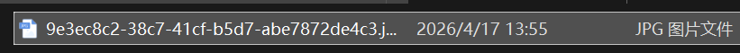
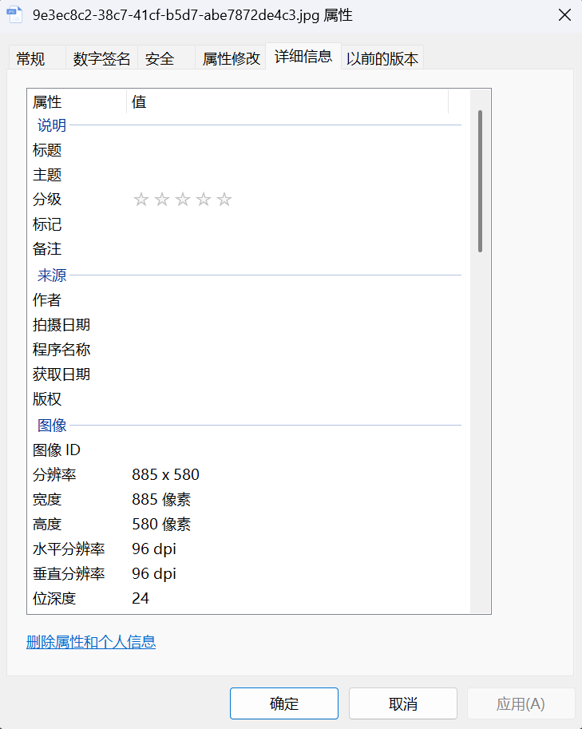
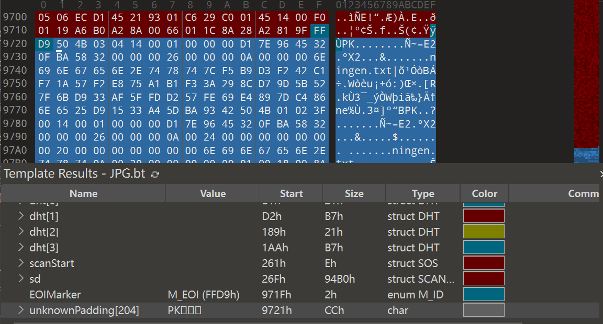
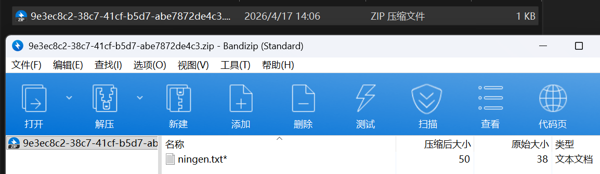
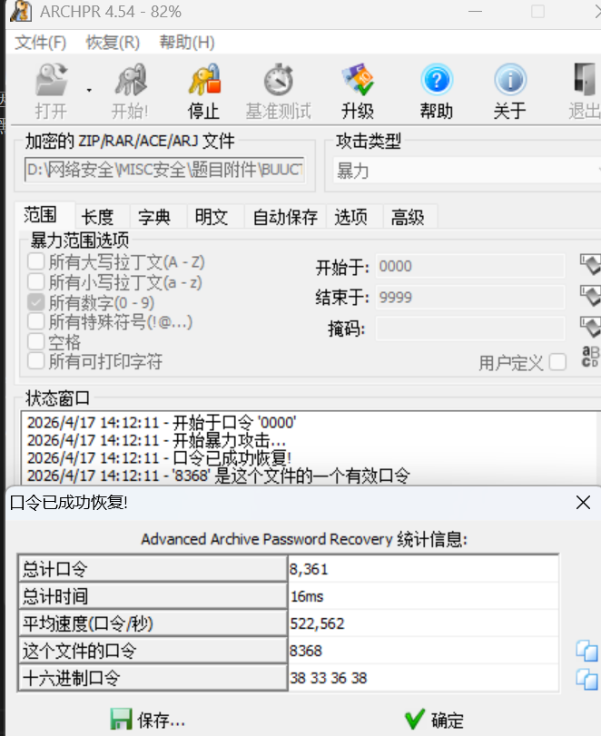
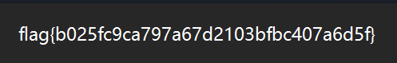

# ningen

**题目描述**：人类的科学日益发展，对自然的研究依然无法满足，传闻日本科学家秋明重组了基因序列，造出了名为ningen的超自然生物。某天特工小明偶然截获了日本与俄罗斯的秘密通信，文件就是一张ningen的特写，小明通过社工，知道了秋明特别讨厌中国的六位银行密码，喜欢四位数。你能找出黑暗科学家秋明的秘密么？注意：得到的 flag 请包上 flag{} 提交  
**工具**：010Editor ARCHPR

拿到附件 发现是张jpg图片

先看看属性

没什么信息 根据题目描述 大致可以猜到这里面藏着一个需要4位数字密码解锁的文件  
可能藏着压缩包？ 试试 **010Editor** 打开

发现 jpg文件 的结束标志 `ÿÙ` 后还有内容 且为 `PK` 开头  
可知这里藏了一个zip压缩包 把 `PK` 前的内容删除 保存 将文件后缀改为 `.zip`

发现压缩包里有个 `ningen.txt` 试着打开 发现需要密码  
根据题目描述 可以确定是四位数字密码 直接用 **ARCHPR** 爆破

设置参数为 所有数字 0000~9999 开始爆破

密码为8368 解锁压缩包 打开 `ningen.txt`

复制 取得flag flag为  
`flag{b025fc9ca797a67d2103bfbc407a6d5f}`
