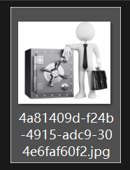
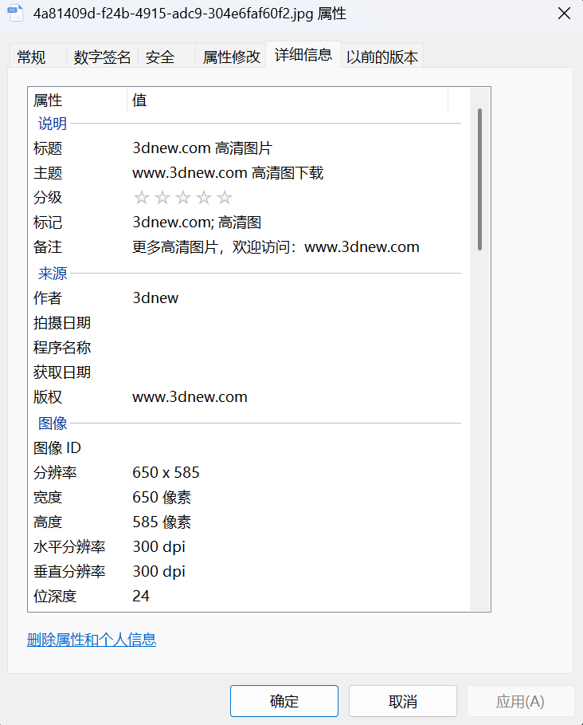
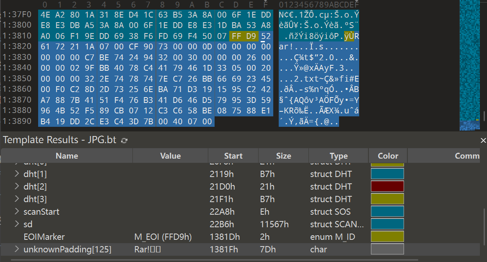
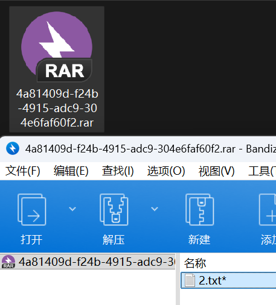
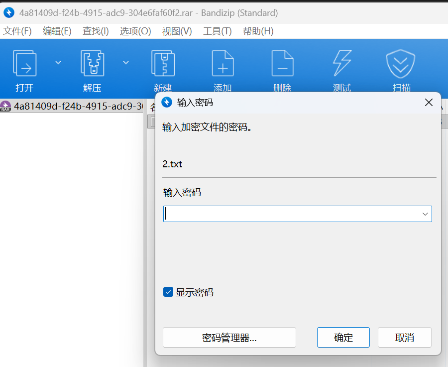
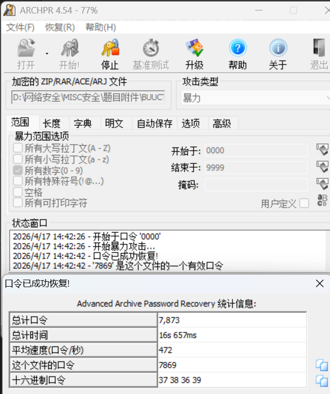
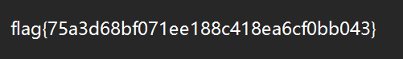

# 小明的保险箱

**题目描述**：小明有一个保险箱，里面珍藏了小明的日记本，他记录了什么秘密呢？。。。告诉你，其实保险箱的密码四位纯数字密码。（答案格式：flag｛答案｝，只需提交答案）注意：得到的 flag 请包上 flag{} 提交  
**工具**：010Editor ARCHPR

拿到附件 发现是个jpg图片

先看看属性

emmm 这个算信息吗 保险起见 访问看看吧

额 那还是先不看了吧

根据题目描述 应该还是要考虑四位数字密码爆破 先用 **010Editor** 看看文件结构吧

发现 jpg文件 的结束标志 `ÿÙ` 后还有内容 且为 `Rar` 开头  
说明这里藏了一个 rar压缩包

把 `Rar` 前的内容都删除 保存 改后缀为 `.rar`

发现里面有个 `2.txt` 尝试打开 发现有密码

根据题目描述 四位纯数字密码 还是直接用 `ARCHPR` 爆破即可  
设置参数为 所有数字 0000~9999 开始爆破

密码为7869 解锁压缩包 打开 `2.txt`

复制 取得flag flag为  
`flag{75a3d68bf071ee188c418ea6cf0bb043}`
