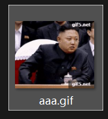
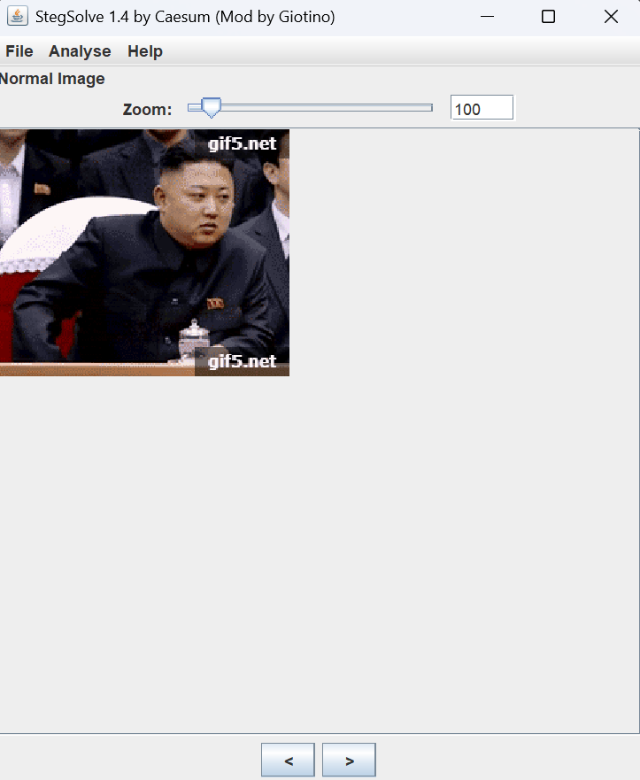
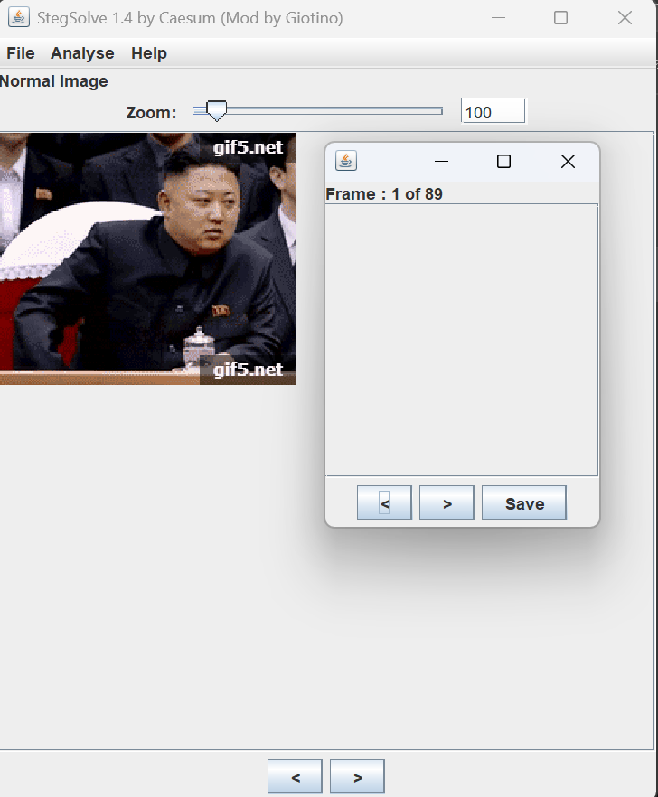
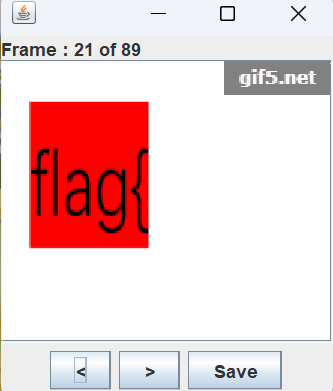
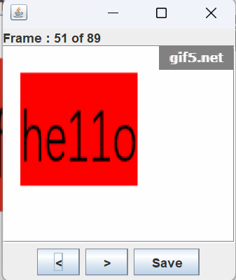
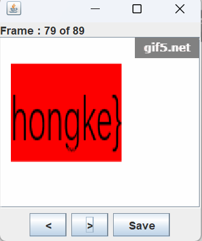

# 金三胖

**题目描述**：注意：得到的 flag 请包上 flag{} 提交  
**工具**：Stegsolve

拿到附件 解压 发现里面是一张gif图片

图片在播放时 时不时闪现红色的字符  
所以试着一帧一帧观看图片闪现的内容

**Stegsolve** 可以做到这一点 我们用它打开图片

点击 `Analyse` 再点击 `Frame Browser` 可以逐帧查看图片

？一片空白  
查了一下好像是版本兼容的问题 所以又去装了1.3版本

拼接 **21 51 79** 这三帧的内容 取得flag flag为  
`flag{he11ohongke}`
