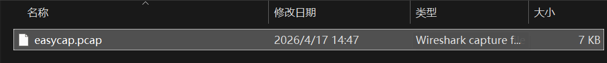
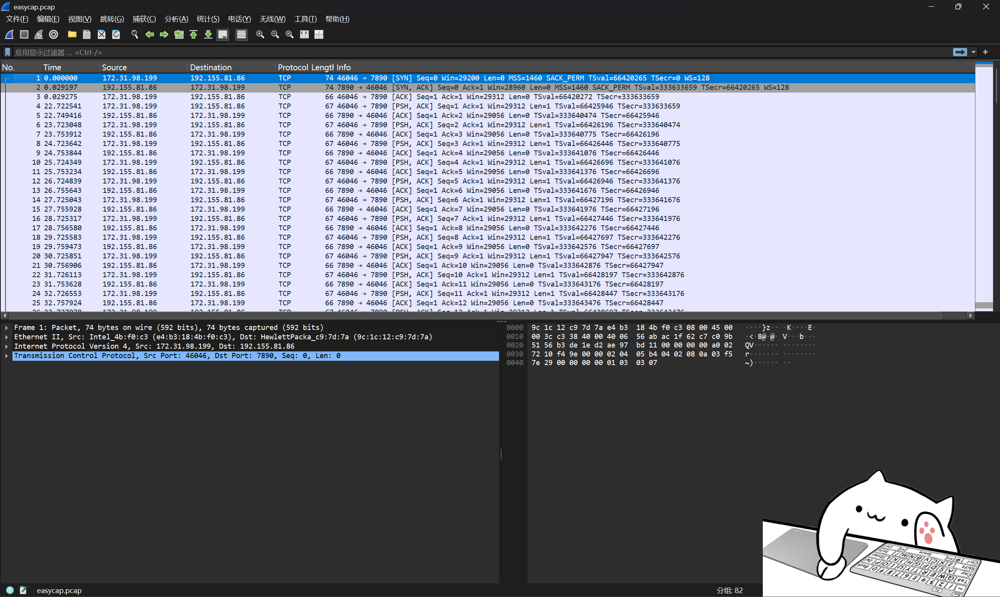
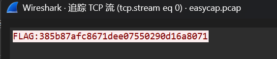

# easycap

**题目描述**：注意：得到的 flag 请包上 flag{} 提交  
**工具**：Wireshark

拿到附件 解压 发现是个 pcap文件

那就要用到 **Wireshark**

现在的问题在于 题目描述啥也没有 我们不知道要抓什么  
点了点也没什么头绪 倒是发现全是TCP协议 试试追踪一下TCP流

额 出了？ 其实没看懂这题目想干嘛 但是总之flag有了  
复制 套上一层 `flag{}` 取得flag flag为  
`flag{385b87afc8671dee07550290d16a8071}`
