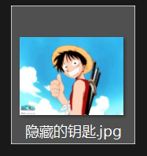
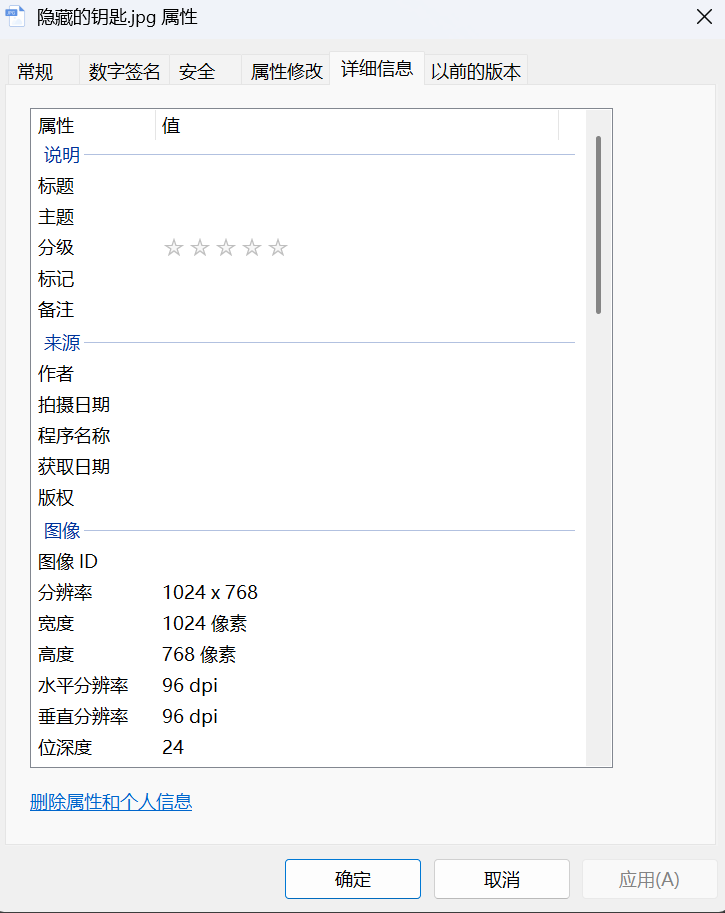
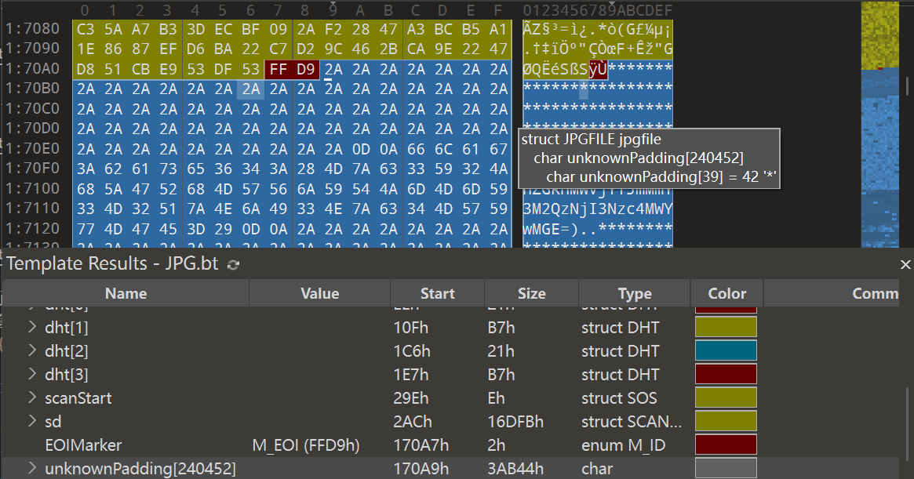
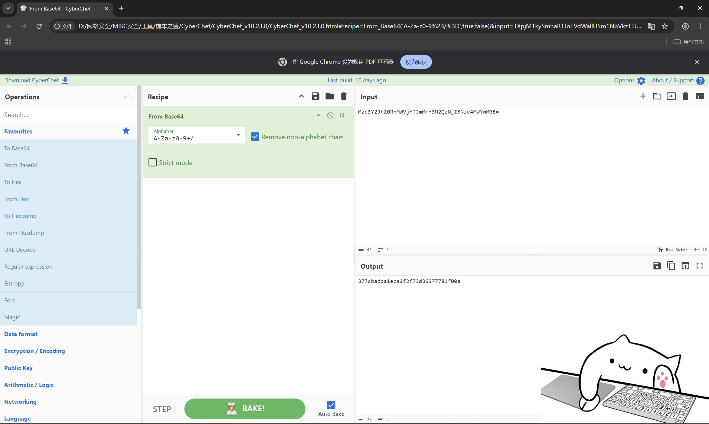

# 隐藏的钥匙

**题目描述**：路飞一行人千辛万苦来到了伟大航道的终点，找到了传说中的One piece，但是需要钥匙才能打开One Piece大门，钥匙就隐藏在下面的图片中，聪明的你能帮路飞拿到钥匙，打开One Piece的大门吗？注意：得到的 flag 请包上 flag{} 提交  
**工具**：010Editor Cyberchef

拿到附件 解压 发现是一张jpg图片

看看属性

好 啥也没有 那就用 **010Editor** 看看文件结构

发现 jpg文件 的结束标志 `ÿÙ` 后还有内容 看起来和flag有关 还是 base64编码 的  
`flag:base64:(Mzc3Y2JhZGRhMWVjYTJmMmY3M2QzNjI3Nzc4MWYwMGE=)`

用 **Cyberchef** 解码看看 拖入 `From base64` 在 Input框 中输入  
`Mzc3Y2JhZGRhMWVjYTJmMmY3M2QzNjI3Nzc4MWYwMGE=`

复制 Output框 中的内容 试试是不是flag 套上 `flag{}` 提交看看

正确 取得flag flag为  
`flag{377cbadda1eca2f2f73d36277781f00a}`
