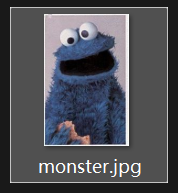
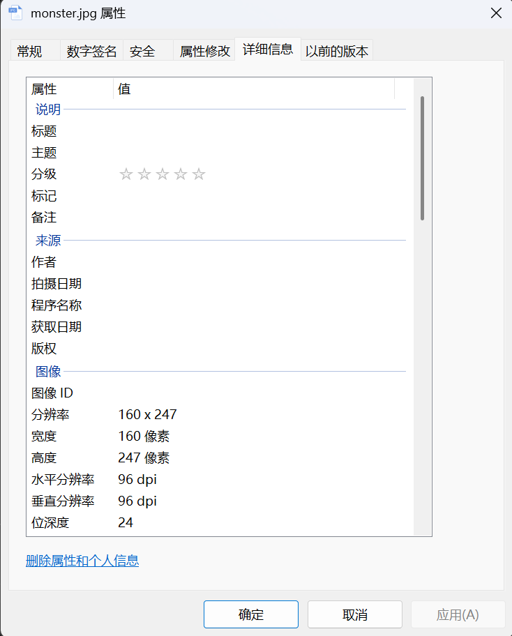
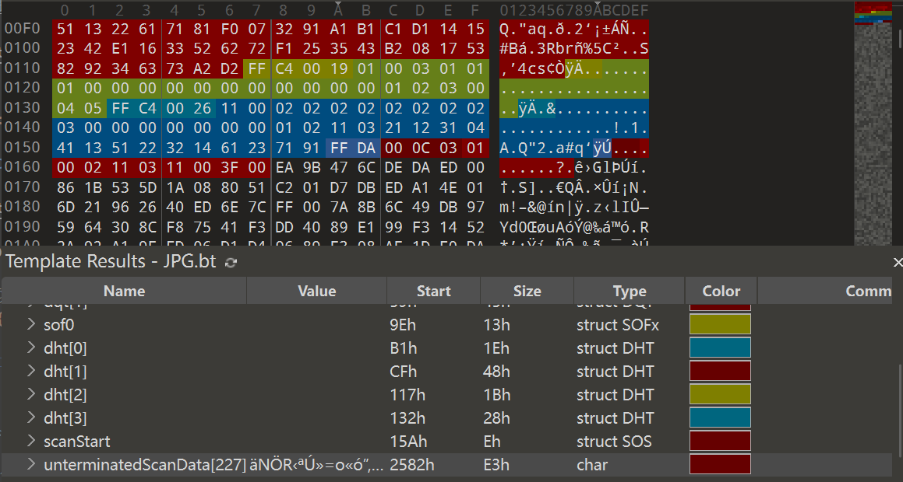
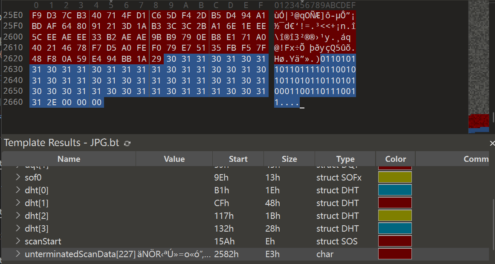
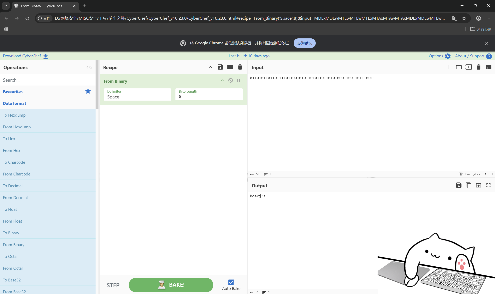

# 另外一个世界

**题目描述**：注意：得到的 flag 请包上 flag{} 提交  
**工具**：010Editor Cyberchef

拿到附件 解压 发现里面是一张jpg图片

看看属性

啥也没有 那就还是用 **010Editor** 看看文件结构

看不太明白 往后面翻试试

发现一段二进制  
复制 用 **Cyberchef** 解密看看 拖入 `From Binary` 在 Input框 中输入  
`01101011011011110110010101101011011010100011001101110011`

复制 Output框 中的内容 试试是不是flag 套上 `flag{}` 提交看看

正确 取得flag flag为  
`flag{koekj3s}`
