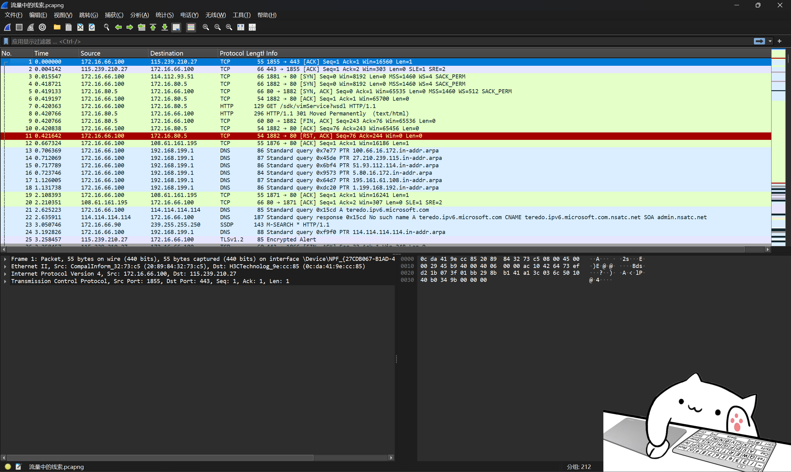
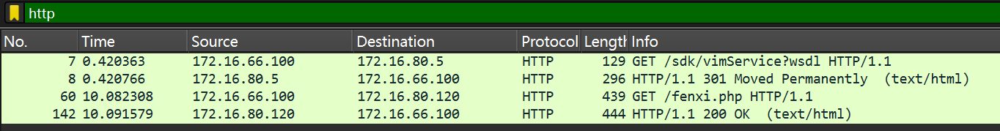
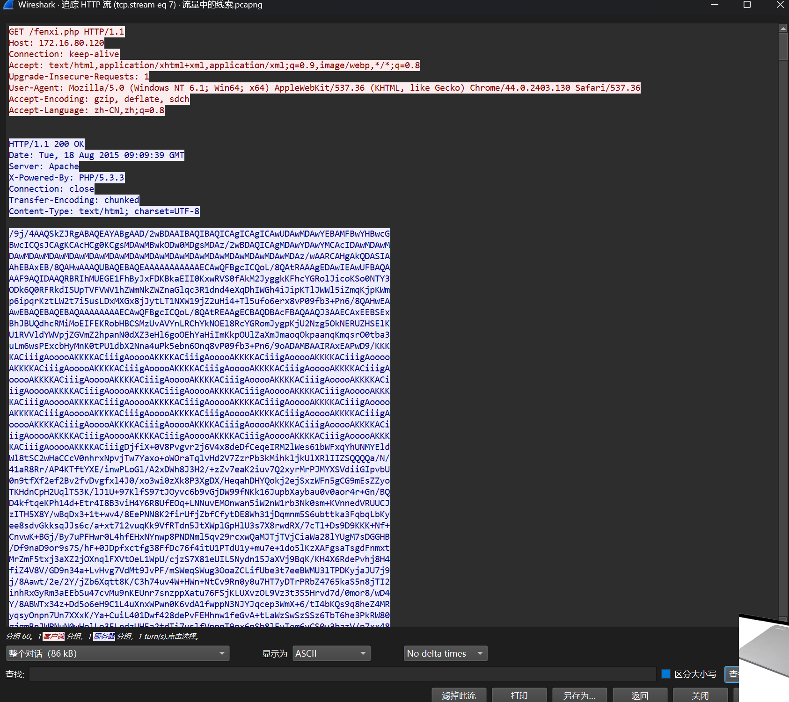
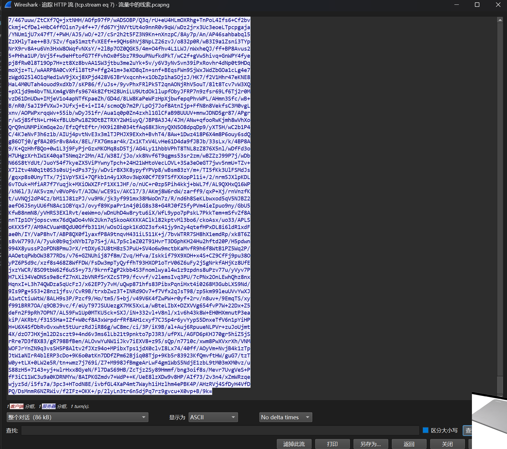
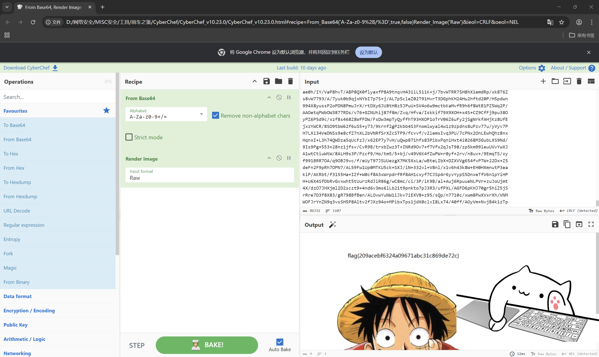

# 数据包中的线索

**题目描述**：公安机关近期截获到某网络犯罪团伙在线交流的数据包，但无法分析出具体的交流内容，聪明的你能帮公安机关找到线索吗？注意：得到的 flag 请包上 flag{} 提交  
**工具**：Wireshark Cyberchef

拿到附件 解压 发现是个 pacpng文件

那就用 **Wireshark** 打开

根据题目描述 这是犯罪团伙之间在线交流的内容  
我们试着筛选出使用 http协议 的流量包 在 显式过滤器 输入 `http`

发现四个包 一个包去了vim服务器 一个301重定向 一个是php网页 `fenxi.php` 一个是 `test/html` 网页  
个人认为 php网页嫌疑最大 先追踪它的http流

一大坨 往下翻翻

确认下特征 大小写字母 数字 还有/与= 大概率是base64编码  
复制 用 **Cyberchef** 解码试试 `From Base64` 再后面的操作都一样 省略

发现解码出来是张图片 上面写着flag  
记下来 取得flag flag为  
`flag{209acebf6324a09671abc31c869de72c}`
