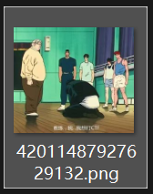
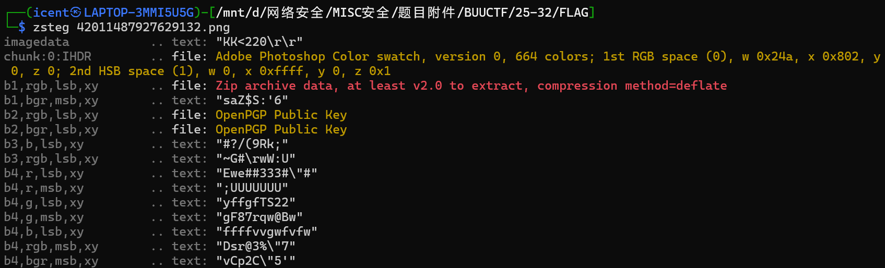
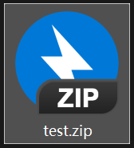
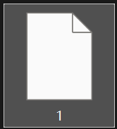
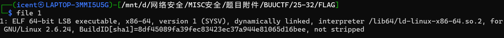
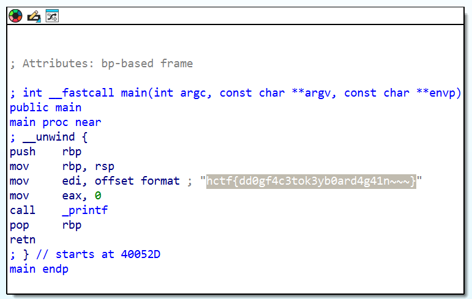

# FLAG

**题目描述**：感谢 牌森 同学提供题目~  
注意：请将 hctf 替换为 flag 提交，格式 flag{}  
**工具**：zsteg IDA

拿到附件 png图片

属性找到东西 010没找到东西 试试LSB

**zsteg** 发现隐写了zip

提取出来

解压

`file` 查看文件类型

ELF文件 **IDA** 打开

汇编代码里写了flag 根据题目描述 改成`flag{}`  
复制 取得flag flag为  
`flag{dd0gf4c3tok3yb0ard4g41n~~~}`
