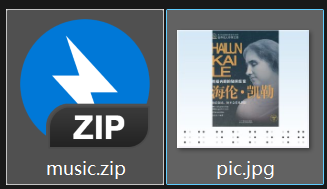
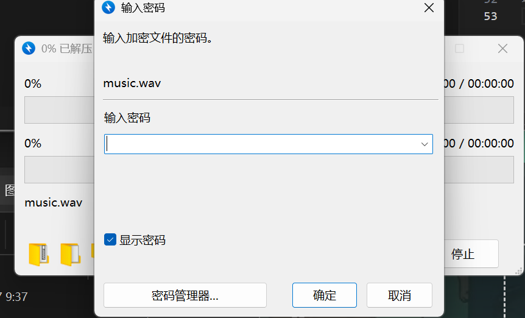
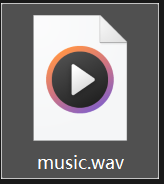
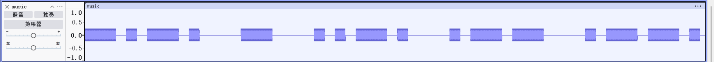
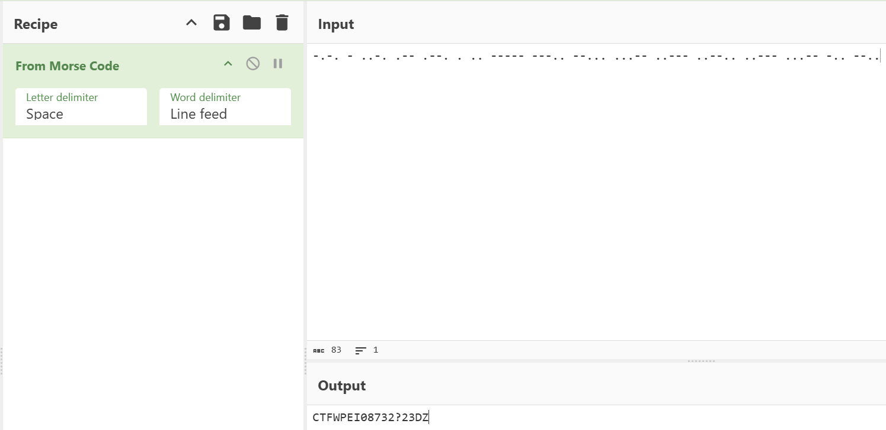

# 假如给我三天光明

**题目描述**：注意：得到的 flag 请包上 flag{} 提交  
**工具**：Audacity Cyberchef

拿到附件 一个zip一个jpg  
尝试解压zip 发现要密码

png图片下面有盲文

翻译过来是 kmdonowg 应该是密码 解压zip

得到一个wav音频 一听就是莫斯密码  
**Audacity** 打开

`-.-. - ..-. .-- .--. . .. ----- ---.. --... ...-- ..--- ..--.. ..--- ...-- -.. --..`

**Cyberchef** 解码

得到 `CTFWPEI08732?23DZ`

这里交flag一直不对 看了别人wp 交的是 `flag{wpei08732?23dz}`  
没招了flag形式卡了我半天
