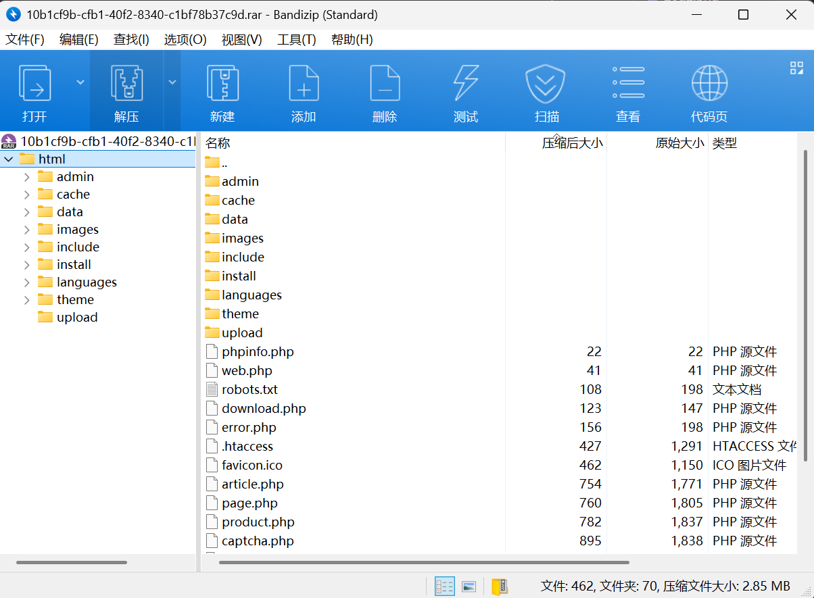
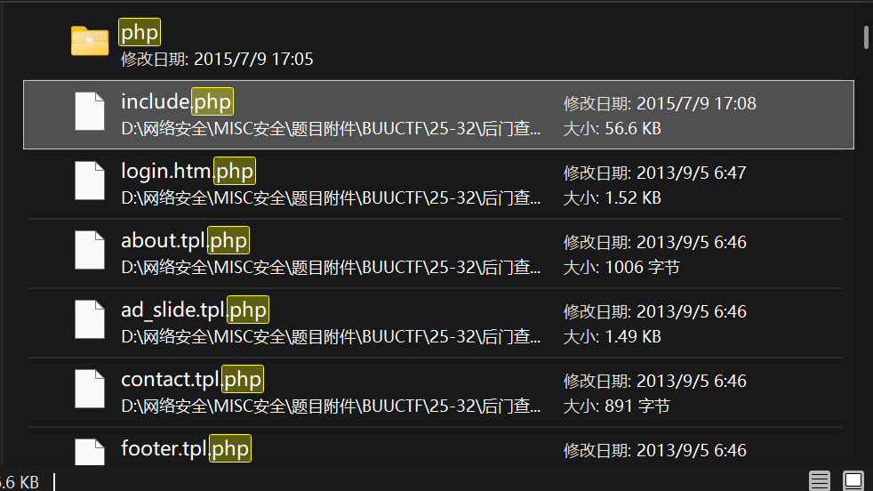
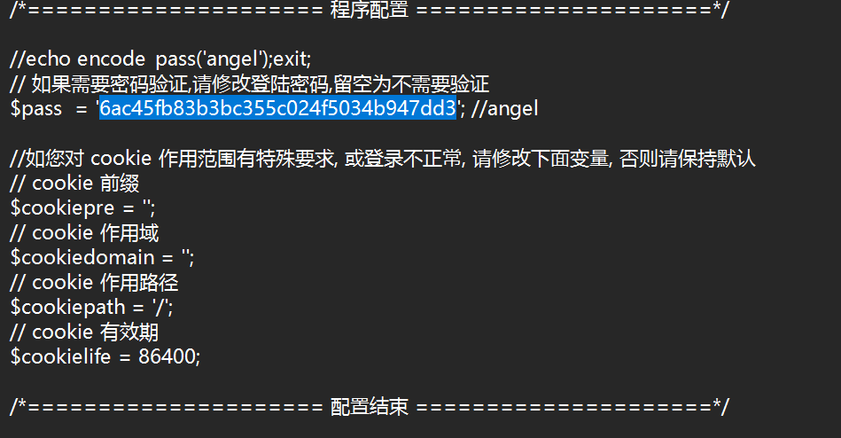

# 后门查杀

**题目描述**：小白的网站被小黑攻击了，并且上传了Webshell，你能帮小白找到这个后门么？(Webshell中的密码(md5)即为答案)。注意：得到的 flag 请包上 flag{} 提交  
**工具**：

拿到附件 东西不少

根据题目描述 被传马了 文件上传 可以看看upload

有个压缩包 解压

得到一个word文件 打开 试试 `Ctrl+a` 全选 看看有没有隐藏文本  
好的并没有

这里对word找了好一会 没什么东西 可能得换个思路  
传马本质会上传一个文件 一般是php 我们直接搜php

include 是一个危险函数 这个名字有点可疑 可以看看

有了 取得flag flag为  
`flag{6ac45fb83b3bc355c024f5034b947dd3}`

二编：做完看别人wp 发现都是D盾扫的 我是原始人
