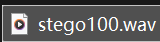
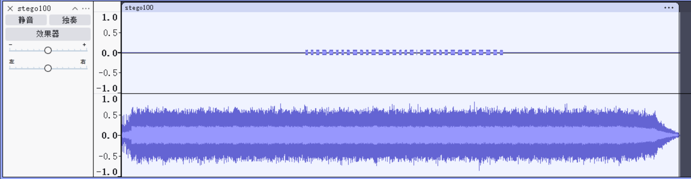
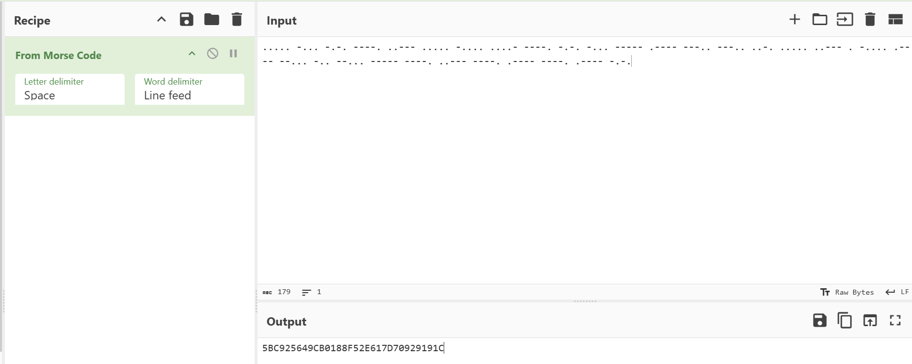

# 来首歌吧

**题目描述**：注意：得到的 flag 请包上 flag{} 提交  
**工具**：Audacity

拿到附件 wav音频

立体声 可能声道有端倪 **Audacity** 看看

左声道有东西 是摩斯密码 记下来

`..... -... -.-. ----. ..--- ..... -.... ....- ----. -.-. -... ----- .---- ---.. ---.. ..-. ..... ..--- . -.... .---- --... -.. --... ----- ----. ..--- ----. .---- ----. .---- -.-.`

取得flag flag为  
`flag{5BC925649CB0188F52E617D70929191C}`
