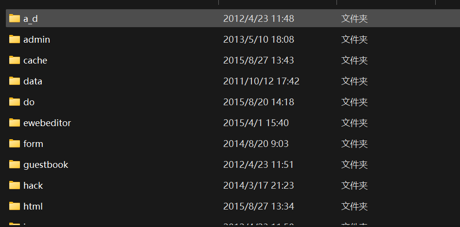
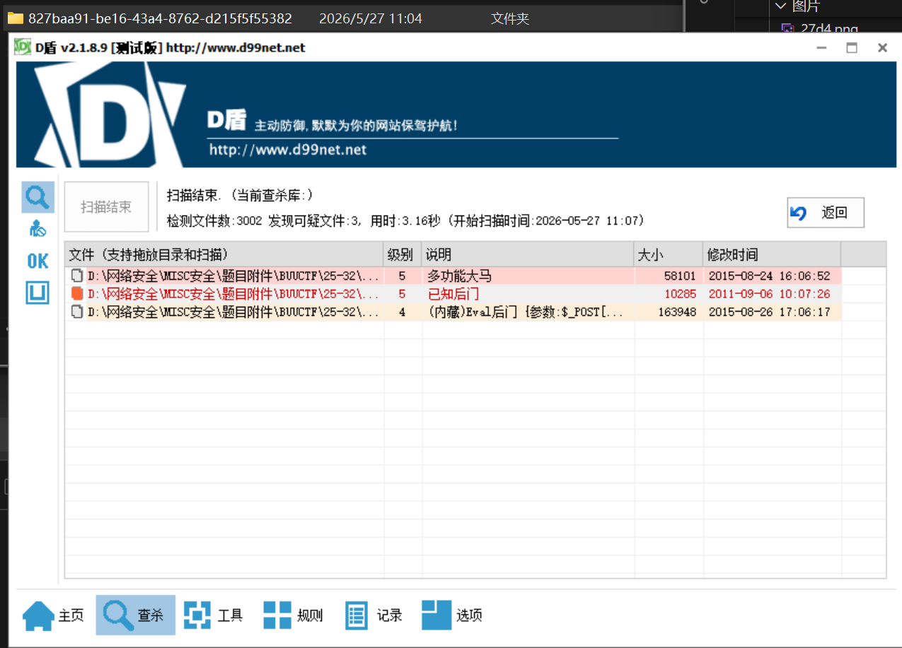

# webshell后门

**题目描述**：朋友的网站被黑客上传了webshell后门，他把网站打包备份了，你能帮忙找到黑客的webshell在哪吗？(Webshell中的密码(md5)即为答案)。注意：得到的 flag 请包上 flag{} 提交  
**工具**：D盾

我不记得做过这道题啊... 怎么显示我已完成

拿到附件 发现和后门查杀那道差不多

这次长记性了 用 **D盾** 查杀题目目录

多功能大马说是 打开看看

复制 取得flag flag为  
`flag{ba8e6c6f35a53933b871480bb9a9545c}`
