# 面具下的flag

**题目描述**：注意：得到的 flag 请包上 flag{} 提交  
**工具**：010Editor foremost WinRAR 7zip wsl

拿到附件 jpg文件

目前没啥信息 **010Editor** 打开看看

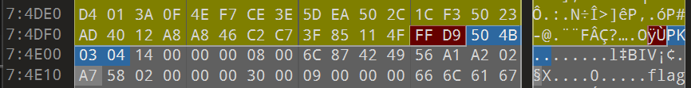

藏了个zip压缩包 **foremost** 提取一下

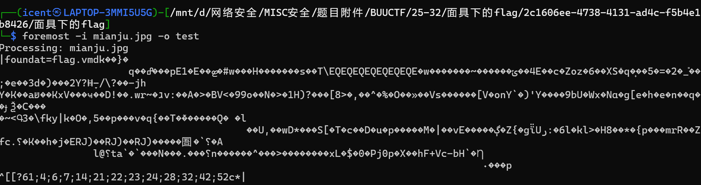

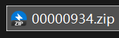

解压

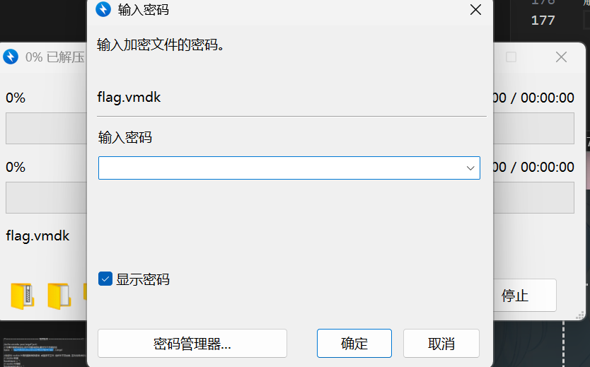

要密码 猜测伪加密 用 **WinRAR** 打开 工具->修复  
解压修复后的文件

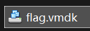

虚拟磁盘 可以用 **7zip** 解压

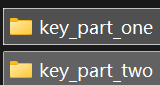

得到两个部分 先看 part one

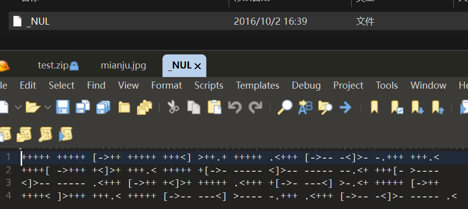

文件叫 `_NUL` 打开是brainfuck  
找个[在线网站](https://www.w3cschool.cn/tryrun/runcode?lang=brainfuck)运行一下

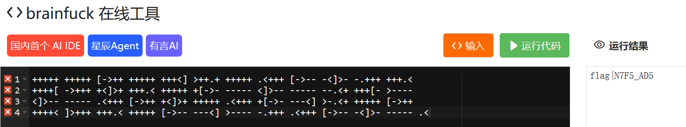

得到 `flag{N7F5_AD5`

再看 part two

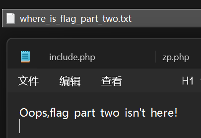

没东西 查阅了一下  
在Windows下解压 文件名带冒号的文件会被视为NTFS流的非主文件流  
会导致windows下看不见这些文件

所以要用linux解压 这里用的wsl

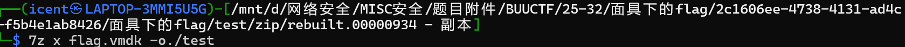

此时 part two 的文件就出现了

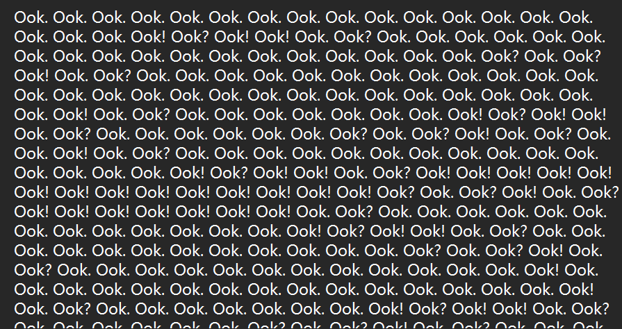

ook编码 找个[在线网站](https://wnkit.com/tool/brainfuck-ook-encrypt-decrypt)

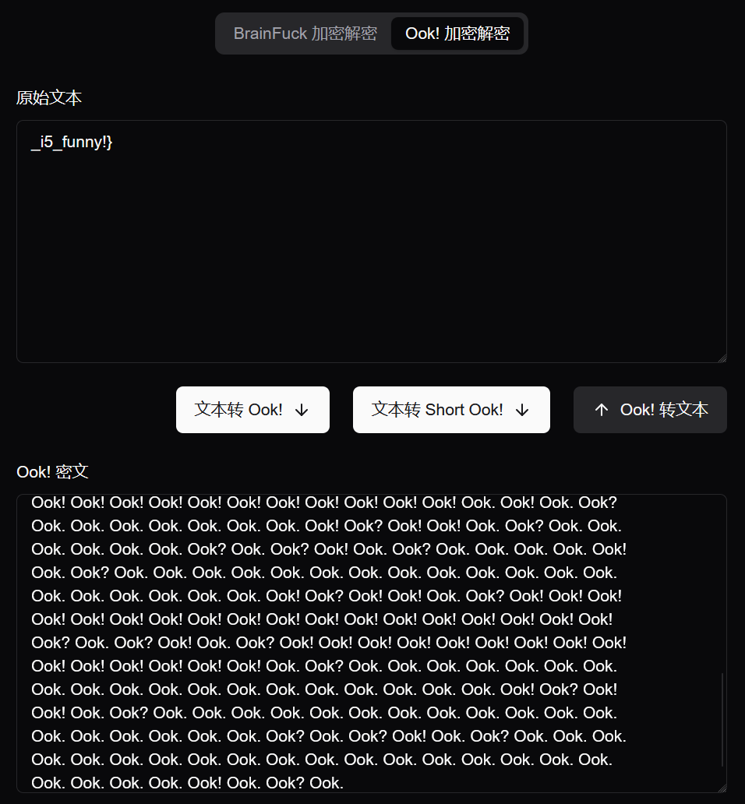

得到 `_i5_funny!}`

取得flag flag为  
`flag{N7F5_AD5_i5_funny!}`
