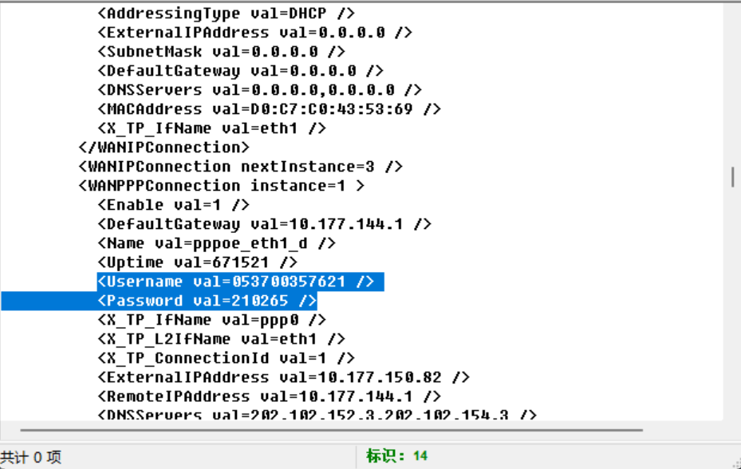

# 荷兰宽带数据泄露

**题目描述**：注意：得到的 flag 请包上 flag{} 提交  
**工具**：RouterPassView

拿到附件 bin文件

根据题目 宽带数据 应该是个路由器固件文件  
可以用 **RouterPassView** 查看

题目也没说要啥 试试用户名或者密码

经过尝试 用户名是flag 取得flag flag为  
`flag{053700357621}`
