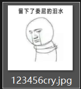
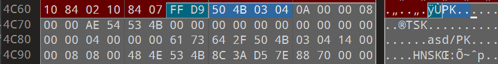
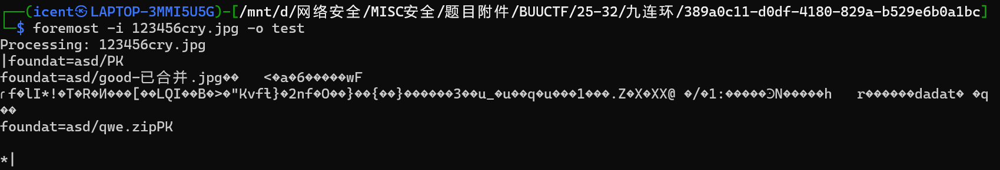
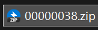
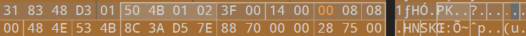
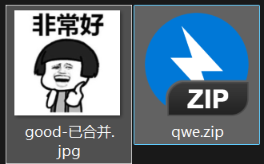
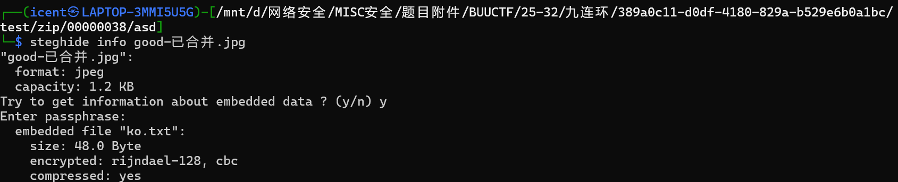
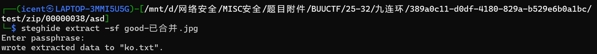
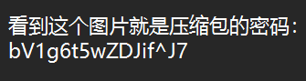
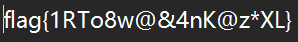

# 九连环

**题目描述**：注意：得到的 flag 请包上 flag{} 提交  
**工具**：010Editor foremost

拿到附件 jpg文件

没什么信息 **010Editor** 打开看看

藏了个zip压缩包 foremost分离一下

解压 发现要密码 先猜伪加密 **010Editor** 打开  
文件区此处为 `00 08` 目录区是 `01 08`  
伪加密 改成`00 08` 保存

> 这里是压缩包嵌套压缩包 010都会高亮显示 会有点难找

解压 得到

这个qwe.zip也被加密了 看了一眼不是伪加密 那应该密码再jpg上  
用binwalk查找 无果 试试 **steghide**

有txt文件 提取

打开 ko.txt

用这个密码解压

复制 取得flag flag为  
`flag{1RTo8w@&4nK@z*XL}`
