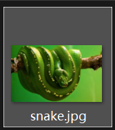
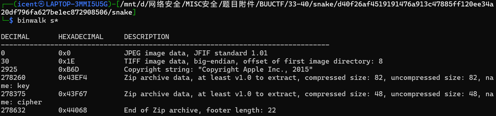
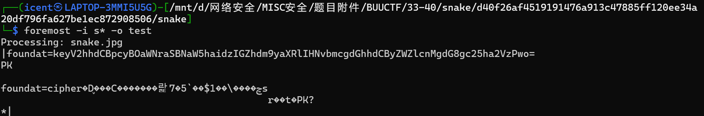
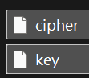
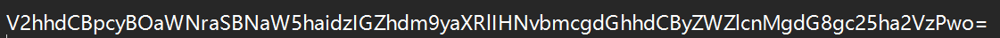
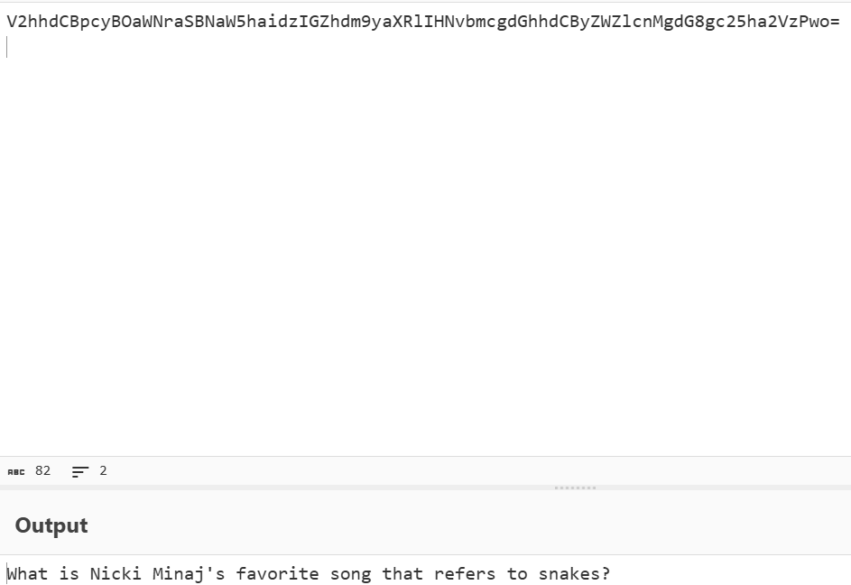
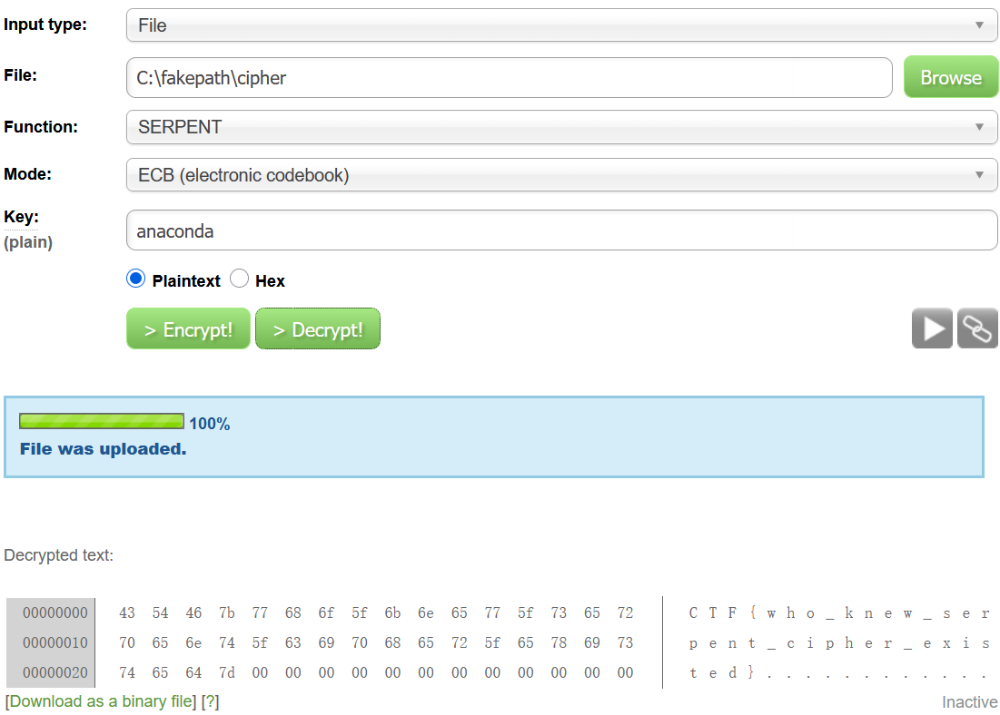

# snake

**题目描述**：注意：得到的 flag 请包上 flag{} 提交  
**工具**：binwalk foremost Cyberchef

拿到附件 jpg文件 内容是绿树蟒



**binwalk** 看看 发现藏了压缩包



**foremost** 提取出来



解压 得到密文和key



密文看不出啥 不过key像base64



**Cyberchef** 解密一下



```
What is Nicki Minaj's favorite song that refers to snakes?

Nicki Minaj 最喜欢哪首提到蛇的歌曲？
```


得到密钥 anaconda(解密的时候试了 是小写)

至于密文怎么处理 题目和各种信息都指向了蛇  
而蛇的英文有 serpent 这正好是一个加密算法的名字  
找个[在线网站](http://serpent.online-domain-tools.com/)解密



复制 改成`flag{}` 取得flag flag为  
`flag{who_knew_serpent_cipher_existed}`
