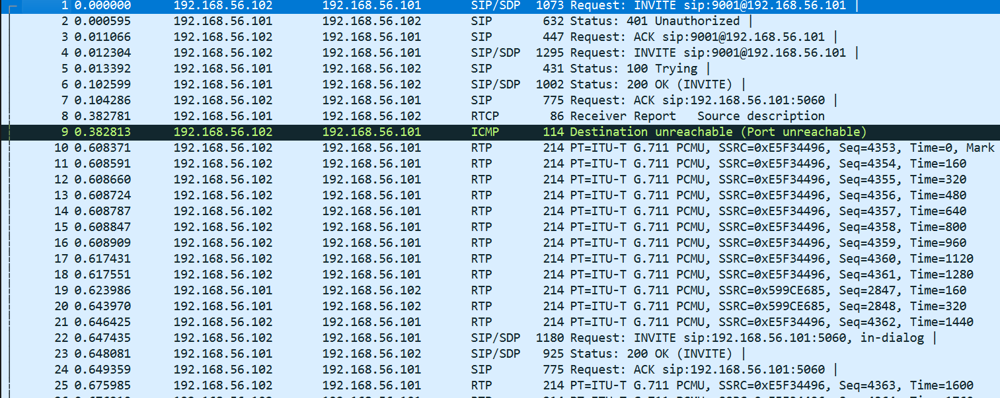
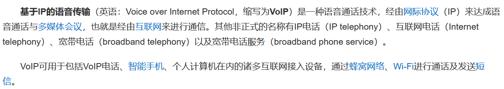
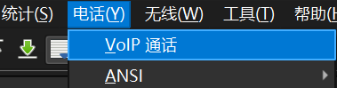
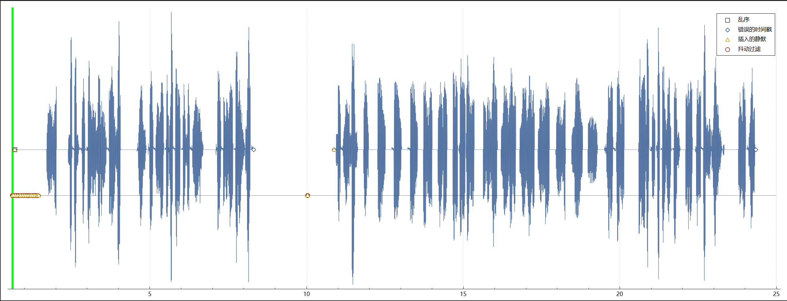

# voip

**题目描述**：注意：得到的 flag 请包上 flag{} 提交  
**工具**：binwalk foremost Cyberchef

拿到附件 pcap文件

**Wireshark** 打开

发现是 ICMP SIP RICP RTP 这种流量  
没咋见过 查一查题目

电话说是 再查查 发现 **Wireshark** 是可以播放这样的流量的

播放

有人念flag 英语听力说是 记得前缀换成 `flag{}`  
取得flag flag为  
`flag{9001IVR}`
