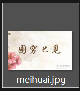
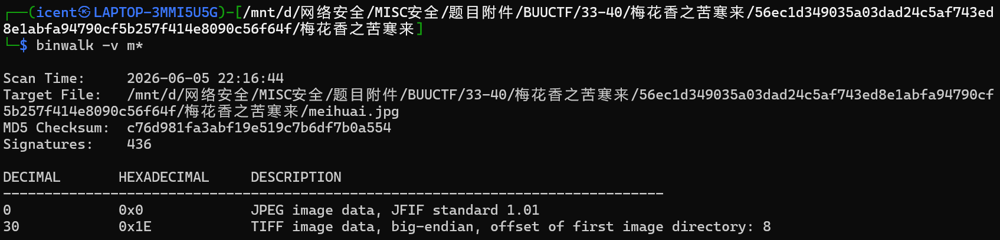
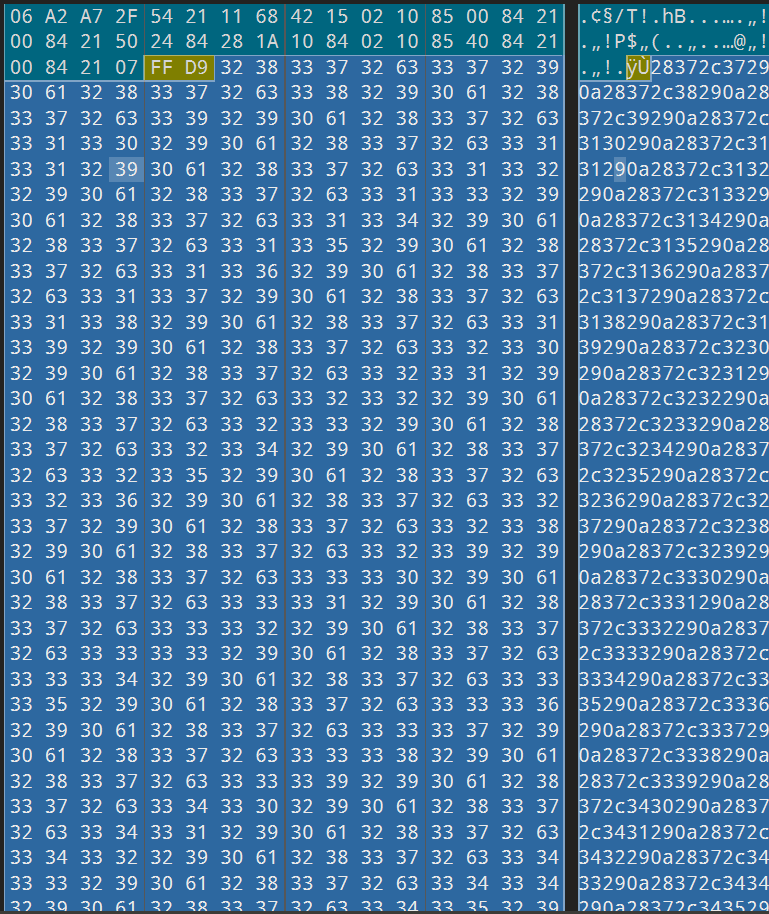
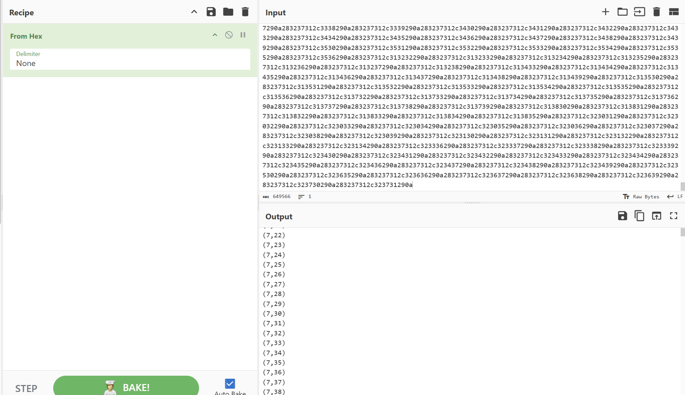
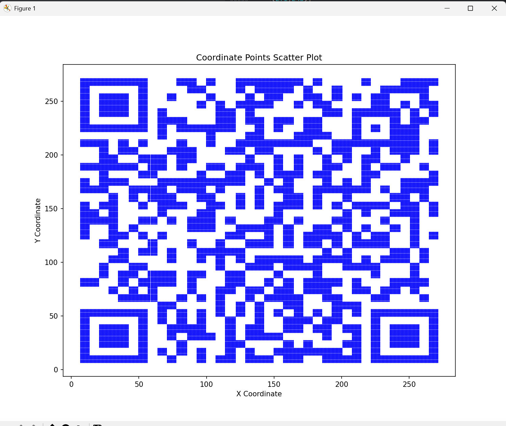
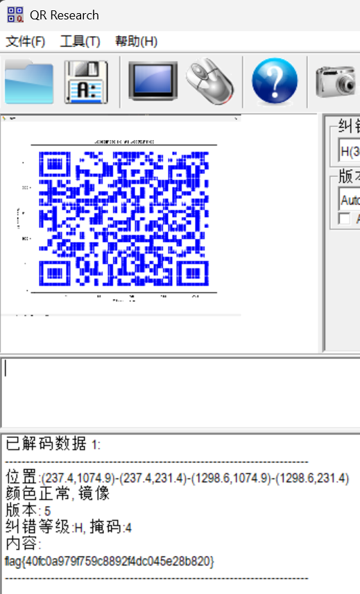

# 梅花香之苦寒来

**题目描述**：注意：得到的 flag 请包上 flag{} 提交  
**工具**：binwalk 010Editor Cyberchef Python QR_Research

拿到附件 jpg图片



**binwalk** 一下 发现有东西



**010Editor** 看看是什么



十六进制 **Cyberchef** 解密一下看看是什么



发现是一堆类似坐标的东西 猜测可能要用这些坐标画图  
把坐标存到 test.txt 里面

用Python写个脚本

```python
# 坐标点画图
import matplotlib.pyplot as plt

# 直接使用 eval 读取（注意：仅当文件来源可信时使用）
def read_coordinates_simple(filename):
    points = []
    with open(filename, 'r') as f:
        for line in f:
            line = line.strip()
            if line:
                # 将字符串 "(7,7)" 转换为元组 (7,7)
                point = eval(line)
                points.append(point)
    return points

# 使用
points = read_coordinates_simple('test.txt')
x_coords = [p[0] for p in points]
y_coords = [p[1] for p in points]

plt.figure(figsize=(12, 10))
plt.scatter(x_coords, y_coords, s=1, c='blue', alpha=0.6)
plt.title(f'Coordinates Plot ({len(points)} points)')
plt.xlabel('X')
plt.ylabel('Y')
plt.grid(True, alpha=0.3)
plt.show()
```

得到



**QR_Research** 扫码



复制 取得flag flag为  
`flag{40fc0a979f759c8892f4dc045e28b820}`
