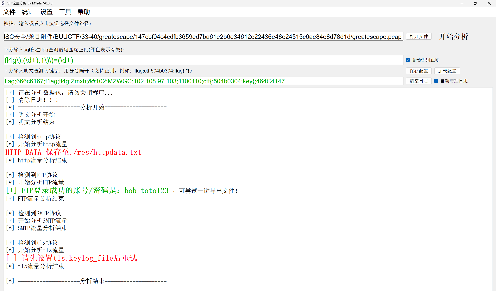
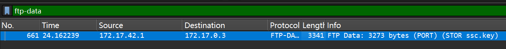
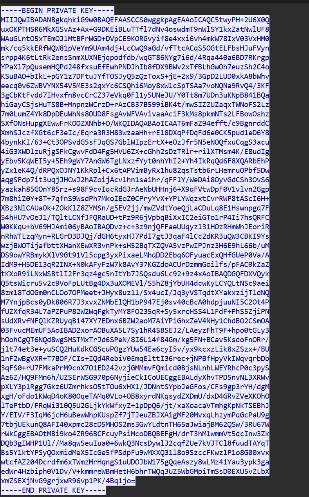
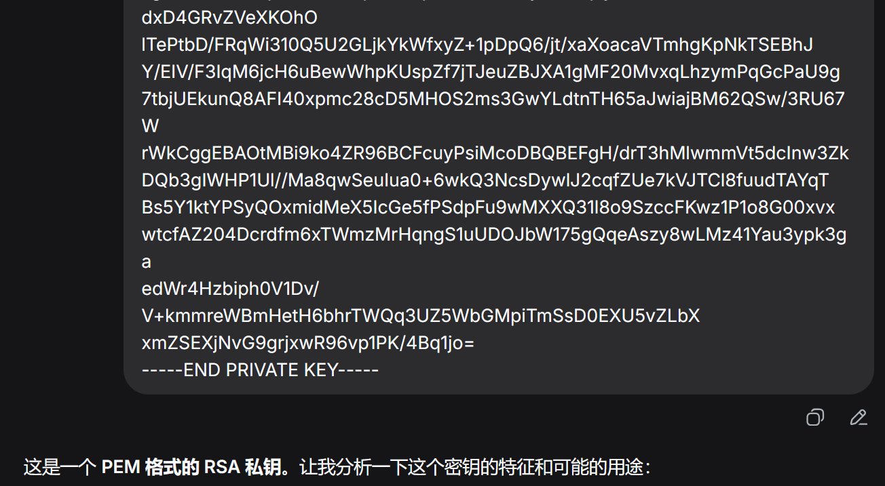
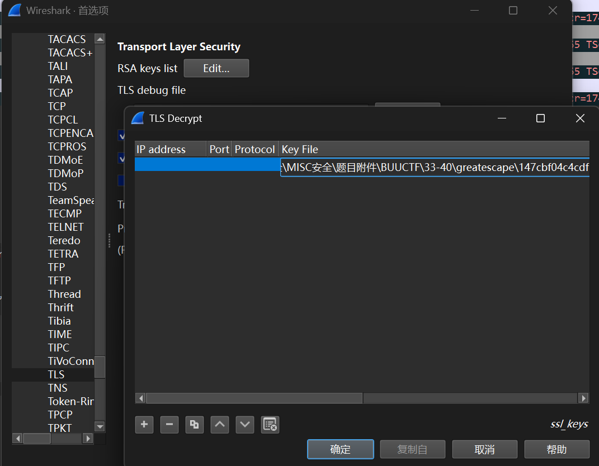
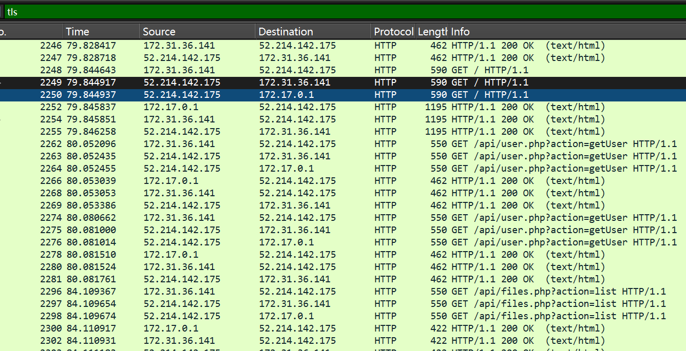
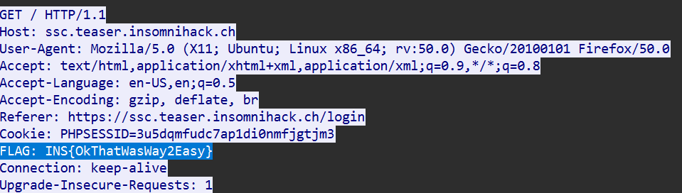

# greatescape

**题目描述**：注意：得到的 flag 请包上 flag{} 提交  
**工具**：CTF-NATA Wireshark

拿到附件 pcap文件

**CTF-NATA** 扫一下先

得到FTP账号和密码 用 **Wireshark** 打开 过滤ftp-data

追踪TCP流

问问ai这是什么东西

RSA密钥说是 密钥 正好刚刚 **CTF-NATA** 提到设置tls.keylog_file  
存下来 保存为 `test.key`

打开 **Wiresahrk**  
编辑 -> 首选项 -> protocols -> TLS -> Edit -> + -> Browser -> test.key

此时就解密了 过滤 tls 翻一翻  
发现 79 80 84 这三个有http

一个一个追踪一下tls流

在80里发现flag 复制 取得flag flag为  
`flag{OkThatWasWay2Easy}`
