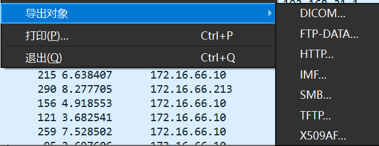
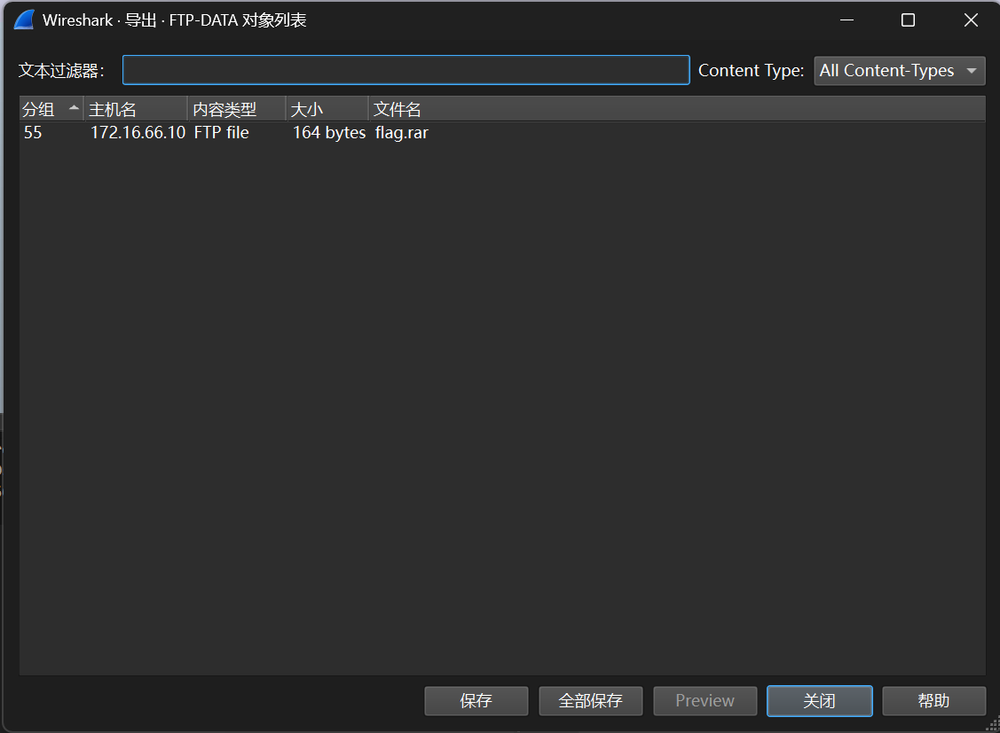
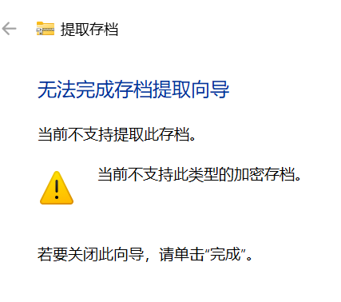
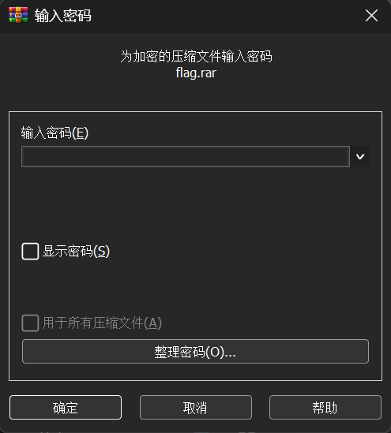
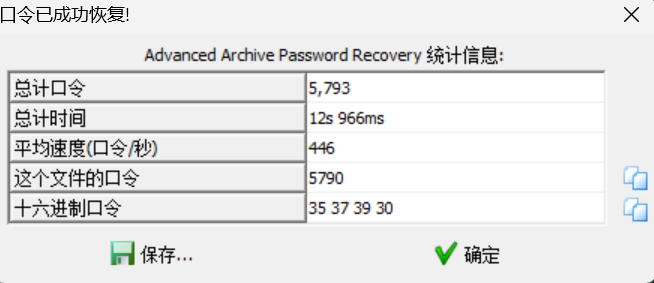

# 被偷走的文件

**题目描述**：一黑客入侵了某公司盗取了重要的机密文件，还好管理员记录了文件被盗走时的流量，请分析该流量，分析出该黑客盗走了什么文件。注意：得到的 flag 请包上 flag{} 提交  
**工具**：Wireshark WinRAR ARCHPR

拿到附件 pacpng文件

根据题目描述 需要从流量包中提取文件 **Wireshark** 打开  
导出对象

发现FTP流有个 flag.rar

尝试解压

**WinRAR** 解压

要密码 这里找了挺久 没什么线索 直接爆破吧  
猜测四位纯数字 **ARCHPR** 爆破

密码5790 解压

取得flag flag为  
`flag{6fe99a5d03fb01f833ec3caa80358fa3}`
