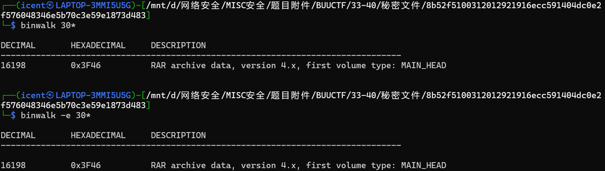
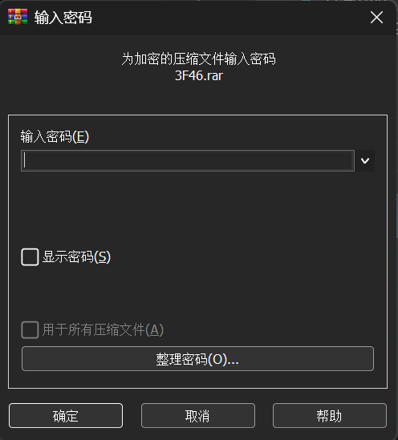
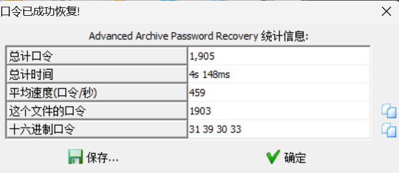

# 秘密文件

**题目描述**：深夜里，Hack偷偷的潜入了某公司的内网，趁着深夜偷走了公司的秘密文件，公司的网络管理员通过通过监控工具成功的截取Hack入侵时数据流量，但是却无法分析出Hack到底偷走了什么机密文件，你能帮帮管理员分析出Hack到底偷走了什么机密文件吗？注意：得到的 flag 请包上 flag{} 提交  
**工具**：binwalk WinRAR ARCHPR

拿到附件 pcapng文件

根据题目描述 依旧从流量提取文件  
由于流量包文件本身就包含了要提取的文件的原始数据  
我们可以尝试 **binwalk** 直接提取

尝试 **WinRAR** 解压

要密码 先不找了 试试直接 **ARCHPR** 爆破

密码1903

取得flag flag为  
`flag{d72e5a671aa50fa5f400e5d10eedeaa5}`
