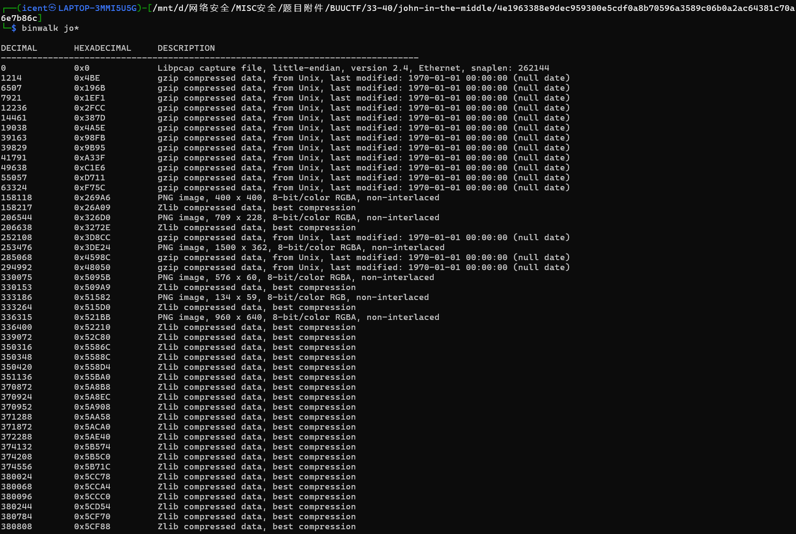
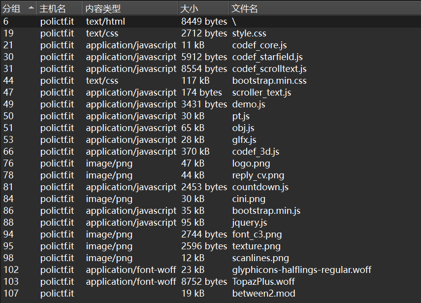
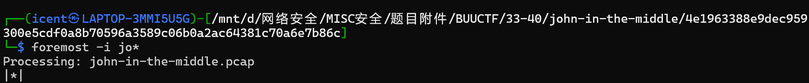
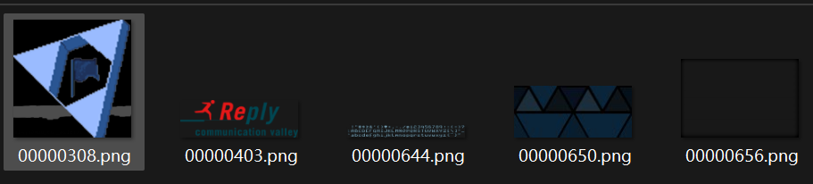
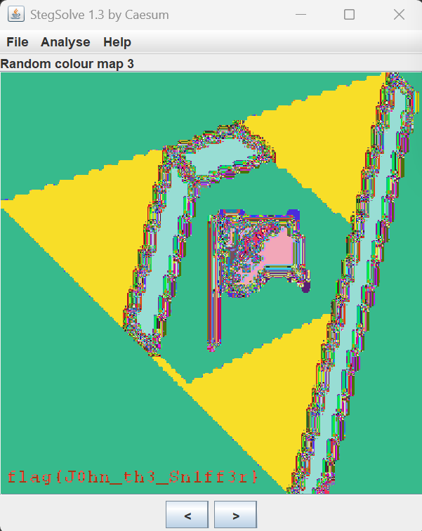

# john-in-the-middle

**题目描述**：注意：得到的 flag 请包上 flag{} 提交  
**工具**：binwalk Wireshark foremost Stegsolve

拿到附件 pcap文件

不着急分析流量 试着 **binwalk** 一下

发现有压缩数据和png 试着提取 发现只提取出压缩数据  
直接用 **Wireshark** 看看文件有啥

看起来是一个网页的各种文件 html和css、js暂时懒得看 先看图片  
换一个工具直接提取 用 **foremost**

得到5张png图片

直接看看不出啥 不过第一个图的标志是个旗子 猜测这个可能性最大  
经过一通工具分析 最后在 **Stegsolve** 调轨道发现了内容

取得flag flag为  
`flag{J0hn_th3_Sn1ff3r}`
