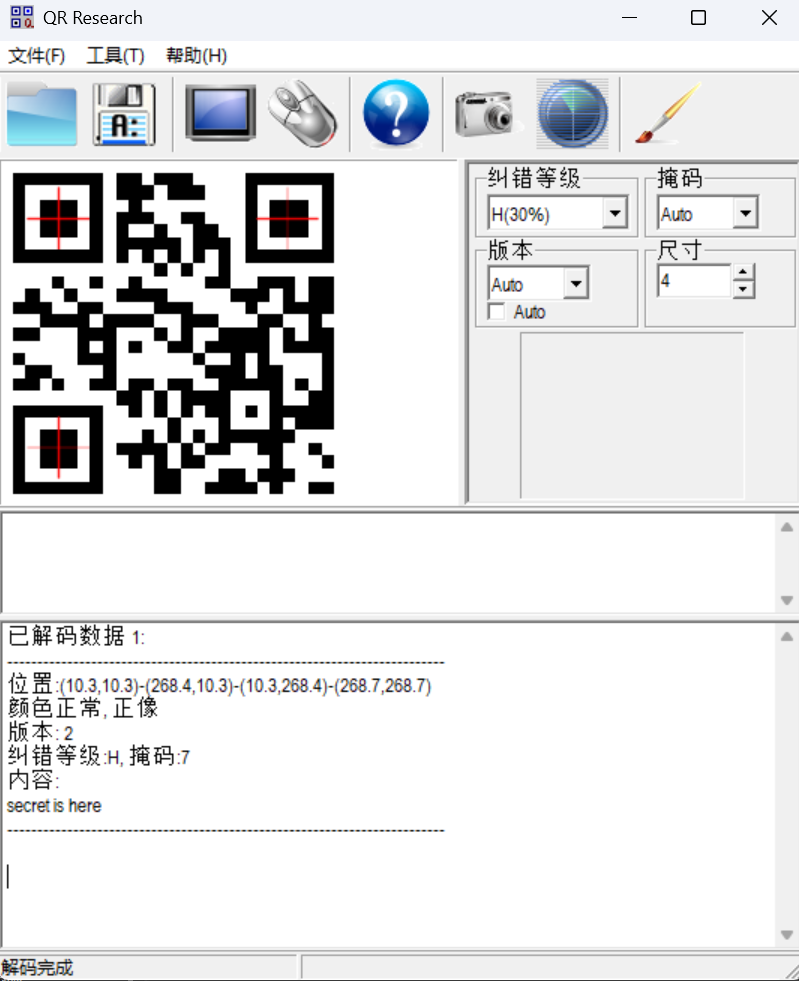
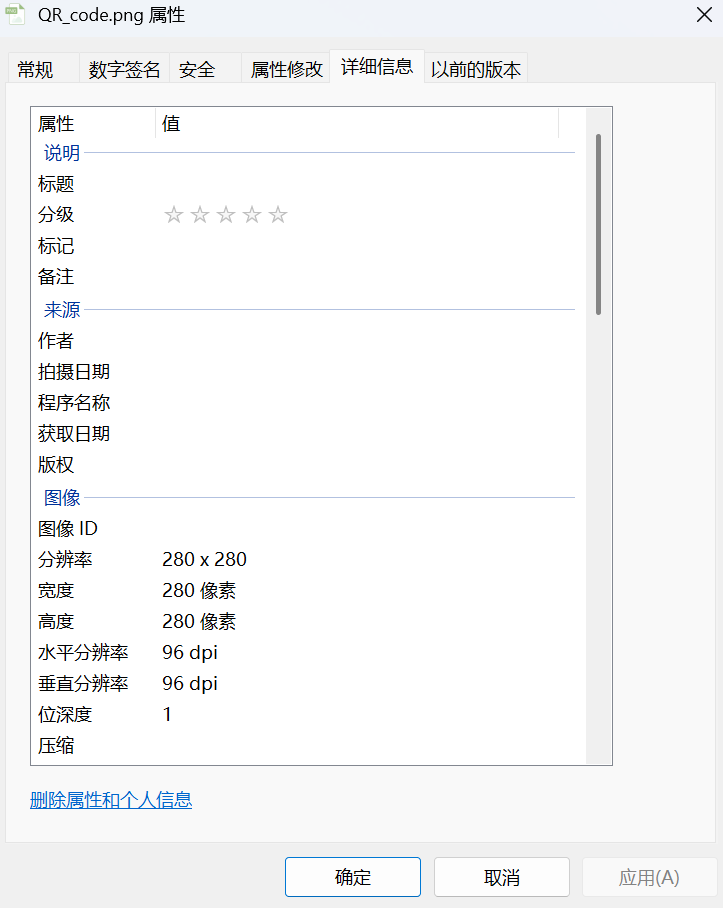
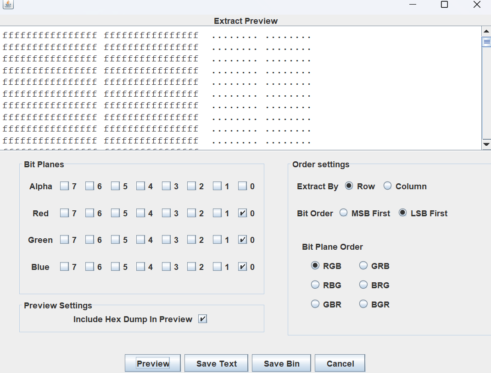
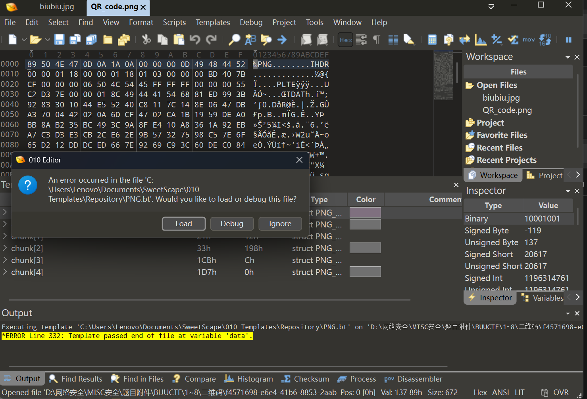
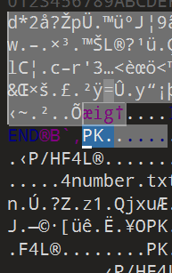
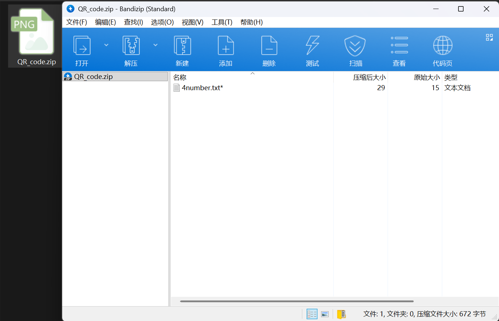
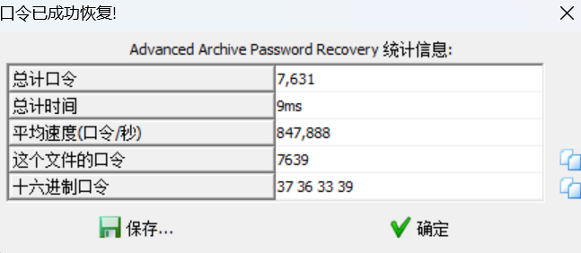
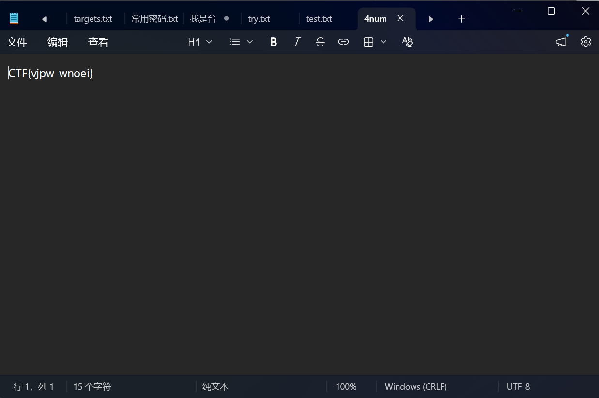

# 二维码

**题目描述**：注意：得到的 flag 请包上 flag{} 提交  
**工具**：QR_Research 010Editor ARCHPR

拿到附件 解压 发现里面是一张png文件 内容是个二维码

用 **QR_Research** 扫一下看看

显示 `secret is here`  
查看图片的属性试试

空的

因为是png文件 所以猜测是否可能有隐写  
使用 **Stegsolve** 看看 检查各个轨道  
各个轨道都没有问题 猜测可能是 **LSB隐写**  
点击 `Analyse` 点击 `Data Extract`  
勾选 LSB First 将 Red Green Bule 勾选为0

无果 换个思路 用 **010Editor** 看看

显示运行 `png.bt` 的时候报错了 那说明这个图片确实有问题  
点 `ignore` 忽略它

我们发现 除了 `PNG` 文件里还有 `PK`  
`PK` 是 zip 文件头的标志 试试看  
把PK前的数据直接删了 将后缀名改为 zip

发现里面有个 `4number.txt` 试着打开 发现需要密码  
根据文件名称 应该是四位数字密码 这里用 **ARCHPR** 爆破  
设置数字爆破 0000到9999

成功 密码为 `7639` 打开 `4number.txt`

将 `CTF` 改为 `flag` 取得flag  
`flag{vjpw_wnoei}`
