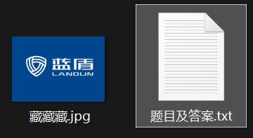
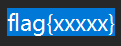
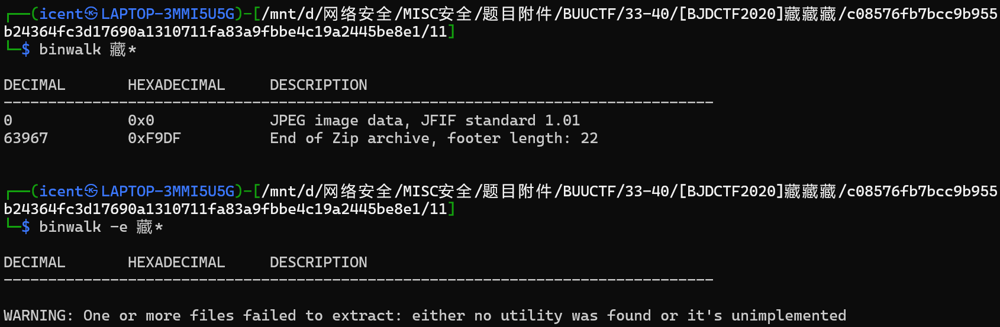
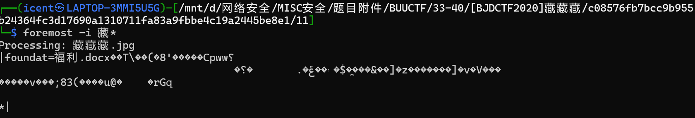
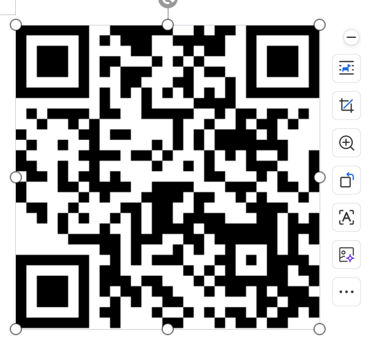
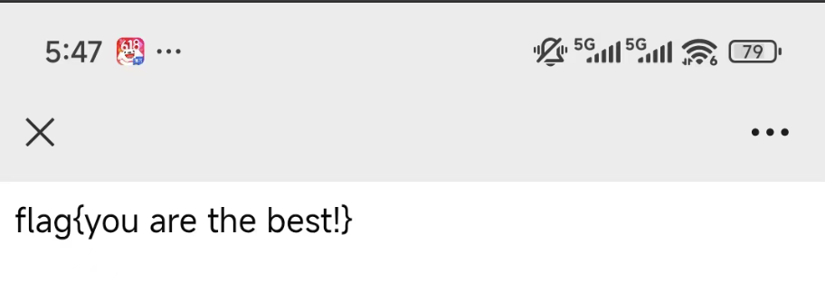

# [BJDCTF2020]藏藏藏

**题目描述**：得到的 flag 请包上 flag{} 提交。来源：https://github.com/BjdsecCA/BJDCTF2020  
**工具**：binwalk Wireshark foremost Stegsolve

拿到附件 jpg文件和txt文件

txt内容如下 没什么东西

jpg图片显示为蓝盾 查资料好像不太能查出东西  
选择 **binwalk** jpg看看

有压缩包 但没提取出来 用 **foremost** 试试

出来了 解压zip得到 福利.docx 打开

二维码 扫一下

取得flag flag为  
`flag{you are the best!}`
