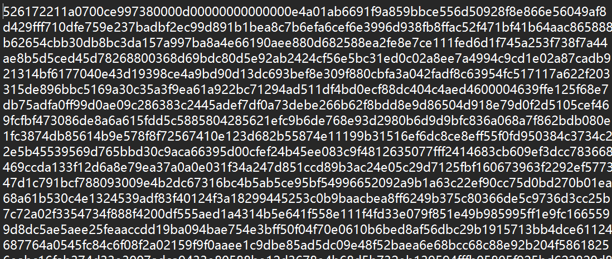
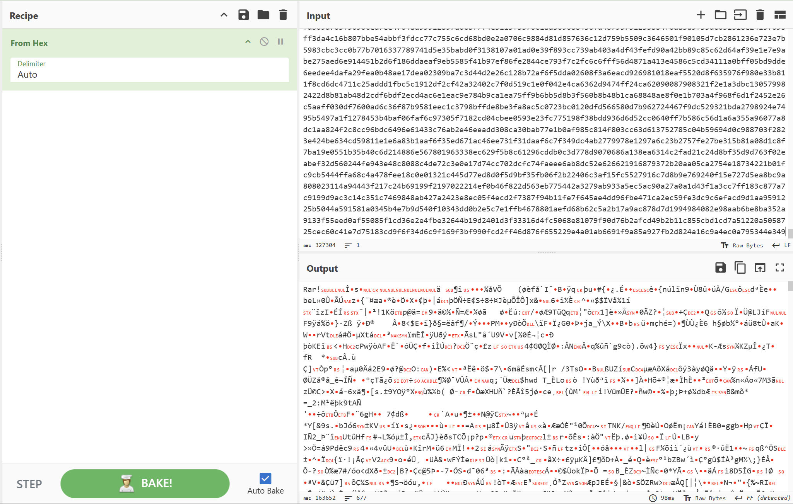
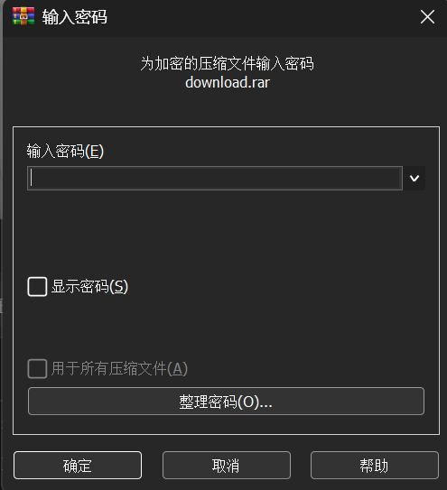
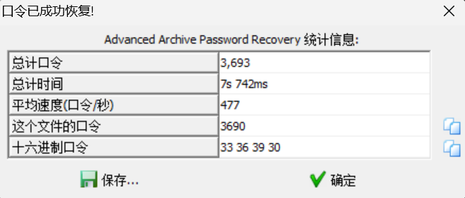
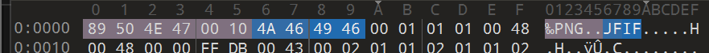
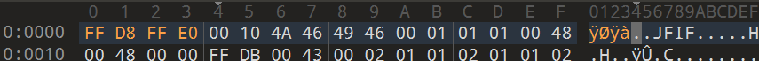

# 黑客帝国

**题目描述**：Jack很喜欢看黑客帝国电影，一天他正在上网时突然发现屏幕不受控制，出现了很多数据再滚屏，结束后留下了一份神秘的数据文件，难道这是另一个世界给Jack留下的信息？聪明的你能帮Jack破解这份数据的意义吗？注意：得到的 flag 请包上 flag{} 提交  
**工具**：Cyberchef WinRAR ARCHPR 010Editor

拿到附件 txt文件

内容

十六进制 用 **Cyberchef** 解

可以看出是rar文件 导出文件 **WinRAR** 解压

要密码 这题也没给别的信息 直接 **ARCHPR** 爆破

密码3690 解压得到png

png没法看 文件有问题 **010Editor** 看一眼

虽然是png头 但实际上是jpg 给它改了

保存 打开图片

取得flag flag为  
`flag{57cd4cfd4e07505b98048ca106132125}`
