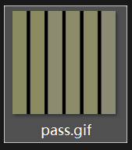
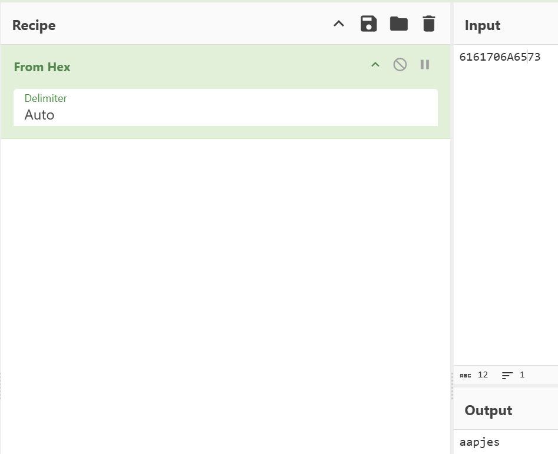

# 很好的色彩呃？

**题目描述**：注意：得到的 flag 请包上 flag{} 提交  
**工具**：Cyberchef

拿到附件 gif图片



经检查 这个gif图片只有一帧 文件本体也分析不出啥  
根据题目 猜测可能需要用到颜色？

利用win11自带的截图工具中的颜色选取器

```
#8B8B61
#8B8B61
#8B8B70
#8B8B6A
#8B8B65
#8B8B73
```

只有后两位不同 猜测后两位是十六进制 **Cyberchef** 解密



取得flag flag为  
`flag{aapjes}`
