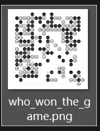
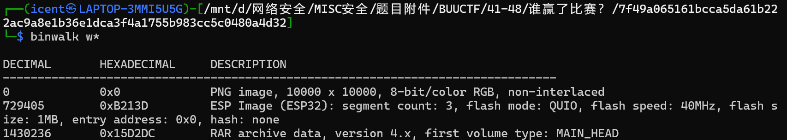
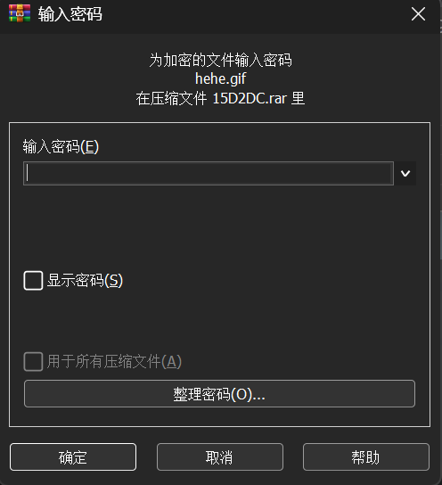
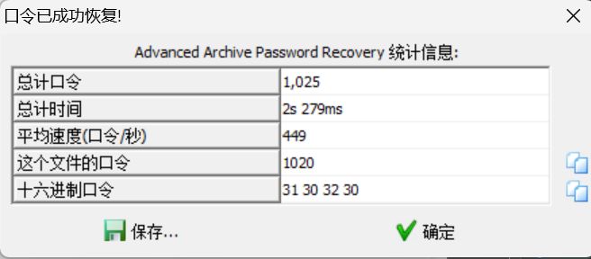
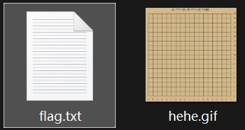
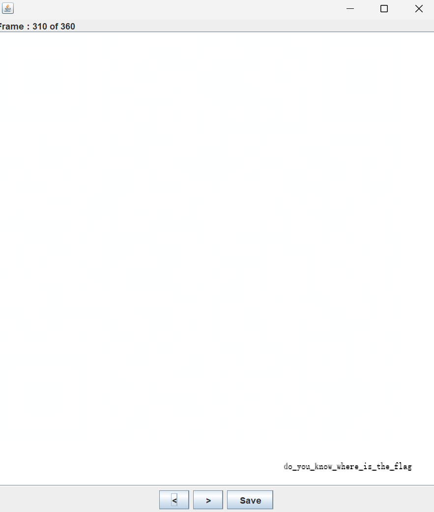
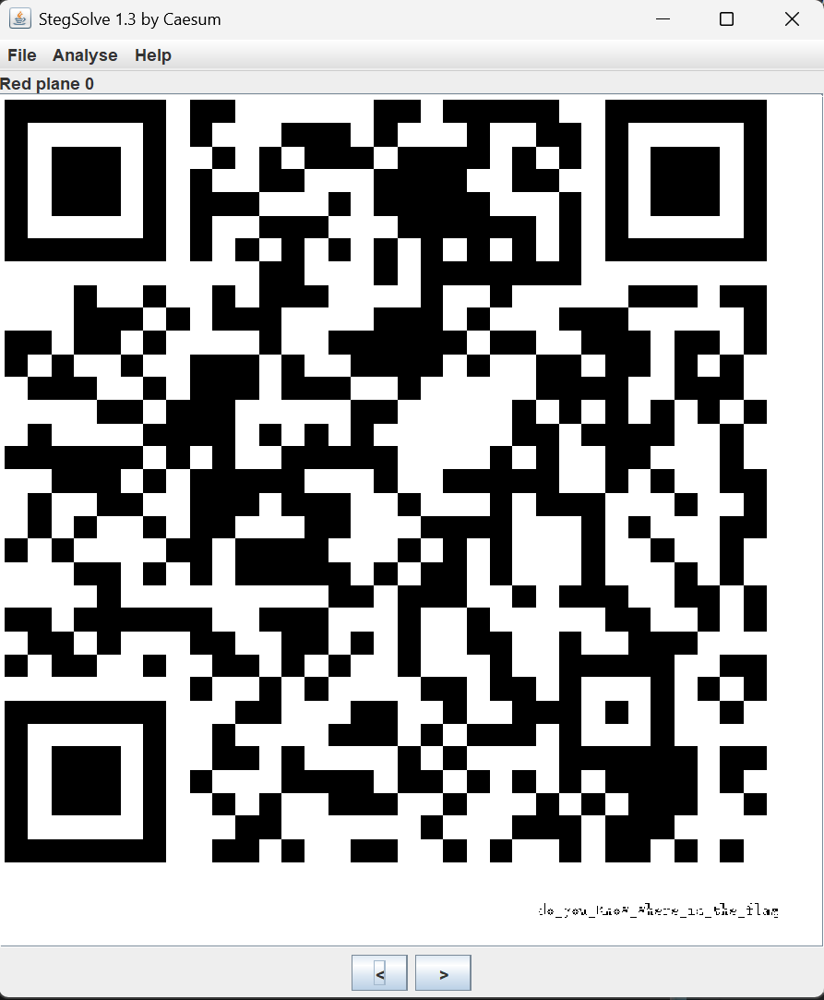
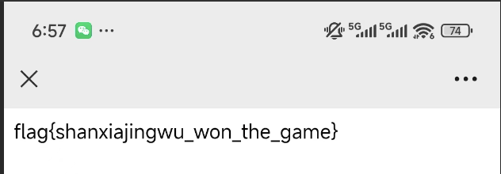

# 谁赢了比赛？

**题目描述**：小光非常喜欢下围棋。一天，他找到了一张棋谱，但是看不出到底是谁赢了。你能帮他看看到底是谁赢了么？注意：得到的 flag 请包上 flag{} 提交  
**工具**：binwalk ARCHPR Stegsolve

拿到附件 png文件

说实话这个png第一眼很像二维码 不过扫不出东西  
先 **binwalk** 一下

目前只能提取出rar 先看看rar

要密码 用 **ARCHPR** 爆破一下

密码1020

解压得到txt和gif txt内容如下

无帮助 看看gif 发现是有帧数的 **Stegsolve** 逐帧读取

310帧有东西 虽然看起来没用 但是出题人这么敢一定有他的道理 保存  
我觉得棋盘像二维码也有它的道理 所以接着用 **Stegsolve** 查看 翻轨道

果然二维码 扫它

取得flag flag为  
`flag{shanxiajingwu_won_the_game}`
