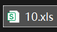
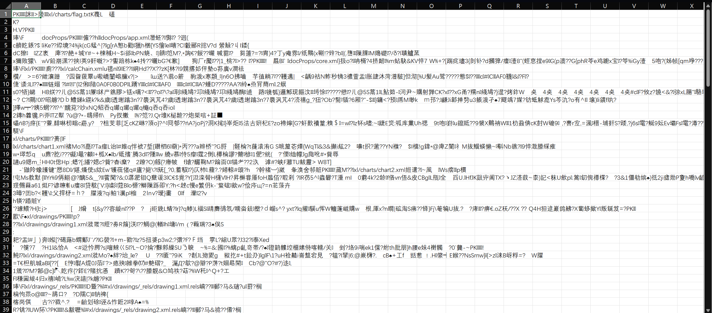
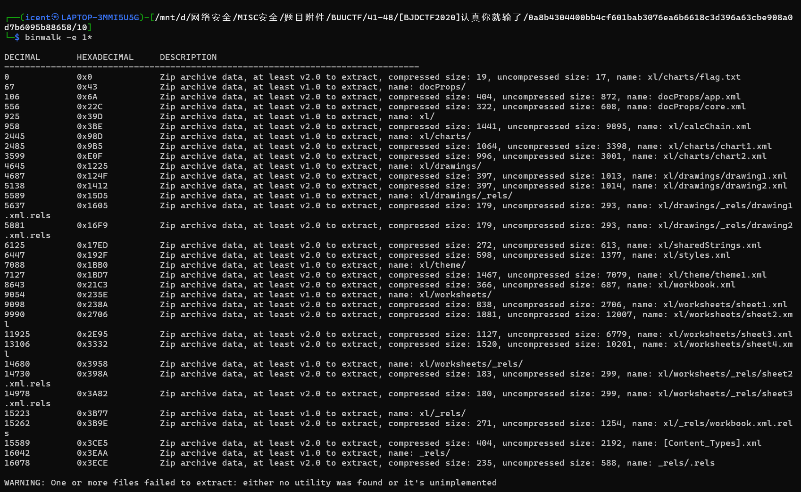
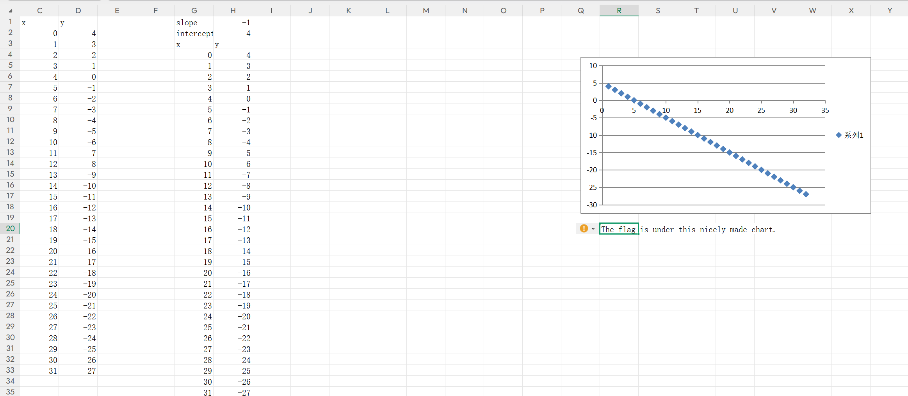
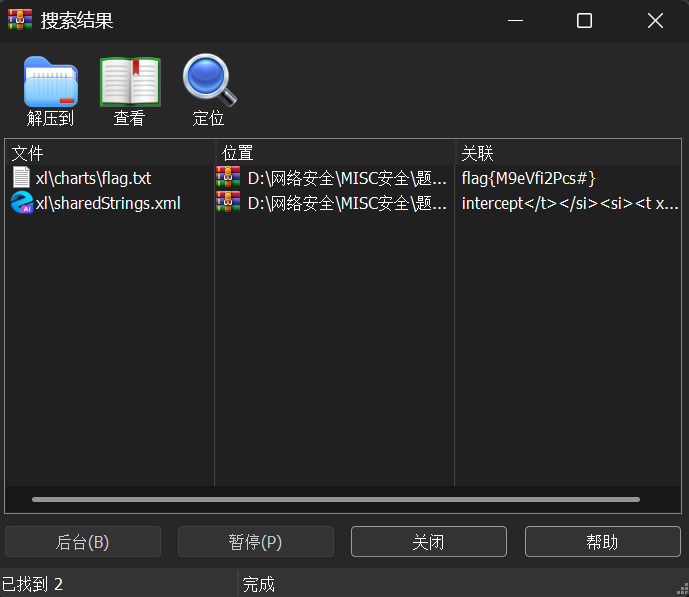
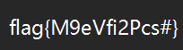

# [BJDCTF2020]认真你就输了

**题目描述**：得到的 flag 请包上 flag{} 提交。来源：https://github.com/BjdsecCA/BJDCTF2020  
**工具**：binwalk WinRAR

拿到附件 xls文件

试着直接打开 显示文件已损坏 不管 接着打开

发现乱码 而且有PK 怀疑压缩包 **binwalk** 一下

提取出一个压缩包 解压

看起来像xls 把后缀zip改成xls 重新打开

`The flag is under this nicely made chart. `

flag在这个做得很漂亮的图表下面。

。。。懒得看 还是把它当压缩包吧 直接用 **WinRAR** 检索"flag"

有个flag.txt 打开

取得flag flag为  
`flag{M9eVfi2Pcs#}`
