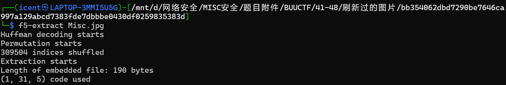
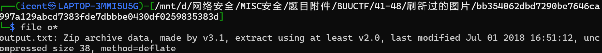
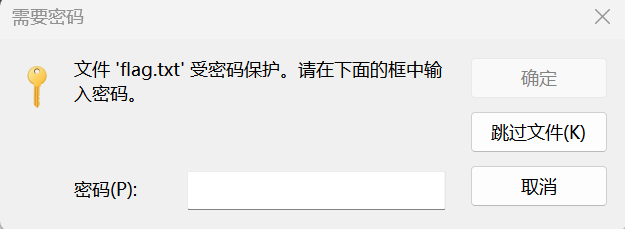
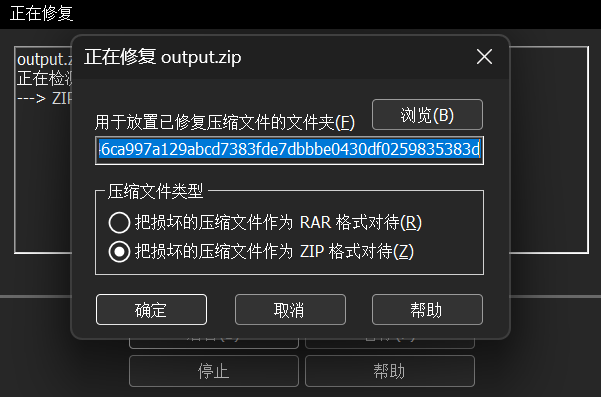

# 刷新过的图片

**题目描述**：浏览图片的时候刷新键有没有用呢注意：得到的 flag 请包上 flag{} 提交  
**工具**：F5-steganography WinRAR

拿到附件 jpg和jpg

分析了半天也弄不出啥 刷新图片也没理解是啥 查wp了

F5刷新说是 这个F5隐写第一次见 也是学到新的了。。。
？那之前那道怎么也分析不出来的das的jpg是不是这个(泪)

提取出一个output.txt （我的指令改过 所以别照搬我的命令行）  
直接打开是乱码 用 file命令看一下

zip文件 改后缀 解压

要密码 爆破未果 猜测可能伪加密 直接 **WinRAR** 修复压缩包

解压成功 得到flag.txt

取得flag flag为  
`flag{96efd0a2037d06f34199e921079778ee}`
