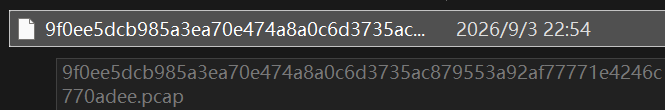
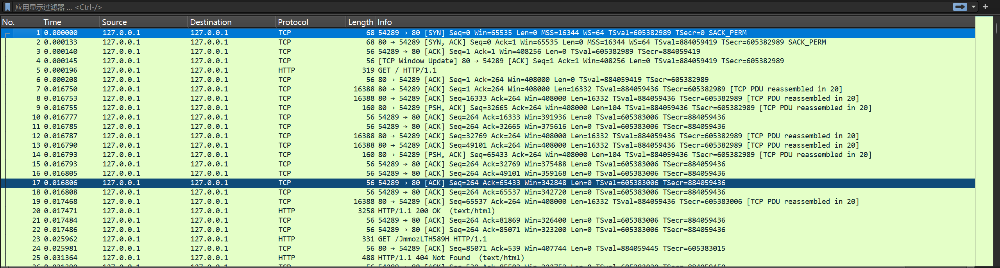
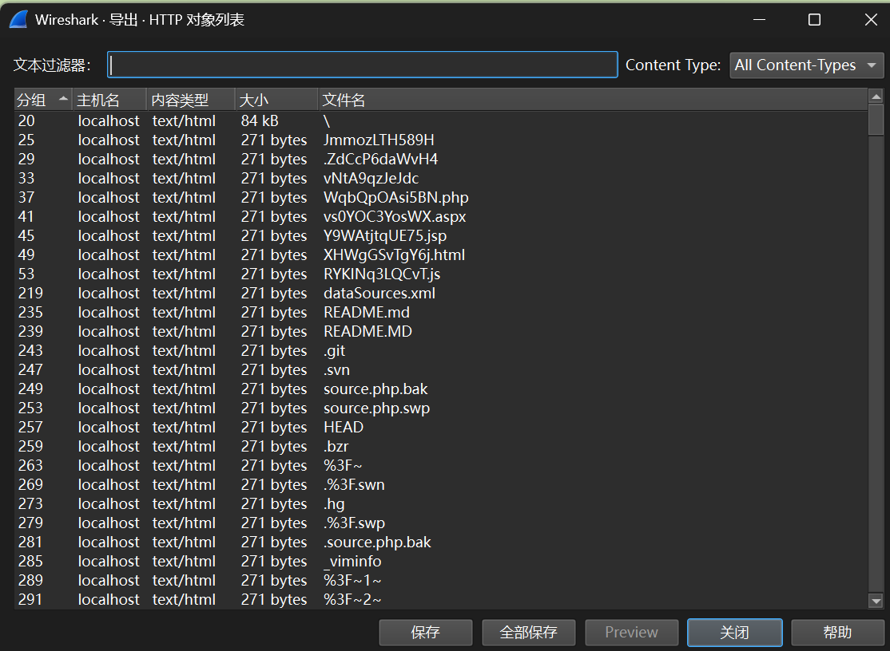
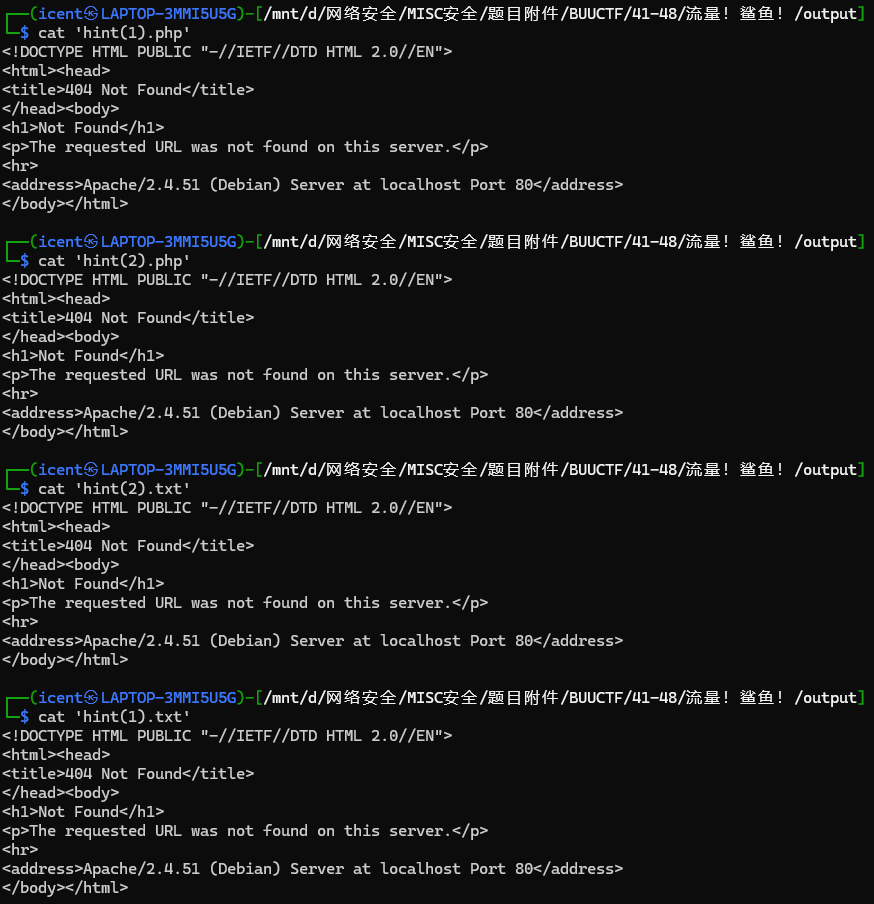
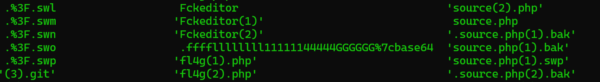
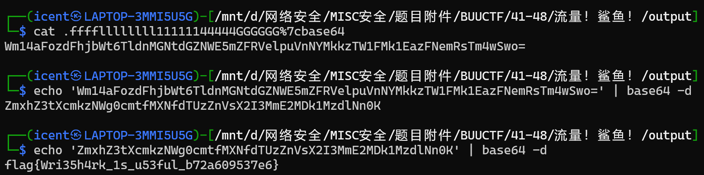

# 流量！鲨鱼！

**题目描述**：就决定是你了！WireShark！  
**工具**：Wireshark kali

拿到附件 pcap文件



题目指名用 **Wireshark** 那就用



发现主要是TCP和HTTP 看看有没有传过什么文件



多如牛毛。。。 而且有些文件直接看看不到 得用 `ls -a`

```
┌──(icent㉿LAPTOP-3MMI5U5G)-[/mnt/d/网络安全/MISC安全/题目附件/BUUCTF/41-48/流量！鲨鱼！]
└─$ cd output;ls -a
 .                         'database(1)'                             'mysql(1).sql'
 ..                        'database(1).php'                         'mysql(2).bak'
'1(1).txt'                 'database(1).propertie'                   'mysql(2).sql'
'1(2).txt'                 'database(2)'                              mysql.bak
'(1).bash_history'         'database(2).php'                          mysql.sql
'(1).bzr'                  'database(2).propertie'                    OABglgZRdf9p
'(1).DS_store'             'database(3).php'                          Ou33g9prP3ZF.php
'(1).git'                  'database(4).php'                         'phpinfo(1).php'
'(1).gitignore'            'database(5).php'                         'phpinfo(2).php'
'(1).hg'                    database.php                              phpinfo.php
'(1).htaccess'              database.propertie                        phpmyadmin
 1.php                     'dataSources(1).xml'                      'phpMyAdmin(1)'
'1.php%3fcmd=env'          'dataSources(2).xml'                      'phpmyadmin(2)'
'1.php%3fcmd=ls'           'dataSources.local(1).xml'                'phpMyAdmin(3)'
'1.php%3fcmd=ls%20-al'     'dataSources.local(2).xml'                'phpMyAdmin(4)'
'1.php%3fcmd=ls%20-al%20'   dataSources.local.xml                    'phpmyadmin(5)'
'1.php%3fcmd=whoami'        dataSources.xml                           pkXo3q7iVtQL.js
'(1).svn'                   data.sql                                  plus
 1.txt                     'db(1).sql'                               'plus(1)'
'(1).viminfo'              'db(2).sql'                               'plus(2)'
 29OLlgz5lkqo               db.sql                                   'qq(1).txt'
'(2).bash_history'         'ddb(1).sql'                              'qq(2).txt'
'(2).bzr'                  'ddb(2).sql'                               qq.txt
'(2).ds_store'              ddb.sql                                   README
'(2).git'                   debug                                    'README(1)'
'(2).gitignore'            'debug(1)'                                'README(1).MD'
'(2).hg'                   'debug(2)'                                'README(2)'
'(2).htaccess'              dede                                     'README(2).MD'
'(2).svn'                  'dede(1)'                                 'README(3).md'
'(2).viminfo'              'dede(2)'                                 'README(4).MD'
'(3).DS_store'             'default(1).php'                          'README(5).md'
 %3F                       'default(2).php'                           README.md
 %3F~                       default.php                               register
'%3F(1)'                    description                              'register(1)'
'%3F~(1)'                  'description(1)'                          'register(1).php'
 %3F~1~                    'description(2)'                          'register(2)'
'%3F~1~(1)'                 download                                 'register(2).php'
'%3F~1~(2)'                'download(1)'                              register.php
'%3F(1).back'              'download(2)'                             'robots(1).php'
'%3F(1).bak'                downloads                                'robots(1).txt'
'%3F(1).bak_Edietplus'     'downloads(1)'                            'robots(2).php'
'%3F(1).save'              'downloads(2)'                            'robots(2).txt'
'%3F(1).save1'              .ds_store                                 robots.php
'%3F(1).save2'             'dump(1).sql'                              robots.txt
'%3F(1).save3'             'dump(2).sql'                              Root
'.%3F(1).swl'               dump.sql                                 'Root(1)'
'.%3F(1).swm'               .DZ4Un60efkDY                            'root(1).rar'
'.%3F(1).swn'               edit                                     'root(1).zip'
'.%3F(1).swo'              'edit(1)'                                 'Root(2)'
'.%3F(1).swp'              'edit(2)'                                 'root(2).rar'
'%3F(2)'                   'edit(3)'                                 'root(2).zip'
'%3F~(2)'                  'edit(4)'                                  root.rar
 %3F~2~                    'edit(5)'                                  root.zip
'%3F~2~(1)'                 Editor                                   'rss(1).xml'
'%3F~2~(2)'                'editor(1)'                               'rss(2).xml'
'%3F(2).back'              'Editor(2)'                                rss.xml
'%3F(2).bak'               'editor(3)'                                RxplcFDngjBB.php
'%3F(2).bak_Edietplus'     'Editor(4)'                                RYKINq3LQCvT.js
'%3F(2).save'              'editor(5)'                               'secret(1).txt'
'%3F(2).save1'              entries                                  'secret(2).txt'
'%3F(2).save2'             'Entries(1)'                               secret.txt
'%3F(2).save3'             'Entries(2)'                              'settings(1).php'
'.%3F(2).swl'              'entries(3)'                              'settings(2).php'
'.%3F(2).swm'              'Entries(4)'                               settings.php
'.%3F(2).swn'              'entries(5)'                               shopadmin
'.%3F(2).swo'               ewebeditor                               'shopadmin(1)'
'.%3F(2).swp'              'ewebeditor(1)'                           'shopadmin(2)'
 %3F~3~                    'ewebeditor(2)'                           'shopadmin(3)'
'%3F~3~(1)'                'example(1).php'                          'shopadmin(4)'
'%3F~3~(2)'                'example(2).php'                          'shopadmin(5)'
 %3F.back                   example.php                              'site(1).php'
 %3F.bak                   'f14g(1).php'                             'site(2).php'
 %3F.bak_Edietplus         'f14g(2).php'                              site.php
 %3F.save                   f14g.php                                  source
 %3F.save1                 'f1ag(1).php'                             'source(1)'
 %3F.save2                 'f1ag(2).php'                             'source(1).php'
 %3F.save3                  f1ag.php                                 'source(2)'
 .%3F.swl                   Fckeditor                                'source(2).php'
 .%3F.swm                  'Fckeditor(1)'                             source.php
 .%3F.swn                  'Fckeditor(2)'                            '.source.php(1).bak'
 .%3F.swo                   .ffffllllllll11111144444GGGGGG%7cbase64  'source.php(1).bak'
 .%3F.swp                  'fl4g(1).php'                             'source.php(1).swp'
'(3).git'                  'fl4g(2).php'                             '.source.php(2).bak'
'(3).svn'                   fl4g.php                                 'source.php(2).bak'
'404(1).php'                flag                                     'source.php(2).swp'
'404(2).php'               'flag(1)'                                  .source.php.bak
 404.php                   'flag(1).php'                              source.php.bak
'4dm1n(1).php'             'flag(1).txt'                              source.php.swp
'4dm1n(2).php'             'flag(2)'                                  src
 4dm1n.php                 'flag(2).php'                             'src(1)'
'4dmin(1).php'             'flag(2).txt'                             'src(2)'
'4dmin(2).php'             'flag(3)'                                  .svn
 4dmin.php                 'flag(4)'                                 'system(1).php'
'(4).ds_store'             'flag(5)'                                 'system(2).php'
'(4).git'                   flag.php                                 'system(3).php'
'(4).svn'                   flag.txt                                 'system(4).php'
 5bipEgusgYoH.jsp          'fm(1).php'                               'system(5).php'
 %5c                       'fm(2).php'                                system.php
'%5c(1)'                    fm.php                                   't(1).php'
'%5c(2)'                    .git                                     't(2).php'
'(5).DS_store'              .gitignore                                test
'(5).git'                   GjVnhe2lACQw.html                        'test(1)'
'(5).svn'                   gxwBsIIKFv9A.js                          'test(1).php'
'a(1).sql'                  H65VNKwSrier.aspx                        'test(2)'
'a(2).sql'                  HEAD                                     'test(2).php'
'adm1n(1).php'             'HEAD(1)'                                  test.php
'adm1n(2).php'             'HEAD(2)'                                  tmp
 adm1n.php                  .hg                                      'tmp(1)'
 admin                     'hint(1).php'                             'tmp(2)'
'admin(1)'                 'hint(1).txt'                              t.php
'admin1(1).php'            'hint(2).php'                              .TT5SD3pil6oh
'admin1(2).php'            'hint(2).txt'                              upload
 admin1.php                 hint.php                                 'upload(1)'
'admin(1).php'              hint.txt                                 'upload(1).php'
'admin(2)'                  home                                     'upload(2)'
'admin2(1).php'            'home(1)'                                 'upload(2).php'
'admin2(2).php'            'home(1).php'                              upload.php
 admin2.php                'home(2)'                                  uploads
'admin(2).php'             'home(2).php'                             'uploads(1)'
'admin(3)'                  home.php                                 'uploads(2)'
'admin(4)'                  houtai                                    user
'admin(5)'                 'houtai(1)'                               'user(1)'
 administrator             'houtai(2)'                               'user(1).php'
'administrator(1)'          .htaccess                                'user(2)'
'administrator(1).php'      IFOw49oAd8qN.html                        'user(2).php'
'administrator(2)'          index                                     user.php
'administrator(2).php'     'index(1)'                                'user.php(1).bak'
 administrator.php         'index(1).html'                           'user.php(2).bak'
'adminlogin(1).php'        '.index(1).php~'                           user.php.bak
'adminlogin(2).php'        'index(1).php'                             users
 adminlogin.php            'index(1).php~'                           'users(1)'
 admin.php                 'index(2)'                                'users(1).php'
 AFqme1NQRROG              'index(2).html'                           'users(1).sql'
 a.sql                     '.index(2).php~'                          'users(2)'
'b(1).sql'                 'index(2).php'                            'users(2).php'
'b(2).sql'                 'index(2).php~'                           'users(2).sql'
 backdoor                   index.html                                users.php
'backdoor(1)'               .index.php~                               users.sql
'backdoor(1).php'           index.php                                 .viminfo
'backdoor(2)'               index.php.~                               _viminfo
'backdoor(2).php'           index.php~                               '_viminfo(1)'
 backdoor.php              'index.php(1).~'                          '_viminfo(2)'
'backup(1).rar'             index.php.~1~                             vNtA9qzJeJdc
'backup(1).sql'            'index.php(1).~1~'                         vs0YOC3YosWX.aspx
'backup(1).zip'            'index.php(1).7z'                         'wc(1).db'
'backup(2).rar'            'index.php(1).bak'                        'wc(2).db'
'backup(2).sql'            'index.php(1).bak_Edietplus'               wc.db
'backup(2).zip'            'index.php(1).rar'                         web
 backup.rar                '.index.php(1).swp'                       'web(1)'
 backup.sql                'index.php(1).swp'                        'web(1).7z'
'backup.sql(1).bz2'        'index.php(1).txt'                        'web(1).rar'
'backup.sql(1).gz'         'index.php(1).zip'                        'web(1).tar'
'backup.sql(2).bz2'        'index.php(2).~'                          'web(1).xml'
'backup.sql(2).gz'         'index.php(2).~1~'                        'web(1).zip'
 backup.sql.bz2            'index.php(2).7z'                         'web(2)'
 backup.sql.gz             'index.php(2).bak'                        'web(2).7z'
 backup.zip                'index.php(2).bak_Edietplus'              'web(2).rar'
 .bash_history             'index.php(2).rar'                        'web(2).tar'
'_basic_config(1).php'     '.index.php(2).swp'                       'web(2).xml'
'_basic_config(2).php'     'index.php(2).swp'                        'web(2).zip'
 _basic_config.php         'index.php(2).txt'                         web.7z
 bbs                       'index.php(2).zip'                         webadmin
'bbs(1)'                    index.php.7z                             'webadmin(1)'
'bbs(2)'                    index.php.bak                            'webadmin(2)'
'bdb(1).sql'                index.php.bak_Edietplus                   webedit
'bdb(2).sql'                index.php.rar                            'webedit(1)'
 bdb.sql                    .index.php.swp                           'webedit(2)'
 b.sql                      index.php.swp                             WebEditor
 .bzr                      'index.php.tar(1).gz'                     'WebEditor(1)'
 classes                   'index.php.tar(2).gz'                     'WebEditor(2)'
'classes(1)'                index.php.tar.gz                          web_Fckeditor
'classes(2)'                index.php.txt                            'web_Fckeditor(1)'
'common.inc(1).php'         index.php.zip                            'web_Fckeditor(2)'
'common.inc(2).php'        'info(1).php'                              web.rar
 common.inc.php            'info(2).php'                              web.tar
 config                     info.php                                 'web.tar(1).gz'
'config(1)'                 JmmozLTH589H                             'web.tar(2).gz'
'config(10).php'            lib                                       web.tar.gz
'config(11).php'           'lib(1)'                                   web.xml
'_config(1).php'           'lib(2)'                                   web.zip
'config(1).php'            'lib(3)'                                  'workspace(1).xml'
'config(2)'                'lib(4)'                                  'workspace(2).xml'
'_config(2).php'           'lib(5)'                                   workspace.xml
'config(2).php'            'localconf(1).php'                        'wp-config(1).php'
'config(3).php'            'localconf(2).php'                        'wp-config(2).php'
'config(4).php'             localconf.php                             wp-config.php
'config(5).php'            'log(1).php'                               wp-includes
'config(6).php'            'log(1).txt'                              'wp-includes(1)'
'config(7).php'            'log(2).php'                              'wp-includes(2)'
'config(8).php'            'log(2).txt'                               WqbQpOAsi5BN.php
'config(9).php'             login                                    'www(1).7z'
'config_global(1).php'     'login(1)'                                'www(1).rar'
'config_global(2).php'     'login(1).php'                            'www(1).tar'
 config_global.php         'login(2)'                                'www(1).zip'
'config.inc(1).php'        'login(2).php'                            'www(2).7z'
'config.inc(2).php'        'login(3)'                                'www(2).rar'
'config.inc(3).php'        'login(4)'                                'www(2).tar'
'config.inc(4).php'        'login(5)'                                'www(2).zip'
'config.inc(5).php'         login.php                                 www.7z
'config.inc(6).php'         log.php                                   www.rar
'config.inc(7).php'        'logs(1).php'                             'wwwroot(1).rar'
'config.inc(8).php'        'logs(2).php'                             'wwwroot(1).zip'
 config.inc.php             logs.php                                 'wwwroot(2).rar'
 _config.php                log.txt                                  'wwwroot(2).zip'
 config.php                 manage                                    wwwroot.rar
'config_ucenter(1).php'    'manage(1)'                                wwwroot.zip
'config_ucenter(2).php'    'manage(2)'                                www.tar
 config_ucenter.php        'manage(3)'                               'www.tar(1).gz'
'configuration(1).php'     'manage(4)'                               'www.tar(2).gz'
'configuration(2).php'     'manage(5)'                                www.tar.gz
 configuration.php          manager                                   www.zip
'crossdomain(1).xml'       'manager(1)'                               XHWgGSvTgY6j.html
'crossdomain(2).xml'       'manager(2)'                               Y9WAtjtqUE75.jsp
 crossdomain.xml           'member(1).php'                            YHx4ZSVfYFXG.jsp
'data(1).sql'              'member(2).php'                            yPBHFrnOZxoD
'data(2).sql'               member.php                                ZBiBj8QTTH8S.aspx
 database                  'mysql(1).bak'                             .ZdCcP6daWvH4
```



这几个hint文件都是404 写着flag的文件也是



这个文件也写着flag 而且出奇的名字长 看看



发现base64 解码两遍 取得flag flag为  
`flag{Wri35h4rk_1s_u53ful_b72a609537e6}`
