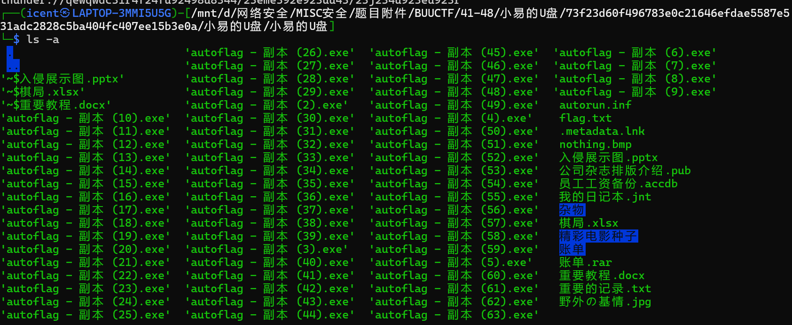
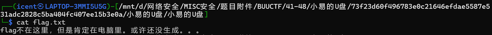
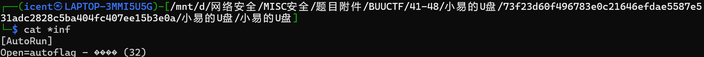
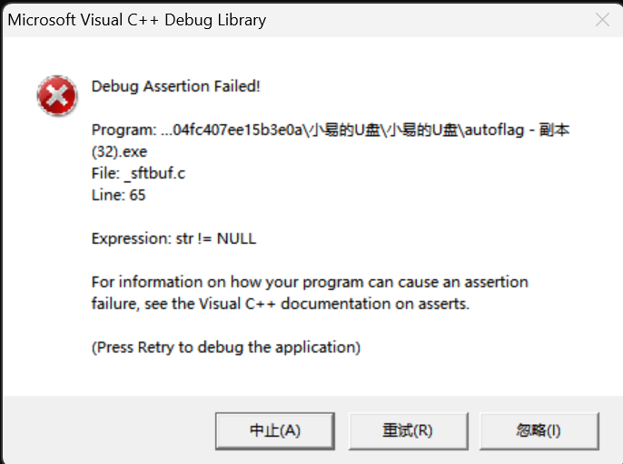
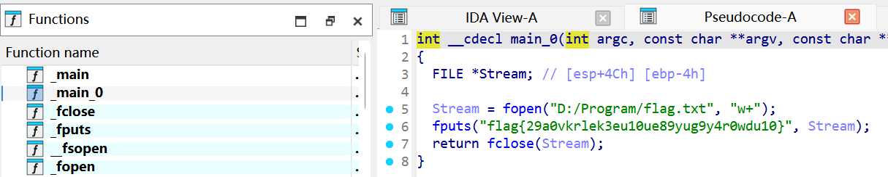

# 小易的U盘

**题目描述**：小易的U盘中了一个奇怪的病毒，电脑中莫名其妙会多出来东西。小易重装了系统，把U盘送到了攻防实验室，希望借各位的知识分析出里面有啥。请大家加油噢，不过他特别关照，千万别乱点他U盘中的资料，那是机密。 注意：得到的 flag 请包上 flag{} 提交  
**工具**：bandzip IDA

拿到附件 iso文件

可以用 **bandzip** 解压

基本都看了一遍 大部分是一些何意味内容 除了flag.txt有hint  
包括那个thunder也是空的

还没生成 可能是用那些exe文件生成

里面有个inf文件 是一个类似快捷方式的配置文件  
可以在启动U盘时直接执行内容 与题目的病毒是吻合的  
不过这种文件在win7后就停用了 所以我们得手动看看它打开啥

可以看到 它配置的是副本32的exe 试着运行

跑不了 暴力一点 **IDA** 反编译 按下`F5`可以变成C语言

在 main0 这个函数中找到 取得flag flag为  
`flag{29a0vkrlek3eu10ue89yug9y4r0wdu10}`
