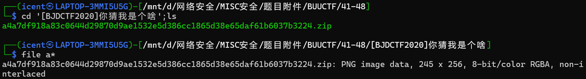
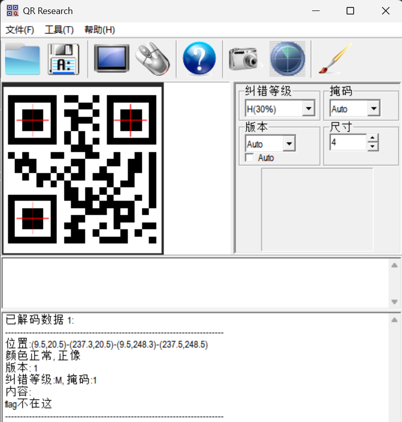
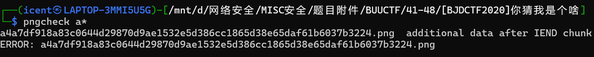
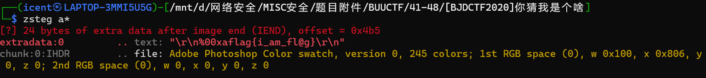

# [BJDCTF2020]你猜我是个啥

**题目描述**：得到的 flag 请包上 flag{} 提交。来源：https://github.com/BjdsecCA/BJDCTF2020  
**工具**：bandzip IDA

拿到附件 但我解压不了 file看一下这给的是个啥

png说是 改个后缀

二维码 **QR_Research** 扫一下

flag不在这 **pngcheck** 一下

发现IEND后面还有内容 **zsteg** 查看一下

取得flag flag为  
`flag{i_am_fl@g}`
