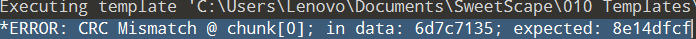
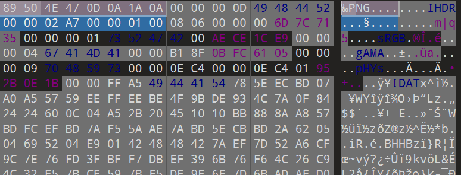
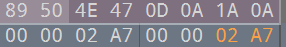
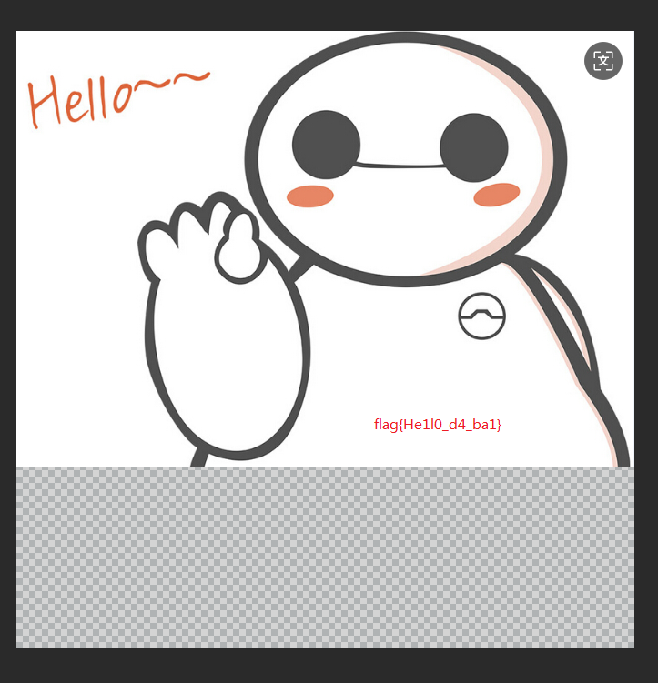

# 大白

**题目描述**：看不到图？ 是不是屏幕太小了 注意：得到的 flag 请包上 flag{} 提交  
**工具**：010Editor

拿到附件 解压 发现里面是一张png文件

根据题目描述 合理怀疑图片的宽高被动过手脚

使用 **010Editor** 打开文件 发现有 **CRC报错** 证实了文件宽高有问题

报错位置在 `chunk[0]` 查找到对应位置  
控制宽高的数据为 `IHDR` 后的八个十六进制数  
前四个为宽 后四个为高

为了使图片尽量展示更多 我们可以试着将宽高调大  
这里只调了高 让其数值上与宽一致

保存 打开图片

图片上显示了flag 取得flag flag为  
`flag{He1l0_d4_ba1}`
