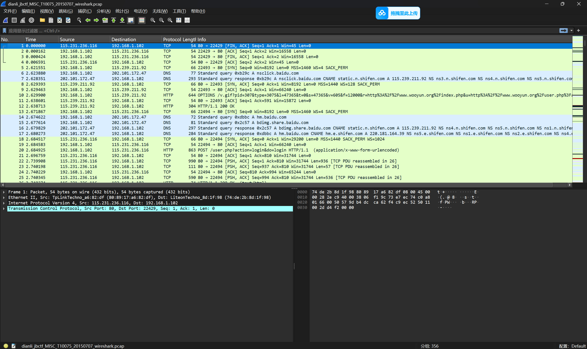
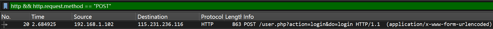
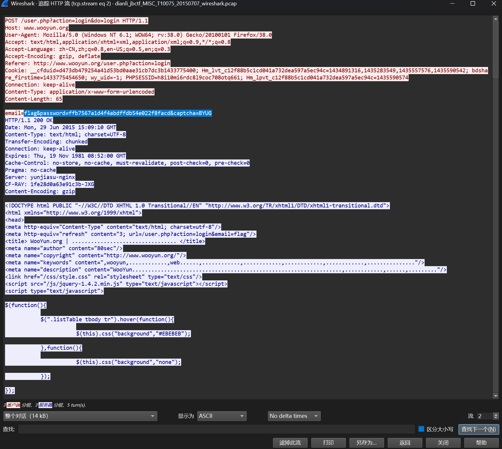

# wireshark

**题目描述**：黑客通过wireshark抓到管理员登陆网站的一段流量包（管理员的密码即是答案） 注意：得到的 flag 请包上 flag{} 提交  
**工具**：Wireshark

拿到附件 解压 发现里面是一个pcag文件

这是 **Wireshark** 的文件 我们用它打开

根据题意 我们需要获取管理员的登录的密码  
而登录这一过程需要向服务器上传数据 所以用的是 **POST** 请求方式

所以我们过滤出 POST请求 的包  
在显式过滤器输入 `http && http.request.method == "POST"`  
意思是过滤出 http流量的 并且 http请求方法为POST 的包

发现只有一个包 右键 追踪流 追踪http流

发现flag 将password的值复制 套上 `flag{}` 取得flag flag为  
`flag{ffb7567a1d4f4abdffdb54e022f8facd}`
