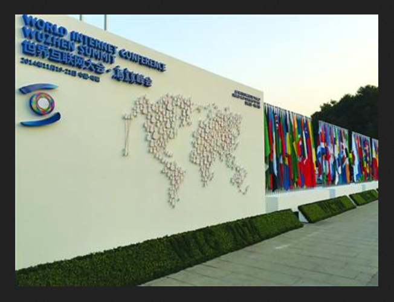
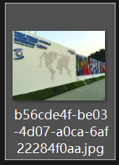
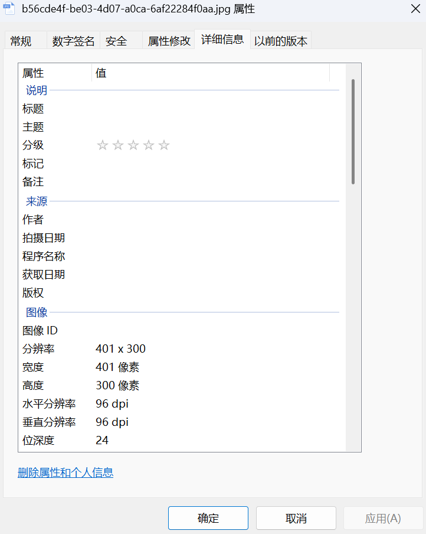
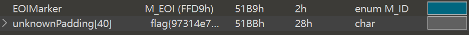
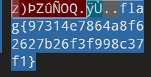

# 乌镇峰会种图

**题目描述**：乌镇互联网大会召开了，各国巨头汇聚一堂，他们的照片里隐藏着什么信息呢？（答案格式：flag｛答案｝，只需提交答案）注意：得到的 flag 请包上 flag{} 提交  
**工具**：010Editor

点击附件 发现是一张图

我们将其另存在本地 发现是个jpg文件

题目说图片隐藏了信息 所以先看看属性

空的

那试试用 **010Editor** 打开  
有 CRC报错 但先不着急看是否是宽高问题  
发现有个未知数据块 里面写着flag

查找相应位置

复制 取得flag flag为  
`flag{97314e7864a8f62627b26f3f998c37f1}`
