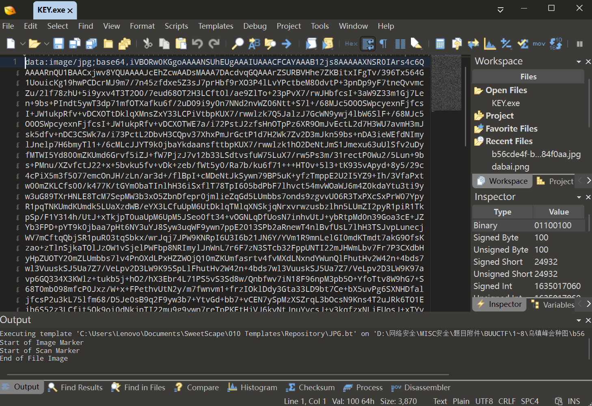
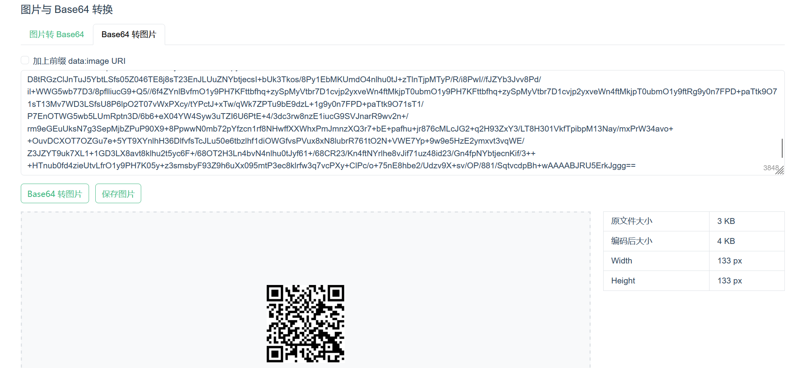
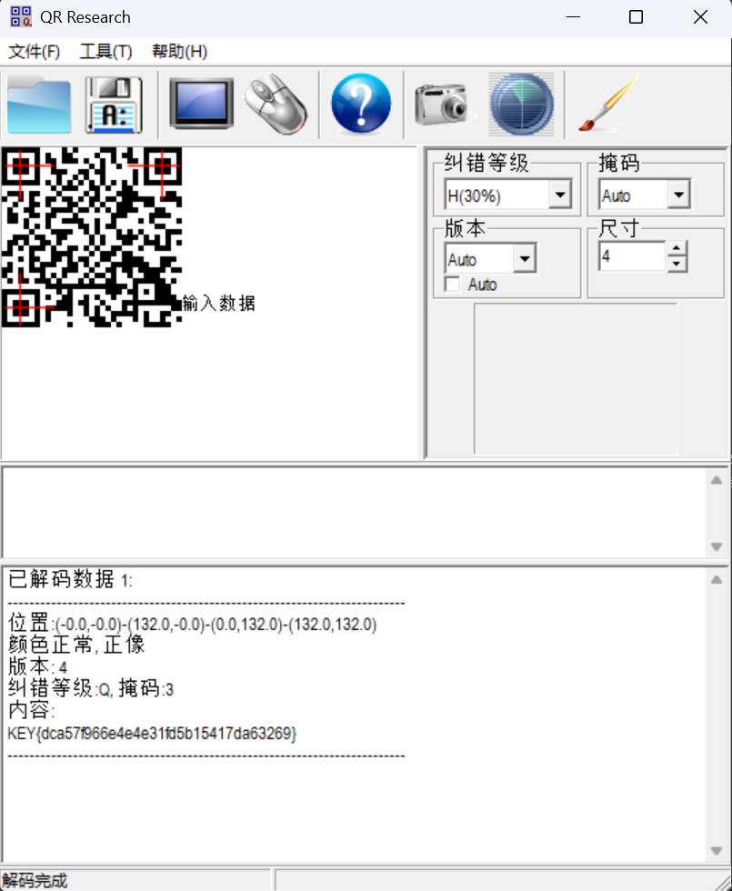

# N种方法解决

**题目描述**：注意：得到的 flag 请包上 flag{} 提交
**工具**：010Editor QR_Research

拿到附件 解压 发现里面是一个exe文件

尝试运行 发现运行不了

用 **010Editor** 打开试试

发现它实际上是个jpg文件 后面的数据进行了 **base64编码**  
试着直接改文件后缀 没用

那找一个base64转图片的[网站](https://www.toolhelper.cn/Image/Base64?tab=base64)

复制文件内容 粘贴 转图片

发现是个二维码 用 **QR_Research** 扫一下

发现flag 复制 将 `KEY` 改为 `flag` 取得flag flag为
`flag{dca57f966e4e4e31fd5b15417da63269}`
