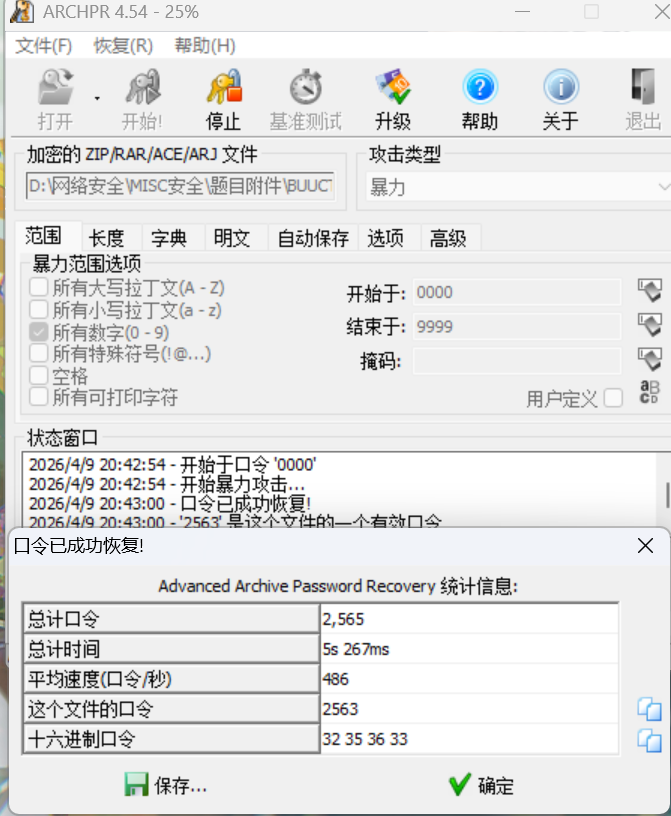
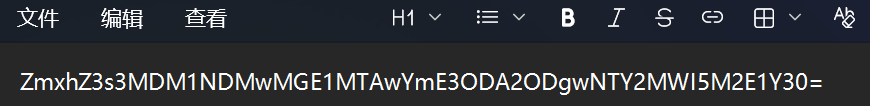
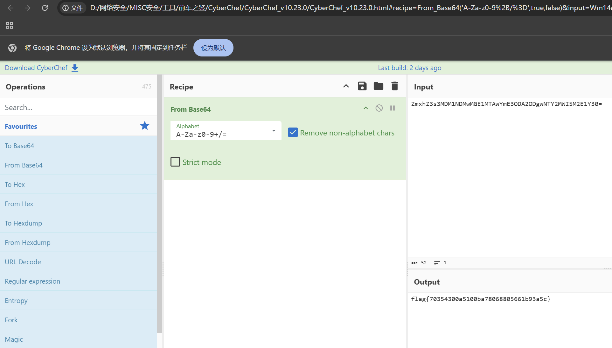

# 基础破解

**题目描述**：给你一个压缩包，你并不能获得什么，因为他是四位数字加密的哈哈哈哈哈哈哈。。。不对= =我说了什么了不得的东西。。注意：得到的 flag 请包上 flag{} 提交  
**工具**：ARCHPR

拿到附件 解压 发现里面是一个rar压缩包

根据题目描述 我们知道它是四位数字加密的 这里直接用 **ARCHPR** 爆破  
设置为数字 0000到9999

密码为 `2563` 打开压缩包中的 flag.txt

发现是 **base64编码**

这里用 **CyberChef** 进行解密  
将 `From  Base64`拖入 在 input 框中输入 `ZmxhZ3s3MDM1NDMwMGE1MTAwYmE3ODA2ODgwNTY2MWI5M2E1Y30=`

在 Output 框中取得解码的内容 取得flag flag为  
`flag{70354300a5100ba78068805661b93a5c}`
