# 大一寒假 Hnusec招新赛-Misc

## **Sound of Cipher**

题目描述：被吃掉了  
工具：DeepSound

拿到附件 wav文件

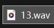

打开听听 发现是一首歌 这种音频音质好的可以考虑 Deepsound隐写  
因为 Deepsound 是最低位隐写 对听感影响不大  
用 **Deepsound** 打开


解出flag.txt 内容为

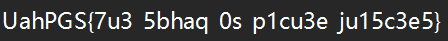

有flag结构 像凯撒密码那一系 先试凯撒

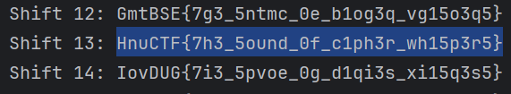

复制 取得flag flag为  
`HnuCTF{7h3_5ound_0f_c1ph3r_wh15p3r5}`

## **What's This**

题目描述：被吃掉了  
工具：binwalk 010Editor zipinfo bkcrack

拿到附件 没后缀名


file命令看一下

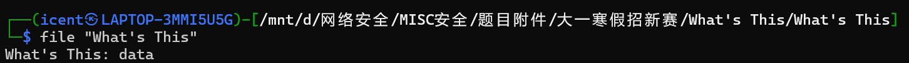

ok啥也不告我 **binwalk** 呢

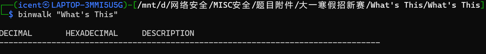

啥也不是说是

**010Editor** 看一看 还就是16进制 但是读不出文件  
考虑文件被处理过了 可能是逆序

试试 `50 4B 03 04` 倒着搜 `40 30 B4 05`

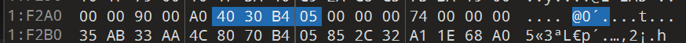

抓到了 而且在文件后半段 不过不是完全的尾部 有点怪  
不过先翻转过来再说 写个脚本

```
# 逆序输出十六进制文件
def rev(file):

    with open(file, "rb") as f:
        data = f.read()

    # 将二进制数据转为十六进制字符串
    hex_str = data.hex()

    # 将十六进制字符串反转
    reversed_hex_str = hex_str[::-1]

    # 将反转后的十六进制字符串转回二进制数据
    reversed_data = bytes.fromhex(reversed_hex_str)

    with open("output", "wb") as f:
        f.write(reversed_data)

if __name__ == "__main__":
    file_name = "What's This"
    rev(file_name)
```

得到文件output **binwalk** 查看一下

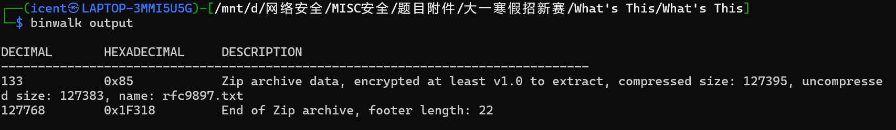

ok有压缩包了 **zipinfo** 压缩了什么

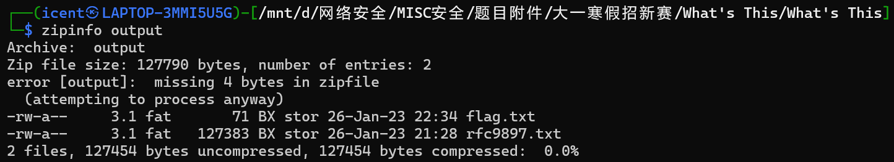

flag.txt 和 rfc9897.txt

刚刚binwalk的时候 前面字节有没识别的东西  
用 **010Editor** 再看看

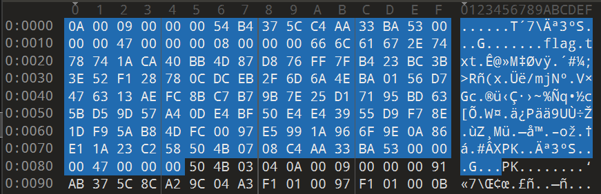

这里能看见下面是有个文件头的 但是对应的是 rfc9897.txt  
上面的字节里有 flag.txt  
猜测是缺了文件头 补上 加上后缀`.zip`

> 这里担心搞错 所以直接复制了个文件改 命名 test.zip

尝试解压 发现要密码  
不是伪加密 在各种地方找了挺久 也试了字典爆破 无果  
看到rfc9897 觉得可能是hint 查一下

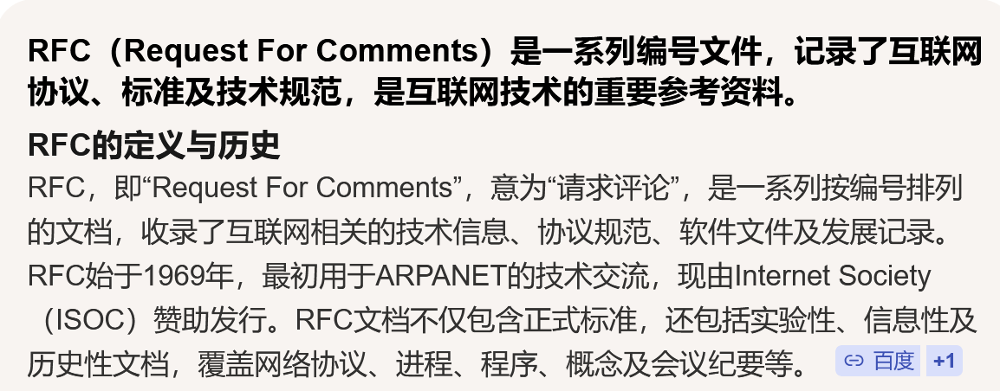

发现是一系列标准 而且直接搜到了有rfc9897这个标准 还能下到原txt文件

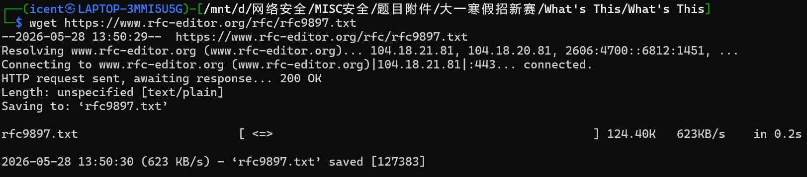

字节和压缩包里的还一样 都是127383字节 大概率明文攻击  
保险起见 用 **bkcrack** 再查下加密方式

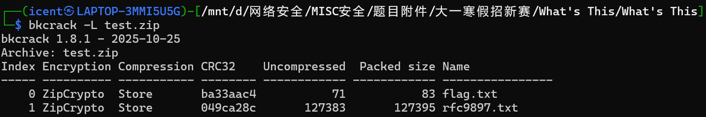

ZipCrypto 打他

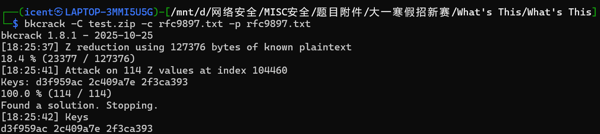

拿到key `d3f959ac` `2c409a7e` `2f3ca393` 提取 flag.txt

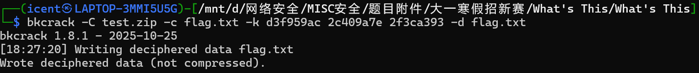

成功 打开

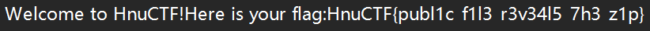

取得flag flag为  
`HnuCTF{publ1c_f1l3_r3v34l5_7h3_z1p}`

## **Dual Vision**

题目描述：被吃掉了  
工具：QR_Research 010Editor Stegsolve Python

附件给的rar


解压 得到 stream2.png


二维码 用 **QR_Research**

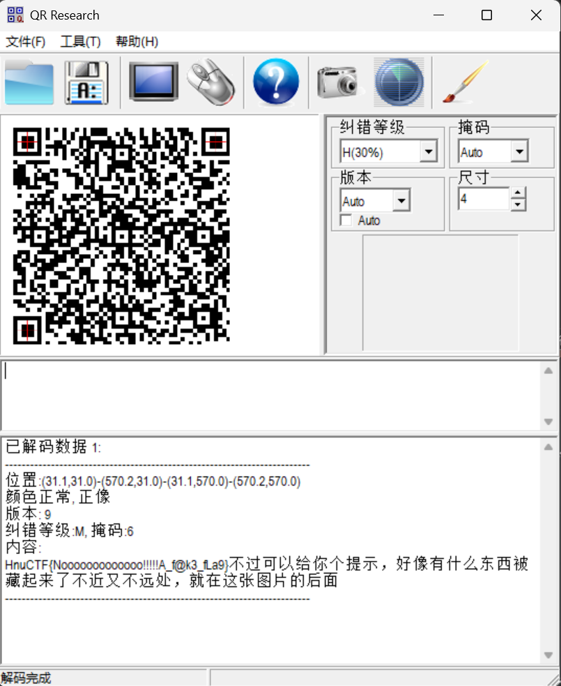

得到hint

```
HnuCTF{Nooooooooooooo!!!!!A_f@k3_fLa9}
不过可以给你个提示，好像有什么东西被藏起来了
不近又不远处，就在这张图片的后面
```

被藏起来了 把常见方法先试一遍  
zsteg 无果 pngcheck 无果 stegsolve 无果

注意到题目 “双重视觉” 以及图片 “stream2.png”  
猜测可能有 stream1.png

回到rar文件看看 用 **010Editor** 打开

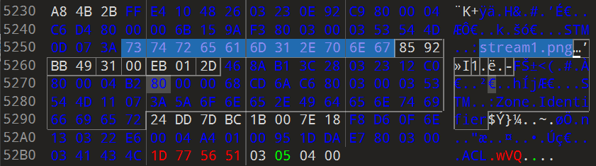

联想到今早上buu的一道题 用wsl解压rar

```
# 用unrar
unrar x 'Dual Vision.rar'
# 用rar
rar x 'Dual Vision.rar'
# 用7z
7z x 'Dual Vision.rar'
```

7z能解压出来 但打不开

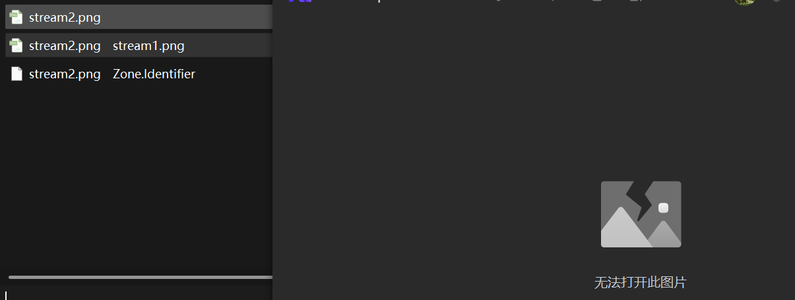

这里问了ai 给了个powershell命令

```
Get-Content -Path .\stream2.png -Stream stream1.png -Encoding Byte | Set-Content -Path .\stream1.png -Encoding Byte
```

得到

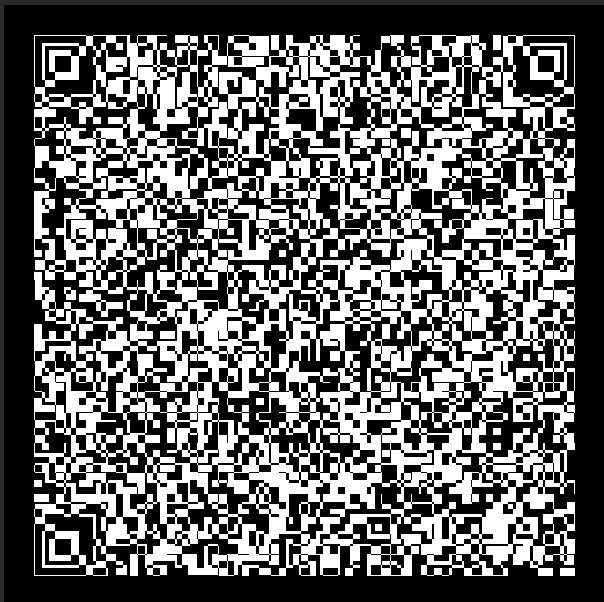

像二维码 扫不出来 以为是类似汉信码的小众码 找了半天没找见  
问学长 学长说不一定要拿来扫

联想到题目“视觉” 可不可能需要和 stream2.png 一起处理

用 **Stegsolve** 打开 stream1.png  
再用 `Image Combiner` 功能把 stream2.png 堆上去

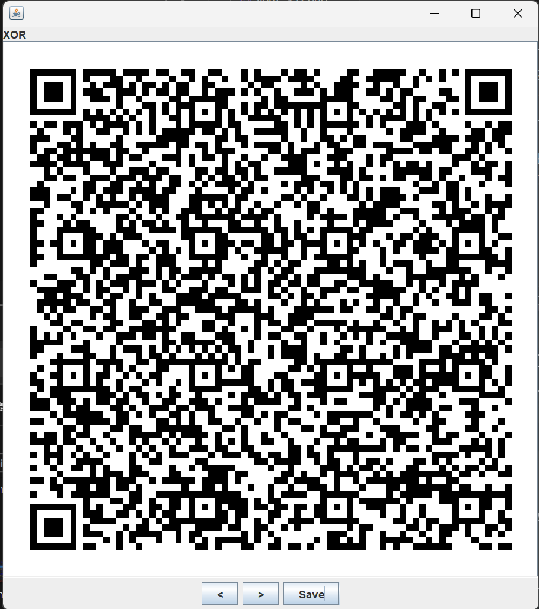

第一个异或就出货了 保存图片 用 **QR_Research** 扫一下

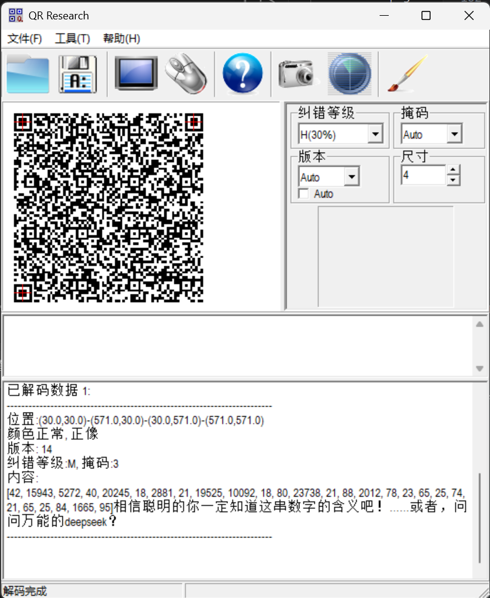

得到

```
[42, 15943, 5272, 40, 20245, 18, 2881, 21, 19525, 10092, 18, 80, 23738, 21, 88, 2012, 78, 23, 65, 25, 74, 21, 65, 25, 84, 1665, 95]

相信聪明的你一定知道这串数字的含义吧！

……或者，问问万能的deepseek？
```

那就问

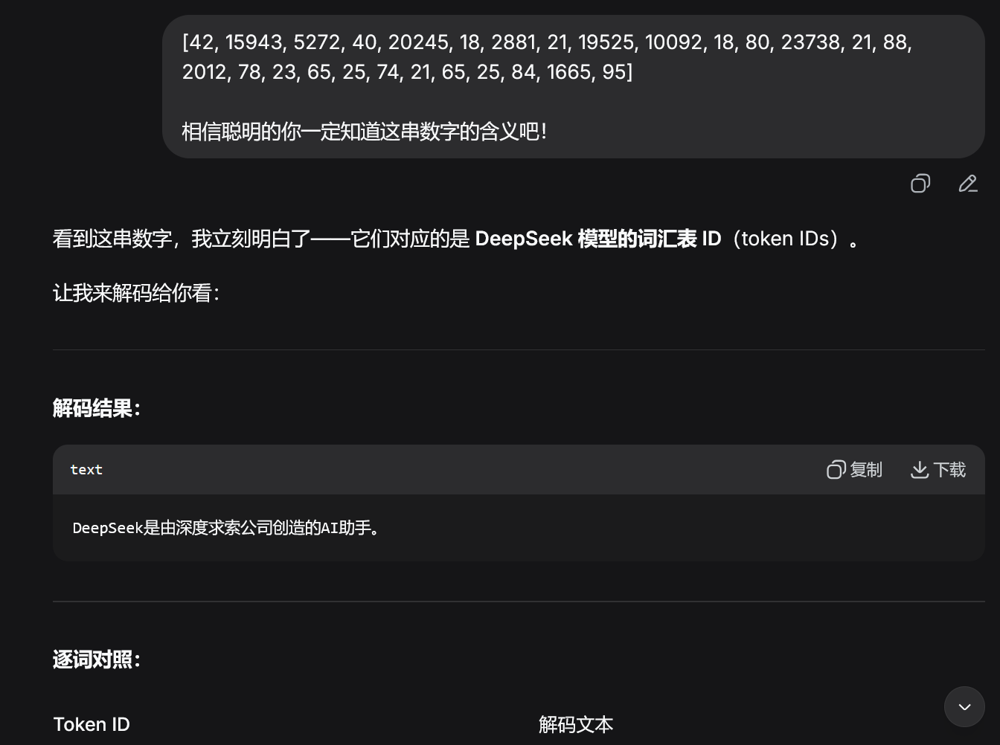

何意味

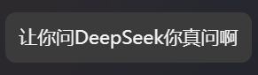

那 那问问万能的学长吧（bushi

“问问万能的deepseek” 是hint  
意思是用deepseek的transformer把上面的token矩阵转换成文本

```
from transformers import AutoTokenizer

tokenizer = AutoTokenizer.from_pretrained("deepseek-ai/DeepSeek-V3")
token_ids = [42, 15943, 5272, 40, 20245, 18, 2881, 21, 19525, 10092, 18, 80, 23738, 21, 88, 2012, 78, 23, 65, 25, 74, 21, 65, 25, 84, 1665, 95]
text = tokenizer.decode(token_ids)

print(text)
```

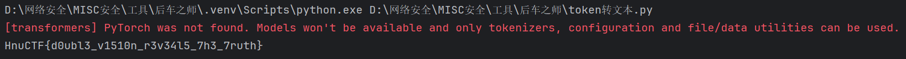

复制 取得flag flag为  
`HnuCTF{d0ubl3_v1510n_r3v34l5_7h3_7ruth}`

## **The Serpent's Shadow**

题目描述：被吃掉了  
工具：pyinstxtractor python

zip解压得到exe


运行一下

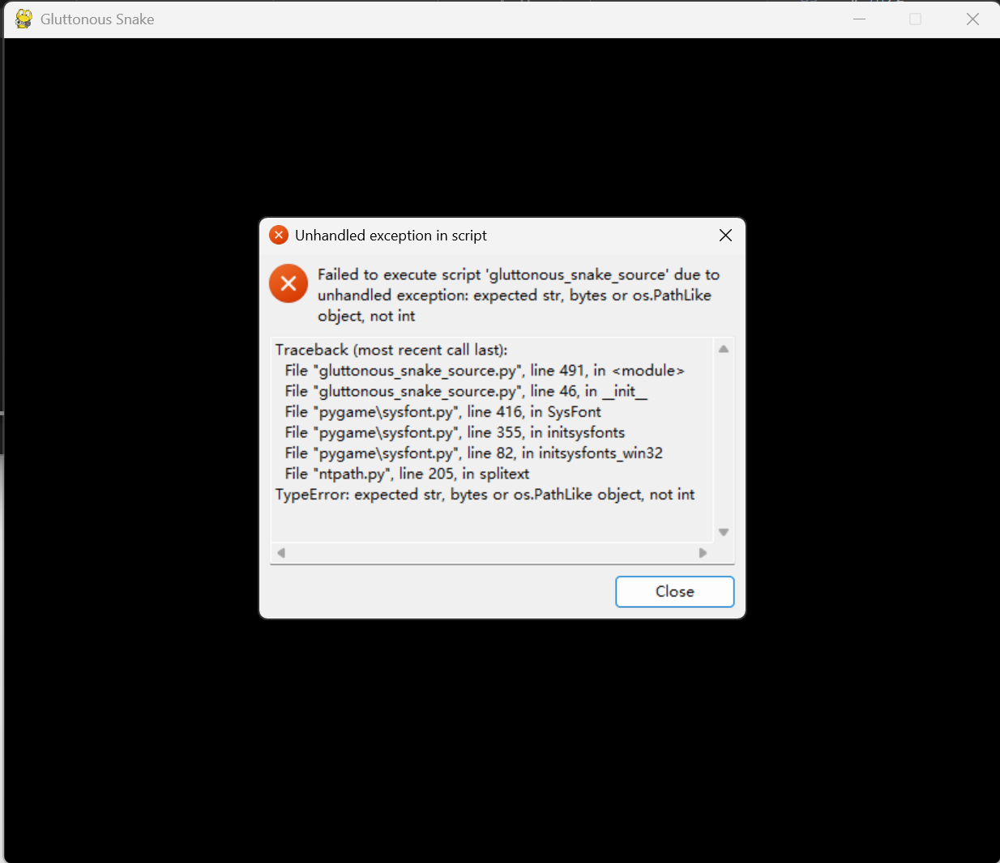

跑不了 不过学长说不影响做题  
exe文件 试试 IDA 打开

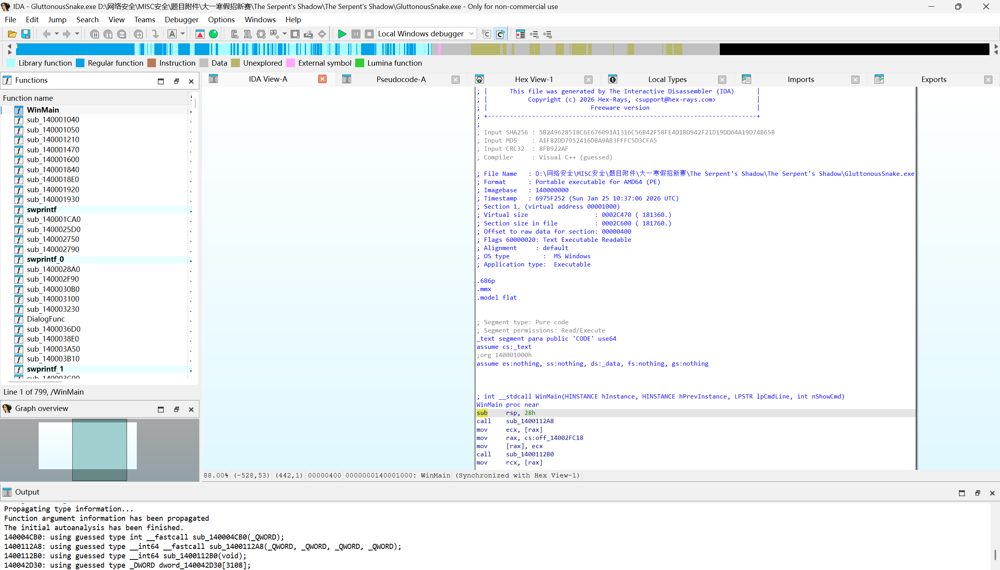

tab可以看各个函数的反编译

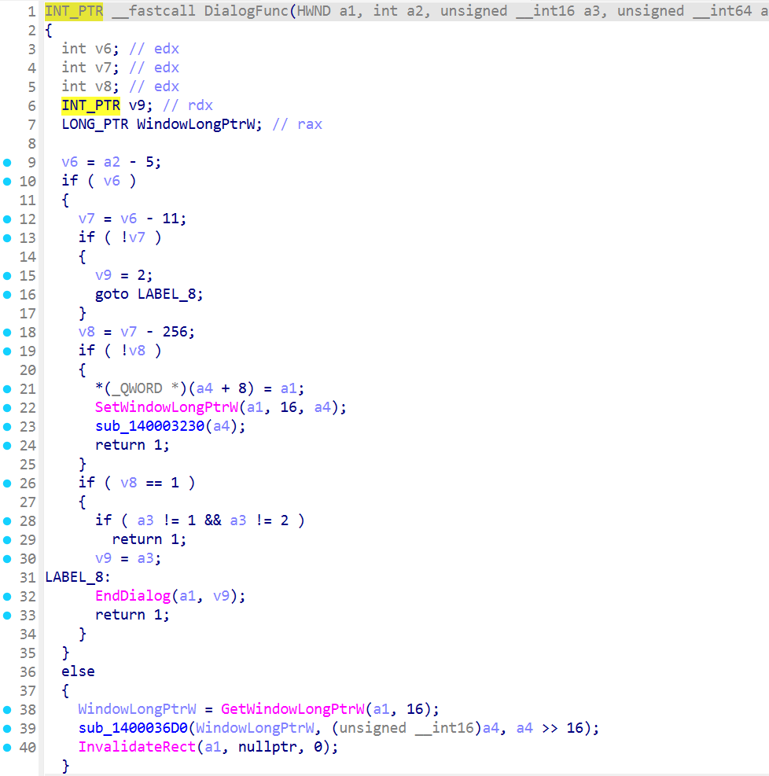

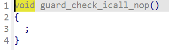

看了半小时 一堆函数给我看力竭了

换个思路呢 刚刚IDA看的时候能看出来这是Python写的  
用python反汇编试试

问了ai **pyinstxtractor** 这个工具可以把exe转成pyc

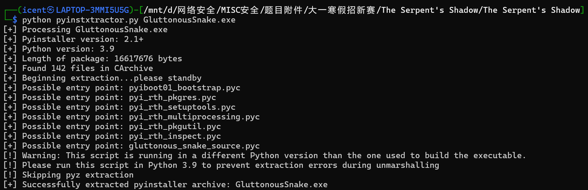

成功了 看看文件


看文件名 这个文件应该就是主文件

pyc文件还没法直接读取 需要再反编译一下

再次问ai uncompyle6 可以做到

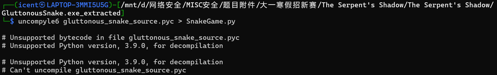

好的它做不到 不支持python3.9版本

再拷打ai 爆出个[在线网站](https://pylingual.io/)

> 这个在线网站要排队 得等一会

得到源码

```
# Decompiled with PyLingual (https://pylingual.io)
# Internal filename: 'gluttonous_snake_source.py'
# Bytecode version: 3.9.0beta5 (3425)
# Source timestamp: 1970-01-01 00:00:00 UTC (0)

import pygame
import sys
import random
import base64
import math
FLAG_PARTS = [('TVkrL08vTFl7ZEhrUFltZA==', 30), ('QSspKVdBSGN6dSEoQGNbYFQoISQ=', 25), ('e15IcHspKic=', 26)]
class SnakeGame:
    def __init__(self):
        pygame.init()
        pygame.key.set_repeat(0)
        self.W, self.H = (820, 680)
        self.screen = pygame.display.set_mode((self.W, self.H))
        pygame.display.set_caption('Gluttonous Snake')
        self.clock = pygame.time.Clock()
        self.start_score = 0
        self.cell = 16
        self.grid_w = 40
        self.grid_h = 30
        self.map_w = self.grid_w * self.cell
        self.map_h = self.grid_h * self.cell
        self.map_x = (self.W - self.map_w) // 2
        self.map_y = 120
        self.move_interval = 0.18
        self.move_timer = 0.0
        self.f_big = pygame.font.SysFont('arial', 56, True)
        self.f = pygame.font.SysFont('arial', 32)
        self.f_s = pygame.font.SysFont('arial', 22)
        self.C = {'bg': (12, 18, 28), 'panel': (25, 35, 50), 'border': (90, 160, 255), 'snake_head': (40, 220, 120), 'snake_body': (30, 200, 110), 'snake_tail': (20, 180, 100), 'snake_outline': (10, 160, 90), 'food': (255, 90, 90), 'food_stem': (139, 69, 19), 'text': (230, 230, 230), 'hi': (255, 210, 90)}
        self.state = 'menu'
        self.paused = False
        self.reset_game()
    def reset_game(self):
        self.snake = [(self.grid_w // 2, self.grid_h // 2), (self.grid_w // 2 - 1, self.grid_h // 2)]
        self.direction = (1, 0)
        self.next_direction = self.direction
        self.can_turn = True
        self.score = self.start_score
        self.food = self.spawn_food()
        self.move_timer = 0.0
        self.paused = False
    def spawn_food(self):
        # ***<module>.SnakeGame.spawn_food: Failure: Different control flow
        p = (random.randint(0, self.grid_w - 1), random.randint(0, self.grid_h - 1))
        if p not in self.snake:
            pass
        return p
    def handle_events(self):
        for e in pygame.event.get():
            if e.type == pygame.QUIT:
                pygame.quit()
                sys.exit()
            if e.type!= pygame.KEYDOWN:
                continue
            else:
                if e.key == pygame.K_ESCAPE:
                    self.state = 'menu'
                    self.paused = False
                    return
                else:
                    if self.state == 'menu':
                        if e.key == pygame.K_SPACE:
                            self.reset_game()
                            self.state = 'playing'
                    else:
                        if self.state == 'playing':
                            if e.key == pygame.K_SPACE:
                                self.paused = not self.paused
                                self.can_turn = True
                            if not self.paused and self.can_turn:
                                    if e.key in (pygame.K_w, pygame.K_UP):
                                        self.next_direction = (0, (-1))
                                    else:
                                        if e.key in (pygame.K_s, pygame.K_DOWN):
                                            self.next_direction = (0, 1)
                                        else:
                                            if e.key in (pygame.K_a, pygame.K_LEFT):
                                                self.next_direction = ((-1), 0)
                                            else:
                                                if e.key in (pygame.K_d, pygame.K_RIGHT):
                                                    self.next_direction = (1, 0)
                                    self.can_turn = False
    def reached_target(self):
        return self.score // 1000 >= 9 and self.score % 1000 >= 999
    def update(self, dt):
        if self.state!= 'playing' or self.paused:
            return None
        else:
            if self.reached_target():
                self.state = 'victory'
                return None
            else:
                if (self.next_direction[0] + self.direction[0], self.next_direction[1] + self.direction[1])!= (0, 0):
                    self.direction = self.next_direction
                self.move_timer += dt
                if self.move_timer >= self.move_interval:
                    self.move_timer = 0.0
                    self.move_snake()
                    self.can_turn = True
    def move_snake(self):
        hx, hy = self.snake[0]
        dx, dy = self.direction
        nx, ny = (hx + dx, hy + dy)
        if nx < 0 or nx >= self.grid_w or ny < 0 or (ny >= self.grid_h):
            self.state = 'game_over'
            return None
        else:
            body = self.snake[:(-1)]
            if (nx, ny) in body:
                self.state = 'game_over'
                return None
            else:
                self.snake.insert(0, (nx, ny))
                if (nx, ny) == self.food:
                    gain = random.randint(1, 10)
                    self.score += gain
                    self.food = self.spawn_food()
                else:
                    self.snake.pop()
    def decrypt_flag(self):
        result = bytearray()
        for data, key in FLAG_PARTS:
            xor_data = base64.b64decode(data)
            b64_data = bytes([b ^ key for b in xor_data])
            plain_bytes = base64.b64decode(b64_data)
            result.extend(plain_bytes)
        return result.decode()
    def draw_snake_head(self, x, y, direction):
        """绘制蛇头"""
        cell = self.cell
        center_x = self.map_x + x * cell + cell // 2
        center_y = self.map_y + y * cell + cell // 2
        radius = cell // 2 - 2
        pygame.draw.circle(self.screen, self.C['snake_head'], (center_x, center_y), radius)
        pygame.draw.circle(self.screen, self.C['snake_outline'], (center_x, center_y), radius, 1)
        eye_radius = cell // 5
        eye_offset = cell // 3
        if direction == (1, 0):
            left_eye = (center_x + eye_offset, center_y - eye_offset // 2)
            right_eye = (center_x + eye_offset, center_y + eye_offset // 2)
        else:
            if direction == ((-1), 0):
                left_eye = (center_x - eye_offset, center_y - eye_offset // 2)
                right_eye = (center_x - eye_offset, center_y + eye_offset // 2)
            else:
                if direction == (0, (-1)):
                    left_eye = (center_x - eye_offset // 2, center_y - eye_offset)
                    right_eye = (center_x + eye_offset // 2, center_y - eye_offset)
                else:
                    left_eye = (center_x - eye_offset // 2, center_y + eye_offset)
                    right_eye = (center_x + eye_offset // 2, center_y + eye_offset)
        pygame.draw.circle(self.screen, (255, 255, 255), left_eye, eye_radius)
        pygame.draw.circle(self.screen, (255, 255, 255), right_eye, eye_radius)
        pygame.draw.circle(self.screen, (30, 30, 50), left_eye, eye_radius // 2)
        pygame.draw.circle(self.screen, (30, 30, 50), right_eye, eye_radius // 2)
    def draw_snake_body(self, x, y, index, total_length):
        """绘制蛇身"""
        cell = self.cell
        center_x = self.map_x + x * cell + cell // 2
        center_y = self.map_y + y * cell + cell // 2
        radius = cell // 2 - 2
        color_factor = 1.0 - index / total_length * 0.3
        body_color = (int(self.C['snake_body'][0] * color_factor), int(self.C['snake_body'][1] * color_factor), int(self.C['snake_body'][2] * color_factor))
        pygame.draw.circle(self.screen, body_color, (center_x, center_y), radius)
        pygame.draw.circle(self.screen, self.C['snake_outline'], (center_x, center_y), radius, 1)
        scale_radius = radius // 2
        pygame.draw.circle(self.screen, (body_color[0] // 2, body_color[1] // 2, body_color[2] // 2), (center_x, center_y), scale_radius)
    def draw_snake_tail(self, x, y):
        """绘制蛇尾"""
        cell = self.cell
        center_x = self.map_x + x * cell + cell // 2
        center_y = self.map_y + y * cell + cell // 2
        radius = cell // 3
        pygame.draw.circle(self.screen, self.C['snake_tail'], (center_x, center_y), radius)
        pygame.draw.circle(self.screen, self.C['snake_outline'], (center_x, center_y), radius, 1)
    def draw_food(self, x, y):
        """绘制食物"""
        cell = self.cell
        center_x = self.map_x + x * cell + cell // 2
        center_y = self.map_y + y * cell + cell // 2
        radius = cell // 2 - 2
        pygame.draw.circle(self.screen, self.C['food'], (center_x, center_y), radius)
        detail_radius = radius // 2
        pygame.draw.circle(self.screen, (self.C['food'][0] // 2, self.C['food'][1] // 2, self.C['food'][2] // 2), (center_x, center_y), detail_radius)
        stem_start = (center_x, center_y - radius)
        stem_end = (center_x, center_y - radius - cell // 4)
        pygame.draw.line(self.screen, self.C['food_stem'], stem_start, stem_end, 2)
    def draw_game(self):
        pygame.draw.rect(self.screen, self.C['border'], (self.map_x - 3, self.map_y - 3, self.map_w + 6, self.map_h + 6), 3)
        snake_len = len(self.snake)
        for i, (x, y) in enumerate(self.snake):
            if i == 0:
                self.draw_snake_head(x, y, self.direction)
            else:
                if i == snake_len - 1:
                    self.draw_snake_tail(x, y)
                else:
                    self.draw_snake_body(x, y, i, snake_len)
        fx, fy = self.food
        self.draw_food(fx, fy)
        sc = self.f.render(f'Score: {self.score}/9999', True, self.C['text'])
        self.screen.blit(sc, (20, 30))
    def draw_paused(self):
        """绘制暂停界面"""
        overlay = pygame.Surface((self.W, self.H), pygame.SRCALPHA)
        overlay.fill((0, 0, 0, 128))
        self.screen.blit(overlay, (0, 0))
        panel_w, panel_h = (400, 200)
        panel_x = (self.W - panel_w) // 2
        panel_y = (self.H - panel_h) // 2
        pygame.draw.rect(self.screen, (30, 45, 65), (panel_x, panel_y, panel_w, panel_h), border_radius=12)
        pygame.draw.rect(self.screen, self.C['hi'], (panel_x, panel_y, panel_w, panel_h), 3, border_radius=12)
        title = self.f_big.render('PAUSED', True, self.C['hi'])
        self.screen.blit(title, (self.W // 2 - title.get_width() // 2, panel_y + 25))
        tips = ['Press SPACE to resume', 'Press ESC to return to menu', '', 'Game progress is saved']
        for i, tip in enumerate(tips):
            text = self.f_s.render(tip, True, self.C['text'])
            self.screen.blit(text, (self.W // 2 - text.get_width() // 2, panel_y + 100 + i * 30))
    def draw_menu(self):
        t = self.f_big.render('GLUTTONOUS SNAKE', True, self.C['hi'])
        self.screen.blit(t, (self.W // 2 - t.get_width() // 2, 160))
        tips = ['Reach the target score to get the flag', 'That\'s ez to do, right?', '', '↑/↓/←/→ : Move', 'SPACE : Start / Pause', 'ESC   : Menu']
        for i, l in enumerate(tips):
            s = self.f.render(l, True, self.C['text'])
            self.screen.blit(s, (self.W // 2 - s.get_width() // 2, 300 + i * 40))
    def draw_game_over(self):
        o = pygame.Surface((self.W, self.H), pygame.SRCALPHA)
        o.fill((0, 0, 0, 160))
        self.screen.blit(o, (0, 0))
        t = self.f_big.render('GAME OVER', True, (255, 80, 80))
        self.screen.blit(t, (self.W // 2 - t.get_width() // 2, 300))
    def draw_victory(self):
        overlay = pygame.Surface((self.W, self.H), pygame.SRCALPHA)
        overlay.fill((0, 0, 0, 180))
        self.screen.blit(overlay, (0, 0))
        panel_w, panel_h = (600, 260)
        panel_x = (self.W - panel_w) // 2
        panel_y = (self.H - panel_h) // 2
        pygame.draw.rect(self.screen, (30, 45, 65), (panel_x, panel_y, panel_w, panel_h), border_radius=12)
        pygame.draw.rect(self.screen, self.C['hi'], (panel_x, panel_y, panel_w, panel_h), 3, border_radius=12)
        title = self.f_big.render('VICTORY!', True, (0, 255, 160))
        self.screen.blit(title, (self.W // 2 - title.get_width() // 2, panel_y + 25))
        flag = self.decrypt_flag()
        flag_text = self.f.render(f'Flag: {flag}', True, (230, 230, 230))
        self.screen.blit(flag_text, (self.W // 2 - flag_text.get_width() // 2, panel_y + 120))
        hint = self.f_s.render('You found another way. Well done.', True, (180, 180, 180))
        self.screen.blit(hint, (self.W // 2 - hint.get_width() // 2, panel_y + 180))
    def run(self):
        while True:
            dt = self.clock.tick(60) / 1000.0
            self.handle_events()
            if self.state == 'playing' and (not self.paused):
                    self.update(dt)
            self.screen.fill(self.C['bg'])
            if self.state == 'menu':
                self.draw_menu()
            else:
                self.draw_game()
                if self.state == 'game_over':
                    self.draw_game_over()
                else:
                    if self.state == 'victory':
                        self.draw_victory()
                    else:
                        if self.paused:
                            self.draw_paused()
            pygame.display.flip()
if __name__ == '__main__':
    SnakeGame().run()
```

分析源码 把flag相关的内容提取出来

```
import base64

FLAG_PARTS = [('TVkrL08vTFl7ZEhrUFltZA==', 30), ('QSspKVdBSGN6dSEoQGNbYFQoISQ=', 25), ('e15IcHspKic=', 26)]

result = bytearray()
for data, key in FLAG_PARTS:
        xor_data = base64.b64decode(data)
        b64_data = bytes([b ^ key for b in xor_data])
        plain_bytes = base64.b64decode(b64_data)
        result.extend(plain_bytes)

print(result.decode())
```

运行

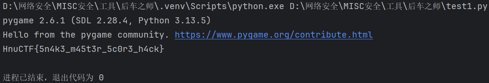

复制 取得flag flag为  
`HnuCTF{5n4k3_m45t3r_5c0r3_h4ck}`
